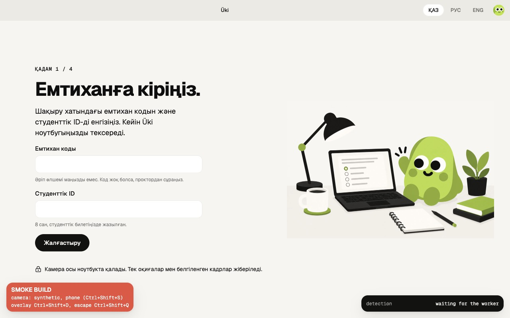
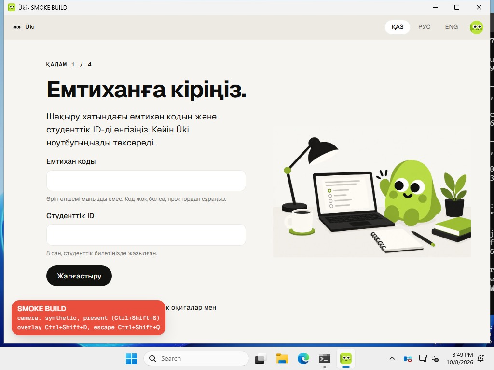

# Phase 0 exit evidence

One row per work package check and per exit criterion. Status is `pass`, `fail` or `pending` (a hand check on the MacBook Pro or, in the lab session, on a Windows 11 lab PC, or a step that needs the cloud keys). Evidence is a command and its result, a CI link, a network log or a screen recording, with the date.

Everything marked pass below ran on one shared development Mac (Apple M4, 16 GB, macOS 15.6) against the local Supabase stack. The Windows 11 lab PCs, the cloud project and CI have produced no evidence yet. Other projects' Docker stacks loaded this Mac during the runs (load average 13 to 48), which matters for every latency figure.

## Work packages

| WP | Check | Run by | Status | Evidence | Date |
| --- | --- | --- | --- | --- | --- |
| 0.1 | `pnpm check` passes locally (Biome, typecheck and tests of every package, Edge Function typecheck and unit tests) | Agent | pass | `pnpm check`: 22/22 turbo tasks; functions tsc; 47 function unit tests | 2026-10-07 |
| 0.1 | `pnpm check` on the tree after the hardening run | Agent | pass | Exit 0. Biome 741 files; guards 759 files. Turbo 22/22 tasks, replayed from cache: the same inputs had already passed. Tests: contracts 369, desktop 374, lock 122, web 136, ui 172, detection 103, i18n 43. Functions, scripts and e2e type checks clean; functions-unit 58 and scripts 82 tests | 2026-10-07 |
| 0.1 | `pnpm check` passes in CI | Agent | pending | No GitHub remote yet. `.github/workflows/ci.yml` exists (WP 0.10) but has never run | |
| 0.1 | A sample screen renders a key in kk, ru and en | Agent | pass | `@uki/i18n` translator tests (kk, ru, en); desktop skeleton window switches `join.title` between kk and en (electron-vite dev) | 2026-10-07 |
| 0.1 | `pnpm i18n:build` checks every message | Agent | pass | 225 catalog keys; crafted bad catalogs fail (missing kk, empty, placeholder mismatch, parse error) | 2026-10-07 |
| 0.1 | Kazakh glyph check (ӘҒҚҢӨҰҮҺІ әғқңөұүһі) | Agent | pass | `pnpm --filter @uki/tokens glyphs`: Geist 18/18, Geist Mono 18/18; no fallback needed | 2026-10-07 |
| 0.1 | Kazakh letters render in Geist on every student screen | You | pending | Hand check on the MacBook and, in the lab session, on a Windows 11 lab PC | |
| 0.2 | `pnpm tokens` reproduces the printed CSS | Agent | pass | tokens test compares tokens.css declaration by declaration with the plan's block (plus the dark focus ring, see decisions); 72 variables; 24 text styles | 2026-10-07 |
| 0.2 | Gallery shows every primitive in every state next to its Figma screenshot | Agent | pass | `pnpm --filter @uki/ui gallery` (port 5190); web `/gallery` in development; each group compared with Figma by Playwright screenshots | 2026-10-07 |
| 0.3 | `pnpm db:reset` and `supabase test db` pass | Agent | pass | 7 migrations + seed apply; pgTAP 7 files, 311 tests (RLS for exam office, assigned proctor, other proctor, session owner, other student; join_exam codes; session states; pause credit; triggers) | 2026-10-07 |
| 0.3 | `pnpm seed:staff` creates the four staff accounts | Agent | pass | Idempotent on a second run | 2026-10-07 |
| 0.3 | `supabase test db` with the five migrations added later on 2026-10-07 (`20261007200000` to `20261007221100`) | Agent | pass | 8 files, 390 tests, run twice. Includes `08_command_followups` (55 assertions). The review's regression cases fail against the old policies and functions | 2026-10-07 |
| 0.3 | A clean `pnpm db:reset` applies all 13 migrations and the seed | Agent | pass | P.9 below: `supabase db reset` on a fresh second stack applied the 13 Phase 0 migrations and `seed.sql` in one run, and pgTAP passed 8 files with 404 tests | 2026-10-08 |
| 0.3 | Every public table has row-level security | Agent | pass | `pg_class` query on the local database: all 17 tables in `public` have `relrowsecurity` on | 2026-10-07 |
| 0.4 | 50 events stored once with the server's review value | Agent | pass | `pnpm test:integration` 65/65, three runs | 2026-10-07 |
| 0.4 | A staff client gets the broadcast within 1 s | Agent | pass | Local: event broadcast median 9 ms, max 11.9 ms (n=5); cloud latency from Kostanay pending (WP 0.10/0.11) | 2026-10-07 |
| 0.4 | A command reaches the session channel; a still uploads and confirms | Agent | pass | Integration tests: command broadcast, group scope, add_time, 403 for another proctor; upload via signed URL, frames confirm, stills signed URL + audit row | 2026-10-07 |
| 0.4 | `pnpm test:integration` after the hardening changes | Agent | pass | Full run after the ingest change: 14 files, 78 tests, with `functions serve`. After the review repairs only `ingest.test.ts` (8/8) and `stills.test.ts` (6/6) ran, each alone; the first attempt failed in setup on an Auth 504 under load | 2026-10-07 |
| 0.4 | A quiet heartbeat writes nothing, and one ingest call is one transaction | Agent | pass | Per-call counters, 2 × 50 calls per kind. A quiet heartbeat before: 1 row version, 1 broadcast row, 2 transaction ids, about 0.75 KB of WAL; after: none. Function time p50 went from 8.6 and 9.0 ms to 5.9 and 7.9 ms (2 rounds of 120 sequential heartbeats) | 2026-10-07 |
| 0.4 | A command whose broadcast is lost reaches the app through the ingest reply | Agent | pass | P.10 below: `pnpm --filter desktop e2e:realtime` stopped and restarted `supabase_realtime_uki` during an exam. With Realtime stopped, the pause and the resume each came with an ingest reply, 2.1c after 10.0 to 10.3 s when the pause left right after a heartbeat; each command applied once. A 12 s heartbeat seen once under load is fixed | 2026-10-08 |
| 0.5 | Detection rules fire for every Tuning moment; 5 minutes of writing raise no flag | Agent | pass | `pnpm --filter @uki/detection test`: 103 tests replaying traces | 2026-10-07 |
| 0.5 | Models ship with a SHA-256 manifest; nothing from a CDN | Agent | pass | `pnpm --filter @uki/detection models` + `models:verify`: 15 files, 55.9 MB | 2026-10-07 |
| 0.5 | A held phone scores at or above the 0.85 `phone_score` default | Agent | fail | Desktop e2e, synthetic camera showing the brand kit's held-phone picture: EfficientDet-Lite0 int8 scored 0.77 on every check, so the default never fires `phone.detected`. The e2e lowers its exam's `phone_score` to 0.7. Not a real phone; tune on the laptops (see decisions, "Detection thresholds") | 2026-10-07 |
| 0.5 | Card match on the synthetic camera | Agent | pass | Desktop e2e: a card drawn from the student's own enrolment photo matched at 0.93 on the first try (3.3 s). This does not test rejecting someone else's card | 2026-10-07 |
| 0.5 | Performance budget on the MacBook Pro and, in the lab session, on a Windows 11 lab PC (15 fps, 2 phone checks/s, CPU under 40%), also with the window hidden | You | pending | Measure with the developer overlay (Ctrl+Shift+D; on a lab PC, the lab zip from GitHub's Windows runners) | |
| 0.5 | Every Tuning moment fires 5/5 on the MacBook and on a Windows 11 lab PC | You | pending | Hand check | |
| 0.5 | Card match accepts your own card and rejects someone else's | You | pending | Print the two mock cards; tune `identity.minSimilarity` (0.5 let a different low-res photo through at 0.53) | |
| 0.6 | Desktop unit, runtime and screen tests; typecheck of main, preload, renderer and test | Agent | pass | 41 files, 374 tests after the review repairs. Each of the 9 desktop repair tests failed with its fix reverted | 2026-10-07 |
| 0.6 | Join to receipt in Electron on macOS against the local stack (`pnpm --filter desktop e2e`) | Agent | pass | 12/12 in 2.1 min (16:16 UTC). Synthetic camera; stand-in Lock paired by code; 1.3 matched at 0.93; 2.2 flagged with 3 confirmed stills; receipt `UKI-204-9166-MT` with a 28,130-byte PDF. 44 screenshots: 13 of the 14 frames and E.3 in en, kk and ru, plus two extra English states. 1.3a is missing because the card matched on the first try. `docs/evidence/desktop-e2e-2026-10-07.json`. Ran before the hardening and review changes and has not run since | 2026-10-07 |
| 0.6 | The same run with real kiosk lockdown (`UKI_E2E_KIOSK=1`) | Agent | pass | Rerun on 2026-10-08 on the quiet host: 12/12, resume 22 ms (see "P.11 kiosk e2e rerun" below). The first run, on 2026-10-07: tests 1 to 11 passed: kiosk on during the exam, quit refused, Close Üki quits at 3.1. The criterion 7 test failed because resume took 7,832 ms; the command function alone took 8,125 ms on the loaded host. The Mac was not left in kiosk mode | 2026-10-07 |
| 0.6 | A 2-minute network cut loses nothing | Agent | pass | `UKI_E2E_OFFLINE_S=120`, using Chromium's offline emulation. 2.1a after 5.3 s; no request got through during the cut. 9 answers on the laptop and 9 on the server, one of them changed offline; the 6 waiting events were stored once; seq 0 to 13, 0 duplicates; `net.offline` 126,122 ms with 11 queued. The file also records a second `net.offline` spell (27.1 s, 1 queued). `docs/evidence/desktop-e2e-offline-120s-2026-10-07.json` | 2026-10-07 |
| 0.6 | Scripted commands show 2.1c, 2.1e and 2.1d within 1 s | Agent | pass | Desktop e2e, final run, from command to screen: start 169 ms, pause 132, resume 636, message 612, add time 190, end 150. Other quiet runs: pause 111 to 210 ms, message 22 to 118 ms. Under host load, up to 7.8 s for resume and 9.5 s for message, almost all inside the command function | 2026-10-07 |
| 0.6 | The flow against the stack: ingest, frames, still uploads, commands, join to receipt (`pnpm test:integration:desktop`) | Agent | pass | 3/3 after the review repairs, on the third attempt: the first two timed out creating the fixture under load and left nothing behind. Commands reached the app in 12 to 579 ms in the WP 0.6 runs | 2026-10-07 |
| 0.6 | Packaged macOS arm64 build | Agent | pass | `Uki-0.0.0-arm64.dmg`, 156,423,040 bytes. Fuse wire as planned: RunAsNode, NODE_OPTIONS and CLI inspect off; only-from-asar and asar integrity on. `codesign --verify --deep --strict` valid (ad hoc). Exits 1 with `--remote-debugging-port`. Built with the local stack's CSP, so not a demo build | 2026-10-07 |
| 0.6 | Lockdown, tray, process scan and receipt PDF in a development build, driven over CDP | Agent | pass | Kiosk held in 4 of 4 rounds; quit refused in lockdown and in tray mode; development escape works; the 15 s scan pushed running apps; savePdf refused without a card. Keys sent over CDP never reach menu accelerators, so only unit tests cover reload blocking | 2026-10-07 |
| 0.6 | Join to receipt with a real camera and the printed cards on the MacBook | You | pending | | |
| 0.6 | macOS lockdown with a real keyboard: Cmd+Tab, Force Quit and the menu bar do nothing; a screenshot shows no exam window | You | pending | | |
| 0.6 | Windows 11 lab PC, in the lab session: the NSIS build and the zip from GitHub's Windows runners, install or run from a folder, join to receipt; Alt+Tab and the Windows key refocus and log `tab.blocked` | You | pending | Not built: needs Windows or CI. The macOS x64 dmg is not built either (a 130 MB Electron download) | |
| 0.6 | Real Wi-Fi off for 2 minutes during 2.1 | You | pending | The e2e used Chromium's offline emulation | |
| 0.7 | Web unit tests and typecheck | Agent | pass | 25 files, 136 tests after the review repairs; each new regression test failed on the old code | 2026-10-07 |
| 0.7 | `pnpm --filter web build` | Agent | pass | Next 16.4 build with its TypeScript step during WP 0.7. Not run again after the hardening changes | 2026-10-07 |
| 0.7 | Dashboard smoke test (`pnpm e2e`): sign-in, the wall from injected events, pause to `session_commands` | Agent | pass | 4/4. Event `at` to tile: p50 28 ms, p95 62 ms (n=6); after the ingest change, p50 19 ms, p95 27 ms | 2026-10-07 |
| 0.7 | A proctor sees only assigned exams | Agent | pass | `pnpm e2e`: Aigerim gets 404 on the Physics 1 wall and lobby. Gulnara gets 404 on Mathematics 2, reads 0 rows of it in 9 tables, and Realtime refuses its channel as Unauthorized. All of this also held during the 120-session load runs | 2026-10-07 |
| 0.7 | With `demo:simulate` running 120 sessions, the wall follows events within 1 s (p95) | Agent | fail | `pnpm e2e:load` on this shared laptop. Probe event `at` to tile: p50 254 ms, p95 15,352 ms (n=62) before the ingest change; p50 403 and 366 ms, p95 22.0 and 31.0 s in the two runs after it. The dashboard's own part passes: Realtime frame to tile p50 14 ms, p95 32 ms, and 76 of 76 events were shown. The tails come from the gateway and the local edge runtime (546 WORKER_LIMIT replies, cold boots, out-of-memory kills) on a saturated host | 2026-10-07 |
| 0.7 | The same on a quiet machine, and on the cloud project from Kostanay | You | pending | | |
| 0.7 | Lobby, overview and wall against the local stack (Playwright scripts) | Agent | pass | 27 lobby, overview and sign-in checks: realtime updates in 31 to 74 ms; Message everyone made 116 commands; Start exam made 116 start commands; 12-hour and session cookies. Wall: ingest to tile in 49 to 279 ms. Pause, resume, preset and free-text messages, group add_time and end each wrote the expected `session_commands` row. A held-back socket caught up on focus with one feed row | 2026-10-07 |
| 0.7 | A.0, 0.1, 1.5, 2.4, 2.4a to 2.4c, 2.4e and 2.5 match Figma | Agent | pass | Playwright screenshots at 1440 px (plus 1280 and 1024 for the rail), compared with the frame screenshots. After the UI kit polish: tile menu at the tile's x + 12 and y + 8; menus 228.98 px against Figma's 229; header rows 36 px (0.1) and 33 px (1.5) | 2026-10-07 |
| 0.7 | Real Chrome, Safari and Edge: cookie lifetimes, and the wall with the real student app | You | pending | | |
| 0.8 | Üki Lock typecheck and tests; relay and LockLink tests | Agent | pass | Lock: 15 files, 122 tests. In the desktop suite: relay 20, relay slot 3, LockLink outage 6 and events 5. All 25 new repair tests failed on the old code | 2026-10-07 |
| 0.8 | Build and zip | Agent | pass | `.output/chrome-mv3` about 2.4 MB; Chrome and Edge zips 1.01 MB each | 2026-10-07 |
| 0.8 | Smoke test: the unpacked MV3 extension in Chrome for Testing (headless), the real relay and the mock portal (`pnpm --filter lock smoke`) | Agent | pass | Paired by code. Lock and start closed 3 tabs. A new tab was closed with `tab.blocked`. `site.closed` for 127.0.0.1 showed E.7. `copy.blocked`; `lock.fullscreen_exit` count 1; `exam.submitted`, then `lock.released` with 2 tabs restored. App-exam lock and release passed, and the Lock was still paired after 45 s quiet. Builds 1234 and 1243 (the one CI installs). Not run again after the review repairs | 2026-10-07 |
| 0.8 | Extension id from the key pair | Agent | pass | The id `make-key` derived equals the id Chromium reported for a keyed build | 2026-10-07 |
| 0.8 | Popups, bar, toast and block page match E.3, E.4, E.5, E.6, E.7 and E.9 | Agent | pass | Smoke screenshots compared with Figma 95:9192, 97:9304, 97:9529, 98:9620, 98:9737 and 98:10081 | 2026-10-07 |
| 0.8 | The service worker stays paired through 10 quiet minutes in Chrome on macOS, and in Chrome and Edge on Windows | You | pending | Only a 45 s headless run so far | |
| 0.8 | Lock and release with the real app and the live wall: `tab.blocked` on the wall, E.7 with `site.closed`, copy blocked, tabs restored | You | pending | | |
| 0.9 | Every student frame in kk, ru and en: no raw key and no missing message | Agent | pass | Desktop screen tests (66), with use-intl's onError collecting nothing | 2026-10-07 |
| 0.9 | Every Lock screen (popup, block page, bar and toast) in kk, ru and en | Agent | pass | Part of the lock suite (122 tests) | 2026-10-07 |
| 0.9 | `pnpm i18n:build` | Agent | pass | 238 catalog keys and 284 dashboard keys; `build:check` reports up to date | 2026-10-07 |
| 0.9 | Kazakh numbers and dates in Chromium and Electron | Agent | pass | `test:browser` in Chromium 153, and a real Electron 44.6.0 window. 0.94 became 0,94; 1,234.5 became 1 234,5; "M10 9, Fri" became "9 қазан, жұма"; the receipt reads "жм, 9 қаз". The app's gallery in Electron shows "кадрда телефон · 0,94". Bundle 243,669 bytes (budget 280 KB) | 2026-10-07 |
| 0.9 | Frames screenshotted in Electron in kk, ru and en | Agent | pass | 44 PNGs from the desktop e2e, kept on this Mac only (`apps/desktop/test/results/frames`): 13 of the 14 frames and E.3 in all three languages; 1.3a is missing. Taken before the Kazakh fix, so Kazakh decimals there still show a point. The screens gallery screenshots cover all 14 frames in every language (84 in Chromium, at 1280 × 800 and 1024 × 700) | 2026-10-07 |
| 0.9 | A Kazakh and a Russian speaker read every student and Lock screen | You | pending | The kk and ru strings are first-pass, including the 13 keys added on 2026-10-07 | |
| 0.10 | Workflows parse: `ci.yml`, `deploy-supabase.yml`, `desktop-dist.yml` | Agent | pass | js-yaml strict load plus a structural check: each step has exactly one of run or uses, `with` appears only on uses steps, and every needs target exists. `ci.yml` has 5 jobs. actionlint and gitleaks are not installed here | 2026-10-07 |
| 0.10 | Vercel installs skip Electron and WXT | Agent | pass | Offline frozen installs in scratch copies of the workspace: 214 packages for lms-mock and 266 for web, none of them Electron or WXT; lms-mock builds | 2026-10-07 |
| 0.10 | Linked cloud project and `pnpm supabase:deploy` | Agent, with your keys | pass | Not from this Mac: its network resets TLS to Postgres (see "P.2 Cloud deploy" below). `deploy-supabase.yml` ran the same steps on GitHub, run [37816123967](https://github.com/k4ssymzhomart/uki/actions/runs/37816123967) on `main` at `f96a507`: link, `db push`, CORS origins and `functions deploy`, every step green. The cloud has the 16 migrations on `main` and 7 Edge Functions | 2026-10-08 |
| 0.10 | The dashboard on Vercel signs in against the cloud project with seed data | Agent, with your keys | pass | The four staff accounts sign in through the cloud Auth API (HTTP 200 each); the seed is loaded (1 workspace, 5 exams, 448 students); `uki-web.vercel.app` answers 200 on `/`, `/sign-in` and `/pilot`. A sign-in in your own browser stays a hand check ("P.2 Cloud deploy" below) | 2026-10-08 |
| 0.10 | A merge to `main` deploys migrations, functions and web | Agent | pending | Vercel deploys `main` to `uki-web.vercel.app` and `uki-portal.vercel.app`. `deploy-supabase.yml` runs after CI passes on `main` only while `CLOUD_DEPLOY=true`; every run before that variable was set was skipped, and the first deploy was started by hand (run 37816123967). The next merge to `main` is its first automatic run | |

## Exit criteria

Every criterion stays pending until it runs against the cloud project on the MacBook Pro and, in the lab session, on a Windows 11 lab PC (WP 0.11). The evidence column shows what this Mac has proved so far, and what is still needed.

| # | Criterion | Status | Evidence | Date |
| --- | --- | --- | --- | --- |
| 1 | Clean MacBook: README takes a new developer from clone to all four apps running in under 15 minutes | pending | | |
| 2 | CI passes on `main`: lint, type check and unit tests on Linux and Windows (GitHub's Windows runners), and builds for web, the extension and the desktop app on macOS and Windows, including the Windows zip that runs without install | pending | Local only. `pnpm check` exits 0 (WP 0.1). `ci.yml` (check, gitleaks, stack, build and desktop jobs) parses. Web, the mock portal and Üki Lock build here, and so does the macOS arm64 dmg. Still needed: a GitHub remote and a CI run, including the Windows and macOS x64 builds | 2026-10-07 |
| 3 | MacBook Pro and a Windows 11 lab PC: face tracking 15 fps or more, phone checks 2 per second or more, app under 40% CPU | pending | Not measured on either machine. A hint only, from the desktop e2e on this Apple M4 (development build, synthetic camera, loaded host): 12 to 14 fps, 2 to 2.5 phone checks a second, 48 to 91 ms per phone check. CPU was not measured | 2026-10-07 |
| 4 | Phone held 1 s creates `phone.detected` on the wall within 1 s at p95, with one still | pending | Local only. Desktop e2e: a phone in view gave the 2.2 warning after 682 ms and `phone.detected` with 3 confirmed stills, but only with `phone_score` lowered to 0.7, because the model scored 0.77. Wall: `pnpm e2e` event to tile p95 62 ms, and 27 ms after the ingest change. With 120 simulated students, p95 was 15.4 s, then 22.0 and 31.0 s, on a saturated host: not met here. Still needed: a real phone, a tuned `phone_score` and the cloud project | 2026-10-07 |
| 5 | Network capture of a 10-minute exam shows no image or video upload except flagged stills | pending | No network capture yet. `pnpm guards` (759 files) rejects `MediaRecorder` anywhere, and Storage writes to any bucket other than `frames`. The production desktop bundle has no `MediaRecorder` and no CDN URL. The e2e's phone flag uploaded its 3 stills through signed `frames/` URLs. Still needed: a network log of a 10-minute exam from a development build on the MacBook | 2026-10-07 |
| 6 | Looking away over 2 s creates `gaze.off_screen`; no face for 10 s pauses the session and the wall shows it | pending | Local only. The detection tests replay look-away and empty-seat traces (103 tests). Desktop e2e: an empty seat on the synthetic camera showed 2.3, and I'm here resumed the exam. `pnpm e2e`: `gaze.off_screen` events sent through ingest changed the tile within 1 s, and the paused tile was checked with a proctor pause. Nobody has yet watched the wall show a no-face pause. Still needed: a person and a real camera on the MacBook and on a lab PC, with the wall open | 2026-10-07 |
| 7 | Proctor pause, message and end reach the student app within 1 s and show 2.1c, 2.1e and 2.1d | pending | Local only. Desktop e2e final run: pause 132 ms (2.1c), message 612 ms (2.1e), end 150 ms (2.1d); resume 636 ms, add time 190 ms. Under host load, up to 7.8 s (resume, kiosk run) and 9.5 s (message), almost all inside the command function. Still needed: the MacBook and a lab PC against the cloud project | 2026-10-07 |
| 8 | Network cut for 2 minutes: answers stay on the laptop and sync with no loss and no duplicates | pending | Local only. Desktop e2e with a 120 s cut (Chromium's offline emulation): 9 answers on the laptop and 9 on the server; the 6 waiting events stored once; seq 0 to 13; 0 duplicates; `net.offline` 126,122 ms. `docs/evidence/desktop-e2e-offline-120s-2026-10-07.json`. Still needed: real Wi-Fi off on the MacBook | 2026-10-07 |
| 9 | Üki Lock pairs by its 6-digit code, blocks a second tab and logs `tab.blocked` | pending | Local only. The Lock smoke test (headless Chrome for Testing, real relay) paired by code, closed a new tab with `tab.blocked`, showed E.7 with `site.closed`, blocked a copy and restored the tabs at release. Still needed: Chrome on macOS, and Chrome and Edge on Windows, with the real app and `tab.blocked` on the wall | 2026-10-07 |
| 10 | Lockdown holds on the MacBook and, in one lab session, on a Windows 11 lab PC: blocked keys do nothing, other apps and screenshots are caught, and the packaged app starts from a folder without admin rights | pending | Local only. Added with the hardware correction (docs/phase-0-plan.md, Exit criteria). The kiosk e2e and the CDP-driven development build on this Mac held kiosk mode and refused quit (WP 0.6 rows above). Still needed: the MacBook hand checks on the packaged build (WP 0.13) and the lab session on a Windows 11 lab PC (WP 0.14) | |
| 11 | Student screens switch between Kazakh, Russian and English from the catalog | pending | Local. Every student frame and Lock screen renders in kk, ru and en with no raw key and no missing message. The desktop e2e took 44 Electron screenshots in the three languages, covering 13 of the 14 frames and E.3. Kazakh numbers and dates are fixed in Electron and Chromium. Still needed: the MacBook and a lab PC, and a native-speaker review of the kk and ru strings | 2026-10-07 |
| 12 | Dashboard on Vercel against the Supabase Cloud project, with seed data and RLS on every table | pass | Cloud (P.2, "P.2 Cloud deploy" below): the Frankfurt project has 24 `public` tables, every one with RLS on, the 16 migrations on `main` and the seed (1 workspace, 5 exams, 448 students, 20 questions). The four staff accounts sign in through the Auth API (HTTP 200) and an anonymous student sign-in works; `uki-web.vercel.app` answers 200 on `/`, `/sign-in` and `/pilot`. Locally, before the cloud: `pnpm e2e` 4/4 with the seed, the exam office seeing all five exams, a proctor only assigned ones, another exam's proctor 404, 0 rows and a refused Realtime channel; pgTAP with RLS for each role. Hand check left: Dana signs in on `uki-web.vercel.app` in your own browser and sees the seeded overview | 2026-10-08 |

## Your tasks

- [x] Create the Supabase project in Frankfurt with an asymmetric JWT signing key (ES256 or RS256), because `@supabase/server` refuses tokens signed with the legacy shared secret. Turn on anonymous sign-ins, then follow `docs/runbooks/cloud-setup.md`.
- [x] Create the GitHub repository and remote. Put the cloud URL and the publishable and secret keys into your local `.env.cloud` and into GitHub secrets.
- [x] Create the two Vercel projects (dashboard and mock portal), then set `UKI_ALLOWED_ORIGINS` to their origins.
- [ ] Make the Üki Lock key pair with `apps/lock/scripts/make-key.ts` and keep the private key out of the repository. Set `VITE_LOCK_EXTENSION_ID`, and build the demo installers with the cloud `VITE_SUPABASE_URL` in `.env`: the built CSP fixes the URL at build time. Done on 2026-10-08 except the installers: `LOCK_DEV_PUBLIC_KEY` and `VITE_LOCK_EXTENSION_ID` are GitHub variables and in the main checkout's `.env`.
- [ ] Print the two mock student cards: your photo with 20231187, and the photo of whoever plays Aliya with 20231455, both with large digits.
- [ ] Book the lab session on a Windows 11 lab PC for the NSIS build and the zips from GitHub's Windows runners, lockdown, and Üki Lock in Chrome and Edge.
- [ ] Have a Kazakh and a Russian speaker review the first-pass kk and ru strings, including the 13 keys added on 2026-10-07. The sheets are in `docs/i18n/` ("P.18 Strings review sheets" below).
- [ ] On the MacBook and a Windows 11 lab PC, tune `phone_score` with real phones and the identity similarity with the printed cards, then record both values in `docs/decisions.md`.
- [ ] Run the pending hand checks above and fill in their rows.

## Quiet-host run, 2026-10-08

The earlier end-to-end runs shared this laptop with four other Supabase stacks (Docker at 450 to 700 % CPU, the edge runtime killed for memory). With those stacks stopped, every automated gate was run again in sequence on the same Apple M4. These are local numbers; the cloud project, the MacBook hand checks and the Windows 11 lab PCs are still pending.

| Gate | Result |
| --- | --- |
| `pnpm check` | pass |
| `supabase test db` | pass, 8 files, 404 tests |
| `pnpm test:integration` | pass, 15 files, 83 tests |
| `pnpm test:integration:desktop` | pass, 3 tests |
| `pnpm e2e` (dashboard) | pass, 4 tests; event `at` to tile p50 11 ms, p95 14 ms (n=6) |
| `pnpm --filter desktop e2e` | pass, 12 tests; evidence in `docs/evidence/desktop-e2e-2026-10-08.json` |
| `pnpm --filter lock smoke` | pass: paired by code, tabs closed, full screen, copy blocked, new tab closed, block page, tabs restored |
| `pnpm e2e:load` (120 simulated students) | pass, 1 test (5.7 min) |

- **Criterion 7 (commands within 1 s):** start 42 ms, pause 56 ms (2.1c), resume 81 ms, message 15 ms (2.1e), add time 30 ms, end 41 ms (2.1d).
- **Criterion 8 (network cut):** a 20 s cut showed 2.1a after 5.3 s; 5 answers and 6 events waited on the laptop; after reconnect 9 answers on the laptop and 9 on the server, app events seq 0 to 12, 0 duplicates, one `net.offline` of 20,029 ms. The 120 s run from 2026-10-07 is in `docs/evidence/desktop-e2e-offline-120s-2026-10-07.json`.
- **Card match:** a card made from the student's own photo matched at 0.93 on the first try.
- **Phone:** the e2e flag uploaded 3 confirmed stills with `phone_score` set to 0.7, because EfficientDet-Lite0 int8 scored the held phone 0.77. Tune on a real phone before Demo Day.
- **Load, 120 simulated students on the wall (WP 0.7, criterion 4's wall leg):** the probe event's `at` to tile p50 52 ms, p95 79 ms (n=120, one clock); simulated flag and log events to their Live events row p50 47 ms, p95 95 ms (n=14); ingest call p95 39 ms; the simulator's 449 events reached its own Realtime client with send to broadcast p95 20 ms, 0 missed, 0 failed; Realtime frame to tile p95 44 ms. Another exam's proctor got 404 on the lobby and the wall, a refused `exam:` channel and 0 rows in every table.
- **Two test fixes in this run:** the network-cut test now counts only requests that start during the cut (one ingest call already in flight finished 2 ms after the cut began), and the load test measures look-aways and second faces from when the app can send them (they are stamped at their threshold crossing and sent when the episode ends) and asserts the 1 s budget only on legs timed on one clock.

## P.8 1.3a evidence

`pnpm --filter desktop e2e` on the MacBook Pro (Apple M4) against the local stack, branch `polish/p8-identity-help-evidence`, 2026-10-08 09:37 UTC: 14 of 14 tests passed in 1.7 minutes. A first run, before the two fixes below, also passed 14 of 14 (1.9 minutes). The run's numbers are in `docs/evidence/desktop-e2e-identity-help-2026-10-08.json`. The e2e now has 14 tests, because the old "1.2, 1.3 and 1.4" test became three: "1.2 and E.3", "1.3a: three failed card matches ask the proctor (student.help_requested, topic identity)" and "1.3 and 1.4: a later card match recovers, then the rules".

| Check | Status | Evidence | Date |
| --- | --- | --- | --- |
| 1.3a opens after three failed card matches | pass | The synthetic camera's card shows another student's number (20230912) next to the student's own photo, so the face matches and the number does not. 1.3a showed 11.4 s after 1.3 opened. Face Ready, Student card "Couldn't read the card · 3 of 3 tries" with Needs help, One person Ready, Continue disabled | 2026-10-08 |
| The help request reaches the server | pass | One `student.help_requested` row in `events`: source `app`, review `log`, data `{"topic":"identity"}`. The session was in state `identity`, with no `identity.matched` yet | 2026-10-08 |
| The flow recovers on a later match | pass | With the right number back on the card, Continue was enabled 6.3 s later on 1.3. `identity.matched` arrived with score 0.93 and tries 5. There was still one help request. Then 1.4 showed and the session reached `ready` | 2026-10-08 |
| 1.3a screenshots in kk, ru and en | pass | `1.3a-kk.png`, `1.3a-ru.png` and `1.3a-en.png` (2560 × 1600: the 1280 × 800 window at 2x) in `/Users/k4ssym/Downloads/qostanai/uki-wt/polish-p8-identity-help-evidence/apps/desktop/test/results/frames/`. The run took 47 screenshots: all 14 Phase 0 student frames and E.3 in three languages, plus `1.3-checking-en` and `2.1e-time-en`. They are kept on this Mac only, like the 2026-10-07 frames | 2026-10-08 |
| 1.3a matches Figma `151:11547` | pass | Side by side at the frame's window size: the 1280 × 800 window at 80, 80 in the 1440 × 960 frame (`get_screenshot` at frame size). The images are `compare-1.3a-en.png`, `compare-1.3a-kk.png` and `compare-1.3a-ru.png` in `.../apps/desktop/test/results/compare/`, next to the frame render `figma-151-11547-1440.png`. The stepper, rows, chips, banner and buttons line up. The mean pixel difference is 2 to 6 of 255 outside the camera picture. Every difference left is known: the camera picture (the synthetic camera draws its own card), the native window buttons (a page screenshot has none), the request time, and the hint pill, face detail and banner body, where the catalog wins (`.figma-cache/151-11547/design-context.md`) | 2026-10-08 |
| Two fixes from the comparison | pass | After the help request, 1.3a went on counting tries ("4 of 3 tries"); the count now stops at 3. The waiting button named the proctor in full; it now reads "Waiting for Aigerim S.", as in Figma and on 2.1c. Each new unit test fails with its fix reverted | 2026-10-08 |

The same run measured the commands from request to screen: start 31 ms, pause 66 ms (2.1c), resume 112 ms, message 46 ms (2.1e), add time 89 ms, end 24 ms (2.1d).

## P.11 kiosk e2e rerun

`UKI_E2E_KIOSK=1 pnpm --filter desktop e2e` ran on the MacBook Pro (Apple M4) against the local stack, from branch `polish/p11-kiosk-e2e` (main at `e399267`). It started at 09:43:38 UTC on 2026-10-08, and 12 of 12 tests passed in 1.6 minutes. The Mac was in real kiosk lockdown from Start exam (2.1) until Close Üki on 3.1. The 2.1 test read `isKiosk()` as true and saw quit refused. The numbers are in `docs/evidence/desktop-e2e-kiosk-2026-10-08.json`, and the 44 screenshots are in `/Users/k4ssym/Downloads/qostanai/uki-wt/polish-p11-kiosk-e2e/apps/desktop/test/results/frames/`, kept on this Mac only.

The host was quiet:

- **Before the run:** load average 5.36, 6.25 and 5.90 (1, 5 and 15 minutes) on 10 cores. No Docker container was over 8 % CPU: the main stack, one other agent's stack and an unrelated database. Two minutes earlier, the busiest processes were macOS file indexing (`fseventsd`, `mds_stores`) and the Docker VM, and the run waited until the 1-minute load fell under 6.
- **After the run:** load average 8.15.
- **The 2026-10-07 run, for comparison:** load 13 to 48, with four Supabase stacks at 450 to 700 % CPU.

Exit criterion 7, from the proctor's request to the frame on screen:

| Command | Frame | Request to screen | Command function alone | Within 1 s |
| --- | --- | --- | --- | --- |
| start | 2.1 | 16 ms | (`start_exam` RPC) | yes |
| pause | 2.1c | 45 ms | 47 ms | yes |
| resume | 2.1 | 22 ms | 26 ms | yes |
| message | 2.1e | 15 ms | 14 ms | yes |
| add time | 2.1e | 22 ms | 23 ms | yes |
| end | 2.1d | 57 ms | not timed | yes |

The end command goes to the second student, whose app runs without kiosk. No command needed a retry. Resume took 7,832 ms on 2026-10-07, with 8,125 ms inside the command function on the loaded host. Now it took 22 ms, with 26 ms in the function. Nothing is over 1 s, so there was no cause to investigate. The slow resume was the host load, as the plan says.

The rest of the run:

- **Card match:** 0.93 on the first try, after 2.6 s.
- **Network cut:** a 20 s cut showed 2.1a after 5.3 s. There were 9 answers on the laptop and 9 on the server, app events seq 0 to 12, and 0 duplicates.
- **Phone:** the phone flag came with 3 confirmed stills. The model scored the phone 0.77 against the e2e's `phone_score` of 0.7.
- **Receipt:** `UKI-204-6677-MT`, with a 27,733-byte PDF.

After the run, `ps` showed no Electron process left and `ioreg` reported `IOConsoleLocked = No`. The app that had been in front before the run was in front again, so the Mac was not left locked.

## P.9 clean db reset

On 2026-10-08, P.9 ran on a second local Supabase stack. The stack used project `uki-p1` on ports 548xx and the same CLI as CI (2.107.0). The scratch config copied `supabase/config.toml` with only the project id and ports changed, and it linked `migrations/`, `seed.sql` and `tests/` from the `wp/1.1-schema` worktree at `origin/main` (33a7a78). The main stack on 547xx was left alone.

- `supabase start -x vector,logflare,imgproxy,studio,edge-runtime`, then `supabase db reset` (29 s). The reset recreated the database and applied all 13 migrations in one run, with no error and no manual step:
  1. `20261007115920_core.sql`
  2. `20261007115925_helpers_rls.sql`
  3. `20261007115927_rpc.sql`
  4. `20261007115930_internals.sql`
  5. `20261007115933_realtime_triggers.sql`
  6. `20261007115936_storage.sql`
  7. `20261007115938_cron.sql`
  8. `20261007200000_command_followups.sql`
  9. `20261007210000_ingest_performance.sql`
  10. `20261007213000_pause_credit_server_only.sql`
  11. `20261007221000_answers_until_real_end.sql`
  12. `20261007221100_ingest_last_seen_every_call.sql`
  13. `20261008090000_proctor_pause_ends_by_proctor.sql`

  Then it seeded `seed.sql` and created the `frames` bucket from `config.toml`.
- `supabase test db`: pass, 8 files and 404 tests. Per file: `01_rls` 86, `02_join_exam` 40, `03_start_submit` 34, `04_session_states` 63, `05_ingest_frames` 50, `06_commands` 48, `07_realtime` 28, `08_command_followups` 55.
- This closes the 0.3 row above. These 13 migrations were applied to the main local stack one at a time, partly by hand, under load. A full reset through the CLI now applies them cleanly. CI's `supabase start` repeats the reset on every push. The same reset with the Phase 1 migration added is evidence for WP 1.1 in `docs/phase-1-exit.md`.

## P.1 CI green, 2026-10-08

| Check | Status | Evidence | Date |
| --- | --- | --- | --- |
| `pnpm check` passes in CI on `main` (row 0.1) | pass | main's first run, [37756081782](https://github.com/k4ssymzhomart/uki/actions/runs/37756081782), failed in "Lint, guards, types and unit tests": the Edge Functions' copy of the contracts is generated and ignored by git, so a fresh checkout had none for `typecheck:functions`. #1 makes `typecheck:functions` sync it first. The next main run, [37757782353](https://github.com/k4ssymzhomart/uki/actions/runs/37757782353), passed all six jobs: check, secret scan, stack, builds, and the macOS and Windows installers | 2026-10-08 |
| Deploy Supabase deploys nothing while `CLOUD_DEPLOY` is unset | pass | Its deploy job was skipped after the red run ([37756551152](https://github.com/k4ssymzhomart/uki/actions/runs/37756551152)) and after the green one ([37758275025](https://github.com/k4ssymzhomart/uki/actions/runs/37758275025)) | 2026-10-08 |

## P.3 Windows CI

WP 0.12. The CI job "Windows (unit tests, zips, installer, launch test)" runs on `windows-latest` (image `windows-2025-vs2026`, Windows Server 2025). Evidence run: [37758235170](https://github.com/k4ssymzhomart/uki/actions/runs/37758235170), PR #4 at `8aff5a5`, before its rebase onto `main`.

| Check | Status | Evidence | Date |
| --- | --- | --- | --- |
| Text files check out with LF on Windows | pass | `.gitattributes`: `* text=auto eol=lf`, with images (the Figma SVGs included), fonts, models and archives marked binary. The first step finds no `w/crlf` file in `git ls-files --eol`; the index was already LF, so nothing renormalized | 2026-10-08 |
| `pnpm check` on Windows (the whole check, not a subset) | pass | Biome; guards; turbo 22/22 tasks (desktop 43 files, 399 tests); functions, scripts and e2e type checks; functions-unit 58 tests; scripts 82 tests. The first run failed 2 receipt-PDF tests that expected `/` in a path built with `node:path`; the tests now expect the OS separator | 2026-10-08 |
| NSIS installer and zip, x64 | pass | `Uki-0.0.0-x64.exe` (137 MB; `oneClick=false`, `perMachine=false`, so the install-mode page offers the current user) and `Uki-0.0.0-x64.zip` (183 MB, the unpacked app) | 2026-10-08 |
| Launch test from the zip, in a new folder | pass | `.github/scripts/windows-launch-test.ps1`: unzipped into a fresh temp folder, then "Uki.exe still runs after 20 s with a window titled 'Üki' (4 Uki processes)"; stopped afterwards | 2026-10-08 |
| Current-user install, then the launch test | pass | `Uki-0.0.0-x64.exe /S /currentuser` installed to `%LOCALAPPDATA%\Programs\Uki`, and the installed `Uki.exe` passed the same 20 s window check. The runner is an administrator, so starting without admin rights stays a lab check | 2026-10-08 |
| The lab zip, never shipped | pass | `pnpm --filter desktop dist:lab` (`electron-vite build --mode lab` with `electron-builder.lab.yml`) gave `Uki-lab-0.0.0-x64.zip`, with the developer overlay (Ctrl+Shift+D) and Ctrl+Shift+Q on. The job checks that the lab renderer has the overlay chunk and the shipped renderer does not; `desktop-dist.yml` never uploads `release/lab` | 2026-10-08 |
| Artifacts for the lab session | pass | `uki-windows-x64-zip`, `uki-windows-x64-lab-zip`, `uki-windows-x64-installer`, and `windows-launch-test` (screenshots of both launches), kept 14 days. To get them: the run's Summary page, Artifacts | 2026-10-08 |
| P.9 in CI: a clean `pnpm db:reset` of every migration | pass | Stack job step "Clean db reset with every migration and the seed (P.9)", right after `supabase start`. Run 37758235170: `db reset: 13 of 13 migrations applied; seed: 5 exams`; pgTAP after it, 8 files and 404 tests. After WP 1.1 merged, [37763483376](https://github.com/k4ssymzhomart/uki/actions/runs/37763483376) gave `db reset: 14 of 14 migrations applied` with `20261009000000_phase1.sql`; pgTAP 14 files, 757 tests. That run passed every job, the Windows launch tests included | 2026-10-08 |
| On a Windows 11 lab PC: the zip from a USB drive or profile folder without admin rights, SmartScreen, the NSIS install for the current user | pending | Lab session (P.5) with the artifacts above | |

## P.12 macOS x64 dmg

The CI job "Desktop installer (macOS dmg arm64 and x64)" runs on `macos-latest` (image `macos-26-arm64`). Evidence run: [37758341250](https://github.com/k4ssymzhomart/uki/actions/runs/37758341250), PR #7 at `bb1e821`, before its rebase.

| Check | Status | Evidence | Date |
| --- | --- | --- | --- |
| The x64 dmg is built in CI next to arm64 | pass | One electron-builder run builds `Uki-0.0.0-arm64.dmg` and `Uki-0.0.0-x64.dmg`; the x64 Electron download happens on the runner | 2026-10-08 |
| Each dmg holds the app for its architecture | pass | `.github/scripts/macos-dmg-check.sh` mounts each dmg read-only and runs `lipo -archs`: arm64 for the arm64 dmg, x86_64 for the x64 dmg | 2026-10-08 |
| Both apps start from their dmg | pass | Same script: "Uki (arm64) still runs after 20 s" and "Uki (x86_64) still runs after 20 s". The x64 app ran under Rosetta 2, which the runner already had; the step installs it when missing. Both apps were stopped and both images detached afterwards | 2026-10-08 |
| Artifacts | pass | `uki-macos-arm64-dmg` (157 MB), `uki-macos-x64-dmg` (164 MB), and `macos-launch-test` (launch logs and screenshots), kept 14 days | 2026-10-08 |
| The x64 dmg on an Intel Mac | pending | No Intel Mac in the hardware; Rosetta 2 on the runner is the only check | |

## P.4 Lockdown guard

WP 0.13: the Windows keyboard hook through Koffi, the blur rule on macOS, and `docs/runbooks/lab-session.md` in place of `demo-laptops.md`.

- **Branch and PR:** `polish/p4-lockdown-guard`, PR #15.
- **CI evidence run:** [37772734282](https://github.com/k4ssymzhomart/uki/actions/runs/37772734282) at `15032cd`. All six jobs passed. The Windows job ran on `windows-2025-vs2026` (Windows Server 2025, 10.0.26100).
- **The MacBook checks** ran on the development Mac (Apple M4, macOS 15.6).

| Check | Status | Evidence | Date |
| --- | --- | --- | --- |
| Key filter: every swallowed key and every passed key | pass | `key-filter.test.ts`, 9 tests. Swallowed: both Windows keys, alone and with Alt, Ctrl or Shift; Alt+Tab, also with Shift or Ctrl; Alt+Esc; Ctrl+Esc. Passed: Ctrl+Shift+Q (the lab zip's escape), Ctrl+Q, Tab and Esc alone or with Shift, Ctrl+Tab, and Ctrl+Shift+Esc. Every other virtual-key code from 0 to 255 passes with Alt and Ctrl held. Exactly four codes have a rule. Key state is read only for Esc | 2026-10-08 |
| Installing and removing the hook, Koffi mocked | pass | `keyboard-hook.test.ts`, 20 tests. Start installs once and stop removes the same handle. While locked, the hook is reinstalled every 10 s, the new one before the old one is removed. Also covered: a hook Windows already dropped; a first install Windows refuses, retried; a failed reinstall, which keeps the old hook; Koffi failing to load, logged once with lockdown going on; prepare installing nothing; dispose; stop never throwing; logs with state changes only. The Win32 binding declares five `__stdcall` functions and installs a global `WH_KEYBOARD_LL` with the registered procedure. A NULL handle throws. Dispose removes any hook still installed, then unregisters once. The procedure returns 1 for a swallowed key without `CallNextHookEx`, and passes Ctrl+Shift+Q on unchanged | 2026-10-08 |
| The hook procedure through real Koffi | pass | Same file. The procedure gets a real `KBDLLHOOKSTRUCT` through Koffi 3.3.2's own marshalling, `vkCode` at offset 0 and `flags` at offset 8. It swallows Win, Alt+Tab and Ctrl+Esc and passes Ctrl+Q. Ran on macOS arm64 (MacBook), Linux x64 (check job) and Windows x64 (Windows job) | 2026-10-08 |
| The blur rule on macOS | pass (unit) | `lockdown.test.ts`, 20 tests. During lockdown on macOS, every blur restores a minimised window, activates the app, shows the window, pins it on every Space and on top, and focuses it. The renderer hears of it once per 5 s. Nothing happens after lockdown. The packaged build drops Cmd+Shift+Q and lockdown holds. `hasDevEscape` keeps the escape in development builds and the lab zip only. The hook starts with lockdown and stops on unlock and on the development escape | 2026-10-08 |
| The Windows job installs and removes the real hook | pass | Step "Keyboard hook (WP 0.13) installs and removes the real WH_KEYBOARD_LL hook through Koffi" passed 2 of 2. Koffi loaded from `node_modules`, `SetWindowsHookExW` returned a handle, a second hook went in before the first came out, and both came out (10 ms). Lockdown's start, reinstall and stop ran against user32 (4 ms). `pnpm check` on Windows also ran them: desktop 46 files, 439 tests, none skipped | 2026-10-08 |
| Koffi is in every Windows build, outside the asar | pass | `.github/scripts/windows-koffi-check.ps1` found the 8 files under `resources/koffi/node_modules` in `Uki-0.0.0-x64.zip`, in `Uki-lab-0.0.0-x64.zip` and in the current-user install. `build/after-pack.cjs` stops a Windows build without them: in a cross build on the MacBook without the binary package, it failed with "after-pack: the keyboard hook's Koffi is missing from resources/koffi/node_modules". A cross-built zip with it had the same layout. The macOS app folder (`electron-builder --mac dir`) has no Koffi file | 2026-10-08 |
| The packaged app loads the hook and still launches | pass | Launch test, once from the zip unpacked into a new folder and once from the current-user install. Uki.exe still ran after 20 s with a window titled 'Üki' (4 processes). The main process log, now captured by the script, said `[desktop] keyboard hook ready` both times. The script fails on `keyboard hook failed` or on a missing ready line | 2026-10-08 |
| A Koffi callback runs from Electron's main-thread loop | pass (proxy) | Windows calls a `WH_KEYBOARD_LL` procedure from the installing thread's message loop, outside any FFI call. On the MacBook, the same path in Electron 44.6.0: a Koffi 3.3.2 registered callback driven by a `CFRunLoopTimer` on the main run loop fired 3 of 3 times. A real key on Windows is a lab check | 2026-10-08 |
| `pnpm check` on the MacBook | pass | Exit 0. Biome checked 781 files and the guards 808. Turbo ran 22 of 22 tasks. Desktop: 45 files and 437 tests passed; 2 were skipped, the Windows-only real hook tests | 2026-10-08 |

**Pending hand checks on the MacBook (You):** on the packaged build, during lockdown. `docs/runbooks/lab-session.md` section 6 has the steps. The packaged build has no development escape, so End session on the dashboard is the way out.

| Check | Status | Evidence | Date |
| --- | --- | --- | --- |
| Cmd+Tab does nothing | pending | | |
| Cmd+Q does nothing | pending | | |
| Force Quit (Cmd+Option+Esc) does nothing | pending | | |
| The menu bar does nothing | pending | | |
| Spotlight (Cmd+Space) does nothing, or brings the exam back and logs `tab.blocked` | pending | | |
| Mission Control (Ctrl+Up, F3) does nothing, or brings the exam back and logs `tab.blocked` | pending | | |
| Notification Center does nothing, or brings the exam back and logs `tab.blocked` | pending | | |
| The screenshot keys (Cmd+Shift+3, 4, 5) do nothing, or bring the exam back and log `tab.blocked`; a screenshot shows no exam window | pending | | |
| The wall shows at most one focus loss per 5 s while the keys are tried | pending | | |

**Pending on a Windows 11 lab PC (P.5, You):** these are in the lab checklist in `docs/runbooks/lab-session.md`.

- The Windows keys, Alt+Tab, Alt+Esc, Ctrl+Esc and Alt+F4 do nothing during lockdown.
- Ctrl+Alt+Del, Win+L and Ctrl+Shift+Esc still work, and the wall shows the focus loss.
- Ctrl+Shift+Q leaves lockdown in the lab zip.
- Any antivirus prompt about the hook is written down.

## P.10 Realtime restart

`pnpm --filter desktop e2e:realtime` (`apps/desktop/test/realtime-restart.spec.ts`) ran on the MacBook Pro (Apple M4) against the main local stack: Realtime v2.107.5 in the container `supabase_realtime_uki`, CLI 2.107.0. Branch `polish/p10-realtime-restart`, PR #13. Each run was the e2e build of the real app with the synthetic camera, one throwaway exam, and the command Edge Function called as the exam's lead proctor, as the wall calls it. The lead proctor is the fixture's copy of the seed's Aigerim Sadykova, in the fixture's own workspace; the seeded exams are not touched.

Each run checks in, starts the exam, answers three questions, then plays rounds. In every round the student answers a question, the round takes Realtime down with Docker, the proctor pauses, 2.1c must show, Realtime comes back, the proctor resumes, and 2.1 must show and hold for 12 s, past the next heartbeat. The rounds take turns:

- **stop:** `docker stop`, then the pause right after the next ingest reply. That is the worst case: the pause waits a whole heartbeat. Then the resume, still with Realtime stopped, and only then `docker start`. Only ingest replies can carry these two commands, and the test asserts that they did.
- **restart:** `docker restart`, and the pause as soon as Realtime stops answering its ping. The resume goes out after the app's channel has joined again.
- **reconnect:** `docker restart`, and the pause as soon as Realtime answers its ping again, while the app's channel rejoins. The resume goes out after the rejoin.

The test reads the window's network: Realtime frames, ingest replies and the `session_commands` reads that catch up after a rejoin. The first of these to carry the command id is the path that applied it. Every time below runs from just before the request to the command function to the frame appearing in the window. The numbers are in `docs/evidence/realtime-restart-2026-10-08-run1.json` and `-run2.json`.

| Check | Status | Evidence | Date |
| --- | --- | --- | --- |
| With Realtime stopped, a pause reaches 2.1c through the ingest reply within about 10 s | pass | 10 of 10 stop rounds after the fix; before it, 23 of 24, and the 24th took 12,007 ms (below). After the fix, the pause left 6 to 16 ms after an ingest reply. 2.1c showed after 10,010 to 10,262 ms, always with the next ingest reply, which left 9,988 to 10,002 ms after the pause. No Realtime frame and no catch-up read carried it. Docker reported the container stopped when 2.1c showed | 2026-10-08 |
| With Realtime still stopped, the resume brings 2.1 back the same way | pass | 10 of 10 after the fix: 9,976 to 10,021 ms, through the ingest reply | 2026-10-08 |
| A pause sent while Realtime restarts shows 2.1c within about 10 s | pass | restart rounds: 10 of 10 after the fix. The pause went out 1.1 to 3.2 s after `docker restart`. 8 came with an ingest reply after 6,906 to 9,141 ms. 2 came with the catch-up read when the channel joined again, after 4,972 and 6,884 ms | 2026-10-08 |
| A pause sent when Realtime answers again, before the channel rejoins, shows 2.1c within about 10 s | pass | reconnect rounds: 10 of 10 after the fix. 8 came with an ingest reply after 1,612 to 2,025 ms, while the channel was still away. In 2 rounds the channel had already joined, and the broadcast brought the pause in 24 and 217 ms | 2026-10-08 |
| Broadcasts work again after the restart | pass | Every resume sent after the rejoin came by broadcast in 8 to 32 ms. Realtime answered its ping again 7.3 to 8.4 s after `docker restart`. The app's channel joined again 8.1 to 18.1 s after `docker restart`, as supabase-js retries after 1, 2 and 5 s, then every 10 s. In the stop rounds it joined again 10 to 12 s after Realtime answered | 2026-10-08 |
| Each command applies once and is acked | pass | Per run: 13 rows on the server (start, then 6 pauses and 6 resumes), all with `acked_at`. The outbox has one row per command, stamped when the command applied. 2.1 held for 12 s after every resume, and the session ended each run in `writing` | 2026-10-08 |
| The ingest heartbeat is 10 s | pass | After the fix, in every round, the longest wait from an ingest reply to the next call was 10,004 to 10,013 ms | 2026-10-08 |
| Realtime is left running, also when the test fails | pass | Every round starts Realtime again in its `finally`; `afterAll` and the global teardown (`test/support/realtime-teardown.ts`) start it if it is stopped. An error thrown inside a round while Realtime was stopped: the round's `finally` started the container again before the run ended. SIGINT to the runner and the worker while Realtime was stopped: running again within a second, exit 130. Each run ended with the container running and healthy. The interrupted run left its fixture workspace; it was removed by hand, and `pnpm --filter desktop e2e:cleanup` does the same | 2026-10-08 |
| `pnpm check` | pass | Exit 0 after the rebase onto main at f78b7ad: Biome 800 files, guards 829, turbo 22 of 22 tasks (desktop 450 tests passed, 2 skipped), functions-unit 61, scripts 83 | 2026-10-08 |
| `pnpm --filter desktop e2e` after the fix | pass | 15 of 15 against the main stack, with WP 1.6's Ask proctor test. Commands from request to screen: start 26 ms, pause 55, resume 9, message 10, add time 20, reply 18, end 36. A 20 s network cut showed 2.1a after 5.3 s and lost nothing, with 0 duplicates | 2026-10-08 |
| `pnpm test:integration:desktop` after the fix | pass | 3 of 3 | 2026-10-08 |

The two runs after the fix, 6 rounds each. Times in seconds count from the Docker command; command times are in ms. The last column is the longest wait from an ingest reply to the next call.

| Round | Kind | Pause sent | Realtime back | Channel rejoined | 2.1c after | Path | 2.1 after resume | Path | Heartbeat |
| --- | --- | --- | --- | --- | --- | --- | --- | --- | --- |
| 1.1 | stop | 12.1 | 33.6 | 43.9 | 10,262 | ingest | 9,996 | ingest | 10,011 |
| 1.2 | restart | 1.1 | 8.2 | 13.1 | 8,988 | ingest | 20 | broadcast | 10,005 |
| 1.3 | reconnect | 8.2 | 8.1 | 18.1 | 1,901 | ingest | 16 | broadcast | 10,010 |
| 1.4 | stop | 10.1 | 32.2 | 44.0 | 10,015 | ingest | 9,981 | ingest | 10,006 |
| 1.5 | restart | 1.2 | 8.1 | 13.1 | 8,899 | ingest | 21 | broadcast | 10,006 |
| 1.6 | reconnect | 8.2 | 8.1 | 13.1 | 1,917 | ingest | 12 | broadcast | 10,005 |
| 2.1 | stop | 12.1 | 33.3 | 44.0 | 10,044 | ingest | 9,976 | ingest | 10,006 |
| 2.2 | restart | 3.1 | 7.9 | 8.1 | 4,972 | catch-up | 14 | broadcast | 10,006 |
| 2.3 | reconnect | 8.2 | 8.2 | 13.1 | 1,826 | ingest | 16 | broadcast | 10,004 |
| 2.4 | stop | 10.1 | 32.2 | 43.8 | 10,020 | ingest | 9,995 | ingest | 10,005 |
| 2.5 | restart | 1.2 | 8.1 | 8.1 | 6,884 | catch-up | 11 | broadcast | 10,013 |
| 2.6 | reconnect | 8.1 | 8.1 | 8.1 | 24 | broadcast | 10 | broadcast | 10,013 |

The load average was 2.0 to 3.7 during these two runs.

**The 12 s case, and its fix.** Before the fix, 38 rounds ran with the same checks, at load averages from 3 to 21. In one stop round, as the load rose to 11, 2.1c took 12,007 ms (`docs/evidence/realtime-restart-2026-10-08-before-fix.json`, round 4). The ingest call that carried the pause left 11,972 ms after the pause, and no call failed in between. The cause is in the sync loop. It checked the 10 s heartbeat only on its 2 s ticks, and each tick counts from the end of the run before it. On a loaded laptop, slow runs pushed the ticks later, so a tick could land at 9.95 s, just short of 10 s, and the heartbeat waited for the next tick at 11.95 s. The loop now schedules its next run no later than 10 s after the last ingest reply (`apps/desktop/src/renderer/outbox/sync.ts`, `untilNextRun`). The regression test, "keeps the heartbeat at 10 s when a slow run shifts the 2 s ticks (P.10)" in `sync.test.ts`, makes one run 1.95 s slow. On the old loop it fails with 11,950 ms. After the fix the heartbeat took 10,004 to 10,013 ms in all 30 rounds. Those rounds ran on a quiet host (load 2 to 5), so the loaded case is covered by the unit test, not live. In the other 37 rounds before the fix, the pause came with an ingest reply, or once with a catch-up read. The app's own share of each trip, the time not spent in the command function or an ingest call, was at most 10.03 s. The command function was slow on the loaded host (up to 4.9 s), and in one reconnect round that stretched the whole trip to 15.0 s.

**Not covered:**

- The cloud project. Realtime there cannot be restarted on demand, so this check stays local.
- The real wall in a browser. The command function is called exactly as the wall calls it.
- A Realtime outage that keeps the channel subscribed but drops broadcasts. The same ingest reply covers it, because every reply carries the unacked commands.

## P.2 Cloud deploy

WP 0.10 on the Supabase project in Frankfurt (`eu-central-1`) and the two Vercel projects, `uki-web` and `uki-portal`.

**Why the deploy ran on GitHub, not on this Mac.** This Mac's network resets TLS connections to Postgres. The pooler refuses the TLS handshake on ports 5432 and 6543, while plain TCP to the same ports and HTTPS to the project both work. So `supabase db push` and `psql` cannot reach the database from here. The deploy ran in `deploy-supabase.yml` on GitHub's runner instead, started by hand. Every SQL check below went through the Management API over HTTPS (`supabase db query --linked`). The runbook now has this as a troubleshooting note (`docs/runbooks/cloud-setup.md`).

The coordinating agent ran the SQL, sign-in and secret checks on 8 October. For this entry the run's steps, the public key set, the HTTP answers and the GitHub names were checked again; nothing here wrote to the cloud.

| Check | Status | Evidence | Date |
| --- | --- | --- | --- |
| Migrations and Edge Functions deploy | pass | [37816123967](https://github.com/k4ssymzhomart/uki/actions/runs/37816123967), Deploy Supabase on `main` at `f96a507`, started by hand (`workflow_dispatch`). The job "supabase db push and functions deploy" passed every step in 59 s: Secrets are set, `supabase link`, Copy the contracts into the functions, `supabase db push`, CORS origins for the functions, `supabase functions deploy` | 2026-10-08 |
| Asymmetric JWT signing key | pass | The project's public key set (`/auth/v1/.well-known/jwks.json`) holds one ES256 key (EC, P-256), so `@supabase/server` accepts its tokens | 2026-10-08 |
| Schema and row-level security | pass | 24 tables in `public`, every one with RLS on. The migration history has 16 migrations, the same 16 files as `supabase/migrations/` on `main` | 2026-10-08 |
| Cron jobs and Vault secrets | pass | `cron.job` has `session_tick` and `retention_nightly`. Vault has `uki_project_url` and `uki_secret_key` (names checked, never values) | 2026-10-08 |
| Edge Functions and their secrets | pass | 7 functions: `ingest`, `frames`, `command`, `stills`, `send-invites`, `shared-report`, `pilot-notify`. Function secrets set: `RESEND_API_KEY`, `UKI_EMAIL_SINK`, `UKI_WEB_URL`, `UKI_ALLOWED_ORIGINS` (names only) | 2026-10-08 |
| The seed | pass | 1 workspace, 5 exams, 448 students, 20 questions. Physics 1's portal link is `https://uki-portal.vercel.app/physics-1/quiz-3`, which answers 200 | 2026-10-08 |
| Staff and student sign-in | pass | The four staff accounts (Dana, Aigerim, Nurlan and Gulnara) each get HTTP 200 from the Auth API's password sign-in. An anonymous student sign-in works | 2026-10-08 |
| The dashboard on Vercel | pass | `https://uki-web.vercel.app` answers 200 on `/`, `/sign-in` and `/pilot` (checked again at 22:55 Almaty time) | 2026-10-08 |
| GitHub secrets and variables | pass | Secrets: `SUPABASE_ACCESS_TOKEN`, `SUPABASE_DB_PASSWORD`, `SUPABASE_PROJECT_REF`. Variables: `CLOUD_DEPLOY=true`, `NEXT_PUBLIC_SUPABASE_URL`, `NEXT_PUBLIC_SUPABASE_PUBLISHABLE_KEY`, `VITE_SUPABASE_URL`, `VITE_SUPABASE_PUBLISHABLE_KEY`, `UKI_ALLOWED_ORIGINS`, `LOCK_DEV_PUBLIC_KEY`, `VITE_LOCK_EXTENSION_ID` (names from `gh secret list` and `gh variable list`) | 2026-10-08 |
| Dana signs in on `uki-web.vercel.app` in your own browser, and 0.1 shows the seeded exams | pending | Hand check (You) | |
| A merge to `main` deploys on its own | pending | The 0.10 row above: the next merge to `main` is the first automatic run with `CLOUD_DEPLOY=true` | |

## P.17 Key rotation

| Check | Status | Evidence | Date |
| --- | --- | --- | --- |
| The secret key, the database password and the Resend key that were exposed are replaced | pass (your report) | During P.2 on 8 October, the old secret key, the database password, the Resend key and the legacy `service_role` key were all still valid, so the rotation was still open. Later that day you said you had rotated them. No agent has checked since: agents hold neither the old nor the new values and must not use them | 2026-10-08 |
| The legacy `anon` and `service_role` keys are turned off | pending | Your report did not say. Project Settings > API Keys > Legacy API keys shows whether they are disabled; Üki never uses them | |
| Every copy of a rotated value is updated | pending | Each one stops something until it carries the new value. The secret key: `SUPABASE_SECRET_KEY` in your `.env.cloud` (the seed and demo scripts), and the Vault secret `uki_secret_key` (the database's calls to `retention` and `pilot-notify` through `pg_net`). The database password: the GitHub secret `SUPABASE_DB_PASSWORD` (the deploy's `link` and `db push`). The Resend key: the function secret `RESEND_API_KEY` (`send-invites` and `pilot-notify`). The Edge Functions get the project's own keys from the platform and need nothing | |
| Proof that the new values work | pending | The next Deploy Supabase run is green (the database password); Send a test invite on 0.5 reaches your inbox (the Resend key); `select name, updated_at from vault.secrets` shows `uki_secret_key` updated after the rotation (the secret key) | |

## P.18 Strings review sheets

`pnpm i18n:export` wrote the sheets for the Kazakh and Russian read-through from `main` at `f96a507`: 1,541 strings, of which 181 are in the student app, 73 in Üki Lock, 16 in the email, 958 on the dashboard and 313 on the landing site; the 270 catalog strings have Kazakh.

| File | What it holds |
| --- | --- |
| `docs/i18n/strings-review.xlsx` | Two sheets, "Russian review" (every string) and "Kazakh review" (the 270 with Kazakh). The header row is frozen and filterable, the text wraps, and every cell is text |
| `docs/i18n/strings-review.csv` | Every string: key, where, en, ru, kk, source, notes; UTF-8 with a byte order mark, sorted by where, then key |
| `docs/i18n/strings-review-kk.csv` | The 270 strings with Kazakh: key, where, en, kk, ru, notes |

Edited Russian and Kazakh cells come back with `pnpm i18n:import <file.csv>`, which refuses the whole sheet on an unknown key or a string that fails the i18n build, such as a renamed placeholder (`packages/i18n/README.md`, "Review sheets"). The read-through itself is still yours (P.18, by Wednesday 14 October).

## Release v0.1

WP 0.15. After #27 merged, `desktop-dist.yml` ran on `main` at `ce12ed0`, started by hand with `publish=true` (`gh workflow run desktop-dist.yml --ref main -f publish=true`): run [37829519197](https://github.com/k4ssymzhomart/uki/actions/runs/37829519197), green. Its five jobs ran from 19:08 to 19:15 UTC on 8 October, about 7.5 minutes after a wait in the queue behind other branches' CI. It published [Üki v0.1.2](https://github.com/k4ssymzhomart/uki/releases/tag/v0.1.2) at 19:15:35 UTC: not a draft, not a pre-release, and `gh release list` marks it Latest. The tag is `v0.1.2`, not `v0.1.1`, because run 1 was the build-only run from the branch, which published nothing.

| File | Stable link | Bytes | Size | SHA-256 |
| --- | --- | --- | --- | --- |
| `Uki-mac-arm64.dmg` | https://github.com/k4ssymzhomart/uki/releases/latest/download/Uki-mac-arm64.dmg | 157,125,789 | 157.1 MB | `31d6cb0ab5eebdf2cb3d4653e34628f180e4eaabc9173a6f8aed5868478f43c1` |
| `Uki-mac-x64.dmg` | https://github.com/k4ssymzhomart/uki/releases/latest/download/Uki-mac-x64.dmg | 163,792,868 | 163.8 MB | `42f395d0e094406795e041d1507636075876ab2ac93bd5a1c99608311bff84ad` |
| `Uki-Setup-win-x64.exe` | https://github.com/k4ssymzhomart/uki/releases/latest/download/Uki-Setup-win-x64.exe | 137,410,966 | 137.4 MB | `fd532ee3b6a782241d1cfdeb2ba3221b37daef0129e042ac41741843c3b7c619` |
| `Uki-win-x64.zip` | https://github.com/k4ssymzhomart/uki/releases/latest/download/Uki-win-x64.zip | 183,231,466 | 183.2 MB | `10880979091ea35d24ad27b8dc53f359cd3747f272bf8dfeecb9e13a405bcb0b` |
| `Uki-Lock-chrome.zip` | https://github.com/k4ssymzhomart/uki/releases/latest/download/Uki-Lock-chrome.zip | 1,225,782 | 1.2 MB | `62accfa374ce4fa4cefa0a3fe6dd43d12d0e326c764d0785f6d7bd77f122ded9` |
| `Uki-Lock-edge.zip` | https://github.com/k4ssymzhomart/uki/releases/latest/download/Uki-Lock-edge.zip | 1,225,782 | 1.2 MB | `62accfa374ce4fa4cefa0a3fe6dd43d12d0e326c764d0785f6d7bd77f122ded9` |

The two Lock zips are the same bytes (decisions, "0.15 Release").

| Check | Status | Evidence | Date |
| --- | --- | --- | --- |
| The Lock key pair is set and the key gives the id | pass | Preflight: `Üki Lock key pair set: extension id enjmmceojibbmnjiplojklhkgmghcchp` | 2026-10-08 |
| Each released Lock zip has the id the released app accepts | pass | The lock job and again the release job read `manifest.json` inside each zip: `Uki-Lock-chrome.zip` and `Uki-Lock-edge.zip` both give `enjmmceojibbmnjiplojklhkgmghcchp`, at version 0.1.2 | 2026-10-08 |
| The apps are built against the cloud project and accept only that Lock | pass | The mac and Windows jobs found the cloud project's URL in the renderer and the extension id in the main process | 2026-10-08 |
| The dmgs and the Windows builds start | pass | macOS: each dmg holds its architecture's app and the app starts from the image, x64 under Rosetta 2 (P.12's check). Windows: Koffi in the zip, and the launch test from the unpacked zip | 2026-10-08 |
| Exactly the six files, and never the lab zip | pass | The release job refused anything but the six names; the release lists exactly `Uki-Lock-chrome.zip`, `Uki-Lock-edge.zip`, `Uki-mac-arm64.dmg`, `Uki-mac-x64.dmg`, `Uki-Setup-win-x64.exe`, `Uki-win-x64.zip` | 2026-10-08 |
| Every `releases/latest/download/<file>` link answers | pass | In the run's last step, and again from this Mac at 19:19 UTC with `curl -sIL`: each of the six answers 200 after a redirect to `releases/download/v0.1.2/<file>`, with a `Content-Length` equal to the file's size above. `releases/latest` lands on `releases/tag/v0.1.2` | 2026-10-08 |
| CI uploads the Üki Lock zips on `main` | pass | CI on `main` at `ce12ed0`, [37829454959](https://github.com/k4ssymzhomart/uki/actions/runs/37829454959), green on Linux, macOS and Windows, has the `uki-lock` artifact (2,451,842 bytes: `Uki-Lock-chrome.zip` and `Uki-Lock-edge.zip`). No earlier run on `main` had it | 2026-10-08 |
| A downloaded dmg opens on the MacBook after the quarantine step (right-click Open, or `xattr -dr com.apple.quarantine /Applications/Uki.app`) | pending | Hand check (You) | |
| The released installer and zip pass SmartScreen with More info, Run anyway, on a Windows 11 lab PC | pending | Lab session (You), `docs/runbooks/lab-session.md` | |
| The released Lock loads unpacked in Chrome and Edge, shows the id `enjmmceojibbmnjiplojklhkgmghcchp`, and pairs with the released app | pending | Hand check (You), `docs/runbooks/lock-pairing.md` | |

## Windows smoke build

Step 6 of the coordinator's VPS plan, the code side: a smoke variant of the Windows zip for a Windows Server 2022 VPS with no webcam, reached over Remote Desktop. Branch `feat/windows-smoke-build`, PR #36. Choices are in `docs/decisions.md` under "Windows smoke build"; the steps are in `docs/runbooks/lab-session.md`, section 10, "Smoke box (VPS)".

| Check | Status | Evidence | Date |
| --- | --- | --- | --- |
| Unit tests | pass | `pnpm --filter desktop test`: 458 passed, 2 skipped (47 files). New: the smoke config extends the base, changes only the name and folder, and is built only by `dist:smoke` (`builder-config.test.ts`); the smoke build keeps the escape (`dev-flags.test.ts`), allows capture where the shipped and lab builds do not, and names its window (`window.test.ts`); the marker says SMOKE BUILD and Ctrl+Shift+S moves the picture through student, phone and empty seat (`smoke-marker.test.tsx`). `pnpm test:scripts`: 157 passed after the rebase onto main at `dcf0a3e`, with the smoke zip never taken for the release's Windows zip (`release.test.ts`) | 2026-10-09 |
| Each build carries exactly its variant's extras | pass | On this Mac, `electron-vite build` in production, lab and smoke mode, each checked with `.github/scripts/desktop-variant-check.sh` against all three variants. Each build passed its own check and failed the other two. Production has no `phone/s`, no synthetic camera error text or `uki-evidence-*` picture, and no `SMOKE BUILD` in the renderer or main process. Lab has only the overlay. Smoke has all three: chunks `overlay-panel`, `smoke-marker.dev` and `synthetic-camera`, and the three evidence pictures | 2026-10-09 |
| The smoke build runs: marker, title, overlay, Ctrl+Shift+S, capture allowed | pass | The smoke `out/` started unpackaged in Electron 44 on this Mac (Playwright), with no backend. The window title was "Üki · SMOKE BUILD" and content protection was off. The marker read "SMOKE BUILD / camera: synthetic, present (Ctrl+Shift+S) / overlay Ctrl+Shift+D, escape Ctrl+Shift+Q". Ctrl+Shift+D opened the overlay, and Ctrl+Shift+S set `window.ukiSyntheticCamera` to `phone`, which the marker then showed.  | 2026-10-09 |
| The synthetic camera works under the app's CSP and uki:// | pass | In the same run, the built `synthetic-camera` chunk opened from `uki://app` for each picture gave a live 640 × 480 track. A frame read back through a video element had mean RGB 115 (student), 120 (phone) and 115 (empty seat), with no renderer errors | 2026-10-09 |
| CI Windows: the smoke zip is built against the cloud project and starts | pass | Push run [37839916033](https://github.com/k4ssymzhomart/uki/actions/runs/37839916033) at `e65fca7` (rebased onto `dcf0a3e`), job "Windows (unit tests, zips, installer, launch test)", on Windows Server 2025. `dist:smoke` built `Uki-smoke-0.0.0-x64.zip` (183,408,180 bytes) with the repository variables. The URL is https and the key a publishable key; the check found the URL in the renderer and the Lock id in the main process. The variant check found the overlay, the synthetic camera's code and pictures, and SMOKE BUILD in the renderer and main process, and none in the preload. The launch test from the unpacked zip: "Uki.exe still runs after 20 s with a window titled 'Üki · SMOKE BUILD' (4 Uki processes)". The log had `[desktop] keyboard hook ready` and `[desktop] smoke build: synthetic camera (Ctrl+Shift+S), developer overlay (Ctrl+Shift+D), Ctrl+Shift+Q, capture allowed`. The smoke steps added about 2.5 minutes; the job took 13.5 minutes.  | 2026-10-09 |
| The window shows in a screen capture only in the smoke build | pass | Same run, same launch script. `smoke.png` shows the SMOKE BUILD window: the title bar, 1.1 and the label. `zip.png`, the shipped zip with content protection, shows only Üki's taskbar button | 2026-10-09 |
| The shipped builds carry no overlay, synthetic camera or marker | pass | Same run: the variant check passed `production` after the shipped Windows build and `lab` after the lab build (overlay only). The macOS job ran the `production` check after the dmg build and passed | 2026-10-09 |
| CI artifact `uki-windows-x64-smoke-zip` | pass | Uploaded by the same run (183,408,340 bytes), kept 14 days, next to `uki-windows-x64-zip`, `uki-windows-x64-lab-zip` and `uki-windows-x64-installer` | 2026-10-09 |
| `desktop-dist.yml` runs the production check after its macOS and Windows builds | pending | The workflow is started by hand, so the step first runs with the next release. It is the script CI runs above | |
| On the VPS over Remote Desktop: the smoke zip unzipped to `C:\apps\uki\smoke` shows the join screen with the SMOKE BUILD label; joining DEMO-LIVE only when the coordinator says so | pending | Hand check (coordinator), `docs/runbooks/lab-session.md` section 10 | |

