# Phase 1 exit evidence

One table per work package: check, status, evidence and date. Status is `pass`, `fail`, `pending` (a hand check, or a step that needs the cloud project or you) or `not-run` (with the reason). Polish items P.1 to P.19 keep their evidence in `docs/phase-0-exit.md`.

## 1.1 Schema and contracts

Ran on the development MacBook against a second local Supabase stack, project `uki-p1` on ports 548xx with CLI 2.107.0, so the main stack on 547xx stayed untouched. The branch was `wp/1.1-schema`, rebased on `origin/main` at ff27edb.

| Check | Status | Evidence | Date |
| --- | --- | --- | --- |
| A clean `db:reset` with the Phase 1 migration | pass | `supabase db reset` applied the 13 Phase 0 migrations, then `20261009000000_phase1.sql`, then `seed.sql`, on a fresh database with no error | 2026-10-08 |
| pgTAP 01 to 14 for every role | pass | `supabase test db`: 14 files, 757 tests. Phase 0's 01 to 08 are unchanged at 404. The new files: `09_phase1_rls` 84, `10_wizard` 109, `11_help_review` 51, `12_reports` 50, `13_privacy` 36, `14_pilot` 23 | 2026-10-08 |
| Row-level security on every table | pass | `09_phase1_rls` checks that every table in `public` has RLS on: 24 tables, 17 from Phase 0 and 7 from Phase 1. For each new table and view it covers the exam office, another workspace's office, an admin, the assigned proctor, another exam's proctor, a student and an anonymous visitor | 2026-10-08 |
| `pnpm check` | pass | Exit 0. Biome 761 files; guards 787 files; turbo 22/22 tasks. Tests: contracts 442 (73 new), web 158, desktop 397, lock 124, ui 172, detection 102, i18n 43, tokens 30, lms-mock 8, db 6. Functions, scripts and e2e type checks clean; functions-unit 61; scripts 83 | 2026-10-08 |
| `pnpm test:integration` against the second stack | pass | 16 files, 86 tests, with `supabase functions serve` on the second stack. The functions runtime of `uki-p1` served all 120 requests of the run | 2026-10-08 |
| `pnpm test:integration:desktop` against the second stack | pass | 3 tests: join, ingest, frames, commands and submit through the replaced `join_exam` and `ingest_batch` | 2026-10-08 |
| `pnpm e2e` (dashboard smoke) against the second stack | pass | 4 tests, `next dev` on port 3141, after `pnpm seed:staff` on the second stack | 2026-10-08 |
| `pnpm db:types` | pass | `packages/db/src/database.types.ts` regenerated from the second stack (`supabase gen types typescript --local`) | 2026-10-08 |
| `pnpm functions:sync` | pass | 21 contract files copied into the functions, `--check` clean, function type check clean | 2026-10-08 |
| CI on the pull request | pass | PR #10 at 8c367b1: every job of the pull-request run 37762433261 and the push run 37762428367 passed. The jobs were lint, guards, types and unit tests; database, functions, desktop flow, dashboard smoke test and demo scripts (pgTAP 01 to 14 after `supabase start`); the web, mock portal and Lock builds; the macOS and Windows installers; and the secret scan. Merged as 2aed25d | 2026-10-08 |
| The main local stack has the migration | pending | The coordinator runs `supabase migration up` on 547xx after the merge | |
| The cloud project has the migration | pending | P.2: `pnpm supabase:deploy` from your machine. Then create the two Vault secrets in `docs/runbooks/cloud-setup.md` so that `retention_nightly` and pilot emails can call their functions | |

What the package adds, for the packages that build on it:

- **Tables (7):** `invites`, `help_requests`, `review_decisions`, `reports`, `report_shares`, `data_requests` and `pilot_requests`. The four enums and the plan's columns on `workspaces`, `exams`, `proctor_assignments`, `students` and `sessions`.
- **RPCs:** `save_exam_draft`, `import_roster`, `assign_proctors`, `schedule_exam`, `confirm_seats`, `close_help_request`, `decide_session`, `add_session_note`, `get_report`, `create_share`, `verify_report` (anon), `request_pilot` (anon) and `audit_read`. For the Edge Functions, with the secret key only: `open_shared_report` and `retention_due`.
- **Triggers:**
  - `help_from_event` creates a help request and sends the `help` broadcast.
  - `invites_sync_status` keeps `exam_students.invite_status` in step with the invite.
  - `pilot_requests_notify` calls pilot-notify through `pg_net`.
  - The audit triggers on `data_requests` and on `workspaces.settings`.
- **Views:** `term_kpis`, `term_weekly_flags`, `term_flag_types`, `term_decisions` and `term_review_time`, built on `term_exams` and `term_sessions`, plus `student_overview` and `review_queue`. All use `security_invoker`.
- **Storage and cron:** the private `exports` bucket, and `retention_nightly` at 22:00 UTC.
- **Replaced functions:** `join_exam` now returns `browser_rules`, `rules_locale` and `room`. `ingest_batch` now stamps `rules_accepted_at` and `rules_locale` once.
- **Contracts:** `wizard.ts`, `review.ts`, `privacy.ts`, `exam-code.ts` and `browser-rules.ts`. Phase 1 blocks were added to `events.ts` (`proctor.note`), `realtime.ts` (`help`), `lock.ts` (`help.queued`, the Lock's `student.help_requested`, `LockExam.browser_rules`) and `api.ts` (`JoinExam` and `IngestStatus`).
- **`_shared/http.ts`:** `serveApi({ auth })` takes `"user"` (the default, unchanged for the four Phase 0 functions), `"none"` or `"secret"`.

Figma: 1.1 builds no screen, so no screen was compared. These frames were read to shape the contracts: 0.4 `158:12473`, 0.3 `51:2050`, 0.3a `160:12932`, E.1 `99:10209`, 0.9a `164:15836`, 2.4d `155:11803`, 3.3 `51:2094`, 3.4 `51:2096`, 3.5 `162:13464`, A.1 `102:10454`, A.2 `104:10579`, A.5a `165:14035` and Book a pilot `194:4014`. Their screenshots are in `.figma-cache/`. Where the frames and the plan disagree, the choice is logged in `docs/decisions.md` under "2026-10-08 · Phase 1 schema and contracts (WP 1.1)".

## 1.2 Shell and Russian

Branches `wp/1.2-i18n-format` (PR #3) and `wp/1.2-shell-russian` (PR #8). The Figma comparisons put the frame on the left and the page on the right, both at 1440 × 960, scaled to half. The page shows the local stack's data, which other packages' tests change, so numbers and rows differ from the frames. Differences that are not data are listed in the evidence column and logged in `docs/decisions.md` under “1.2 Shell and Russian”.

| Check | Status | Evidence | Date |
| --- | --- | --- | --- |
| Dashboard strings are `key → { en, ru }`, and `pnpm i18n:build` fails on a missing or empty Russian or English message | pass | `pnpm i18n:build`: 239 catalog keys and 305 dashboard keys in en and ru. `packages/i18n/test/build.test.ts` covers ru missing, ru empty, en missing and en empty, en and ru arguments that differ, a plural arm Russian lacks, the Phase 0 plain-string format, a duplicate key across files and `$comment`; i18n 48 tests | 2026-10-08 |
| Russian for every dashboard key, marked for the read-through | pass | All 289 keys on main (Phase 0's 287 and WP 1.1's two proctor-note keys) and the 16 keys added here have Russian; each file's `$comment` says “native review needed, P.18”. The test asserts that ru and en have the same dashboard leaves | 2026-10-08 |
| Every Phase 0 dashboard page and the new pieces render in Russian with no missing key | pass | `apps/web/test/russian.test.tsx`, 11 tests. It renders A.0, the lookup error, 0.1 with each filter, 0.1b open, 1.5 with each tab, 2.4 with Message group (2.4b), Extend time (2.4c), the tile menu (2.4a) and End (2.4e), 2.5, 3.4a open, 0.1c open, and a proctor's sidebar in `ru`. Each test fails on any next-intl `onError` and on any raw `dashboard.*` key. A self-check proves that a deleted Russian message fails | 2026-10-08 |
| The language comes from `uki_locale`, else the staff member's first language (ru unless en), else English | pass | `apps/web/src/i18n/request.test.ts` (7 tests): a visitor gets en; `{ru}` gets ru; the cookie wins without a staff lookup; a cookie of `kk` is ignored | 2026-10-08 |
| The choice survives a new session (cookie) | pass | `e2e/language.spec.ts` against `next dev -p 3200` and the local stack: Dana (first language ru) opens in Russian; 3.4a Language switches to English; the cookie lasts a year; after Log out and a new sign-in the page is still English; a new browser context with the same storage state is English; the switch goes back to Russian | 2026-10-08 |
| Phase 0 dashboard e2e still passes with the cookie locale | pass | `UKI_E2E_BASE_URL=http://localhost:3200 playwright test -c e2e/playwright.config.ts`: 5/5 (4 Phase 0 tests and the language test). The wall: event to tile p95 67 ms | 2026-10-08 |
| Sidebar per role (0.1 for the exam office, 0.9 for proctors); unbuilt pages and Phase 2 and 3 entry points hidden | pass | `shell-model.test.ts`: the exam office gets Workspace and Admin with all eight items once they are built, proctors get Workspace with six; today only Overview, Exams and Live are built, so the Admin section is hidden. `activeNav` covers `/review`, `/reports`, `/students`, `/settings`, `/privacy-centre` and `/my-exams`, but not `/privacy` | 2026-10-08 |
| Proctors land on `/my-exams` after sign-in | pending | Behind `PROCTORS_LAND_ON_MY_EXAMS = false` (`apps/web/src/features/shell/shell-model.ts`) until WP 1.5 builds `/my-exams`. Sign-in, `/`, `/sign-in` and the Overview item already use `staffHomePath(role)`. Unit-tested both ways | 2026-10-08 |
| 0.1c filters the overview by faculty and keeps it in a cookie | pass | `scope.test.ts`, `preferences.test.ts` (the cookie is set and cleared, a proctor and a non-uuid are refused), `overview-model.test.ts` (rows per faculty; exams this Monday-to-Sunday week in Asia/Almaty) | 2026-10-08 |
| 0.1b counts stills in `frames` and `events` for the overview's exams | pass | `russian.test.tsx` opens 0.1b and reads 38 and 9 870; `packages/ui/src/feedback/popover.test.tsx` covers PopoverInfo. Counts only, without sizes (decisions) | 2026-10-08 |
| `pnpm check` | pass | Exit 0 on the branch rebased onto WP 1.1: Biome 775 files, guards 801 files, turbo 22/22 tasks (web 188, ui 173, i18n 48 tests), functions-unit 61, scripts 83 | 2026-10-08 |
| CI on the pull requests | pass | PR #3 (the string format) at 10b8d2f: every job of runs 37764320216 and 37764328144 passed (Linux checks, pgTAP, integration, dashboard e2e, macOS and Windows installers, builds, secret scan); merged as 5d62252. PR #8: CI on the merge request, see the PR | 2026-10-08 |
| Figma 3.4a `87:8591` (account menu) | pass | 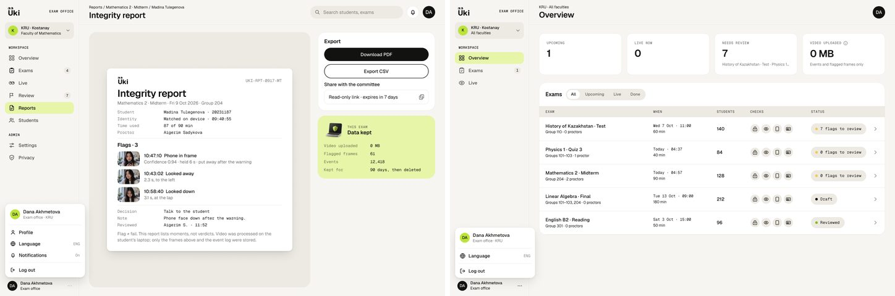 Same panel, header, separators and rows. Profile and Notifications are hidden on purpose (no Phase 1 page; A.7 is Phase 3) | 2026-10-08 |
| Figma 3.4a in Russian | pass |  “Язык РУС”, “Выйти”; the role line fits | 2026-10-08 |
| Figma 0.1b `84:5341` (why 0 MB) | pass | 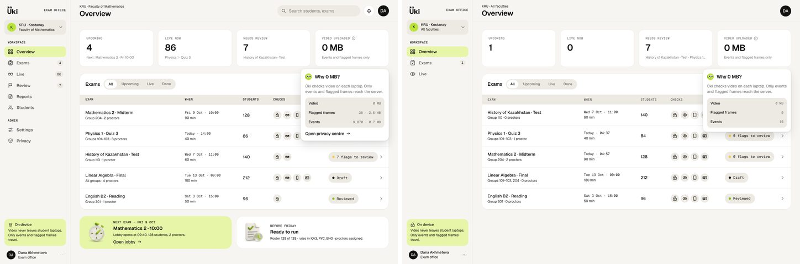 Same place under the tile, face, title, body and rows. The sizes (“· 2.6 MB”) and “Open privacy centre” are left out on purpose (decisions; the link returns with 1.12) | 2026-10-08 |
| Figma 0.1c `84:5436` (faculty switcher) | pass | 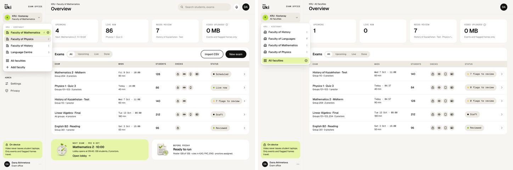 Same header, rows with building icon, count and check, separator and All faculties. Add faculty is hidden on purpose. The local workspace has no faculty chosen, so All faculties is checked | 2026-10-08 |
| Figma 0.1 `51:2046` in Russian | pass | 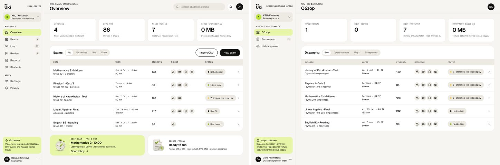 Layout as in English; dates as “ср, 7 окт”. The long role label “Экзаменационный отдел” is clipped in the user block (P.18) | 2026-10-08 |
| Figma 2.4 `51:2080` in Russian | pass | 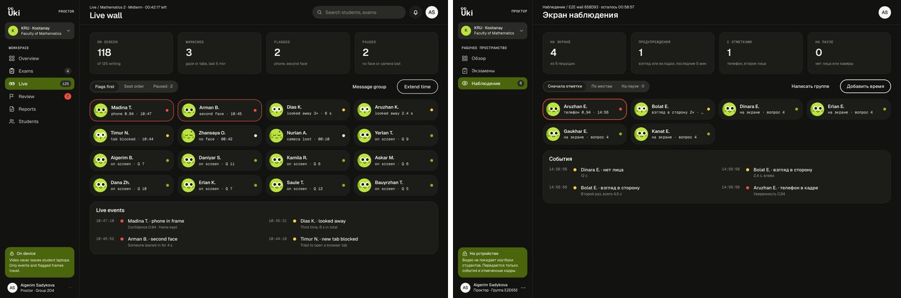 A throwaway live exam with 6 students (e2e wall fixture, removed afterwards). The longer Russian status line is cut on one tile (P.18) | 2026-10-08 |
| Native Russian read-through of every dashboard string | pending | P.18, you, Wed 14 | |

## 1.6 Ask proctor

Branch `wp/1.6-ask-proctor` (PR #12). Ran on the development MacBook against a third local Supabase stack, project `uki-w16` on ports 549xx with CLI 2.107.0, so the main stack on 547xx stayed untouched; `next dev` on port 3402. The Figma comparisons put the frame on the left and the page on the right at the frame's size, scaled to half: the dashboard at 1440 × 960, the student app and the browser window at 1280 × 800 (the window cut out of the 1440 × 960 frame). The pages show the local stack's data, so names, numbers and questions differ from the frames. Choices are logged in `docs/decisions.md` under "1.6 Ask proctor".

| Check | Status | Evidence | Date |
| --- | --- | --- | --- |
| `help_from_event` takes E.5a's four reasons | pass | `20261010060000_help_topics.sql`: break and other are stored as themselves, an unknown topic is still technical. `supabase test db`: 15 files, 771 tests, all pass, after the migration on the second stack; the new `15_ask_proctor` has 14 (topics from the app and from the Lock, two proctors of one exam reading every request, Mark done by the second proctor without a message command, the closing broadcast with `done_at`, a second closing changing nothing) | 2026-10-08 |
| A clean reset with the new migration | pass | `supabase db reset` on the new stack applied the 15 migrations, `20261010060000_help_topics.sql` last, and the seed; pgTAP again after it: 15 files, 771 tests, pass | 2026-10-08 |
| Unit tests | pass | contracts 443 (`HELP_TOPICS`, `ASK_REASONS`, each reason as a Lock event); ui `help.test.tsx` 5 (`AskProctorPanel`, `HelpRequestsPopover`, `HelpRequestRow`, the Lock bar's lime state); web 206 with `help-model` 4, `help-data` 4, `help-requests` 8 (badge, popover, raised hand, Mark done, Reply, the broadcast, the catch-up read, the exam office without buttons) and `event-copy` (the five topics); desktop 411 with five new flow tests (ASK_HELP from 2.1 and 2.3, not from 2.1c; the reply as 2.1e; a message over 1.3a; ready with the rules language), two runtime tests (the Lock's request answered with `help.queued`, also on a resend; the app's request through a network cut) and five screen tests; lock 129 with the controller (content.help, help.queued) and the overlay sheet in kk, ru and en | 2026-10-08 |
| 2.4d in Russian with no missing key | pass | `apps/web/test/help-russian.test.tsx`: the Requests button, the popover with both requests, a raised hand on a tile and the Reply dialog in `ru`; no next-intl error and no raw `dashboard.*` key | 2026-10-08 |
| Dashboard e2e: a request on 2.4d, Reply, Mark done across two proctors' walls | pass | `e2e/help.spec.ts` with `UKI_E2E_PORT=3402 pnpm e2e`: 6 of 6 (Phase 0's 4, the language test and this one). Two proctors of one live fixture exam each open the wall; requests through ingest raise "Requests · 2" and "raised hand" on both; Reply on the lead's wall writes the `message` command `{ text: "Radians.", scope: "student" }` and clears the request on the second wall; Mark done on the second wall clears the lead's badge, with `done_by` the second proctor and no command; a reload with requests open writes one `help.read` audit row | 2026-10-08 |
| Request to 2.4d latency, local | pass | The event's `at` to the Requests badge changing in each page (a MutationObserver stamp; page clock minus test clock 0.5 ms), 24 requests on two walls: n = 48, p50 24 ms, p95 60 ms, max 108 ms (`docs/evidence/phase-1/1.6/help-latency-local.json`). In the full `pnpm e2e` run, after one uncounted warm-up request (an earlier run's first request paid 1 971 ms for a cold edge isolate): n = 48, p50 34 ms, p95 93 ms, max 104 ms (`help-latency-local-suite.json`). The plan's 1 s at p95 holds locally | 2026-10-08 |
| Request to 2.4d latency, cloud | pending | Waits for P.2 (the cloud project); rerun `e2e/help.spec.ts` against the Vercel dashboard with `UKI_E2E_BASE_URL` | |
| Desktop e2e: Ask proctor from 2.1 with the reply as 2.1e; 1.4a; `rules_accepted_at` once | pass | `pnpm --filter desktop e2e` with `SUPABASE_WORKDIR` on the new stack: 15 of 15, three times (2.7, 2.0 and 2.0 min). 1.4a opens in place; ready stamped `rules_accepted_at` with `rules_locale` en, unchanged after the screenshots in Kazakh and Russian and 12 s more in Russian. Ask proctor on 2.1: Question is unclear with a note reached `help_requests` 802 ms after the click on Send (through the outbox and ingest; polled every 300 ms, Playwright's click included), the lead's `close_help_request` reply showed as 2.1e in 16 to 413 ms over three runs, and 2.1e replaced the help banner. On 2.3 the button is the element at its own centre, above the veil. Every proctor command within 1 s, the reply included. `docs/evidence/phase-1/1.6/desktop-e2e.json`. The sheet 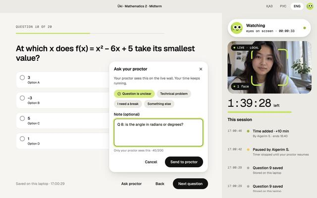, the banner after Send  and the reply 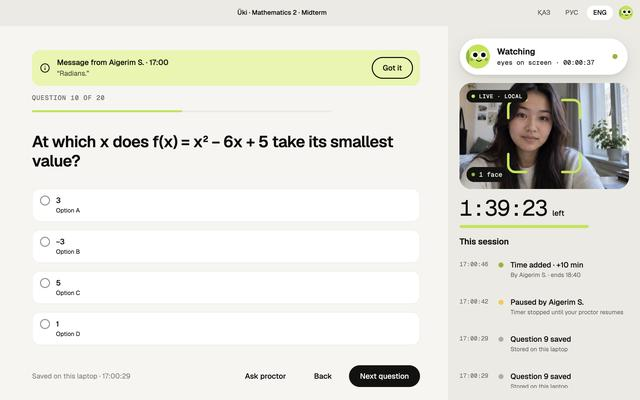 | 2026-10-08 |
| Lock smoke: E.5a through the app | pass | `pnpm exec tsx apps/lock/scripts/smoke.ts` (Chrome for Testing, the built extension and the app's real relay): PASS. Ask proctor in the bar, Technical problem with the note, Send: the relay received `lock.event` `student.help_requested` `{ topic: "technical", text: "The calculator tab doesn’t open." }` filed under the locked exam; the sheet waited with Send loading until `help.queued` with the event's id, then confirmed 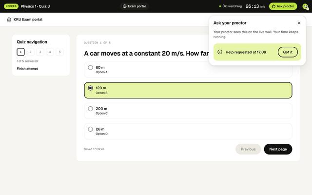. The app's own side (queueing the Lock's event and answering `help.queued`, also on a resend) is the desktop runtime test above. Another agent's Electron held a relay port twice, so the run waited for free ports | 2026-10-08 |
| `pnpm check` | pass | Exit 0: Biome 790 files, guards 819 files, turbo 22/22 tasks. Tests: contracts 443, ui 178, web 206, desktop 411, lock 129, i18n 48, detection 102, tokens 30, lms-mock 8, db 6; functions-unit 61; scripts 83. The Windows runner took over 5 s for the first wall render (4.3 to 4.6 s on main before); main's shared Vitest base now allows 20 s (PR #18) | 2026-10-08 |
| `pnpm test:integration` against the second stack | pass | 16 files, 86 tests, with `supabase functions serve` on `uki-w16` (`SUPABASE_WORKDIR` points the tests' CLI lookup at it) | 2026-10-08 |
| CI on the pull request | see the PR | | |
| Figma 2.4d `155:11803` | pass | 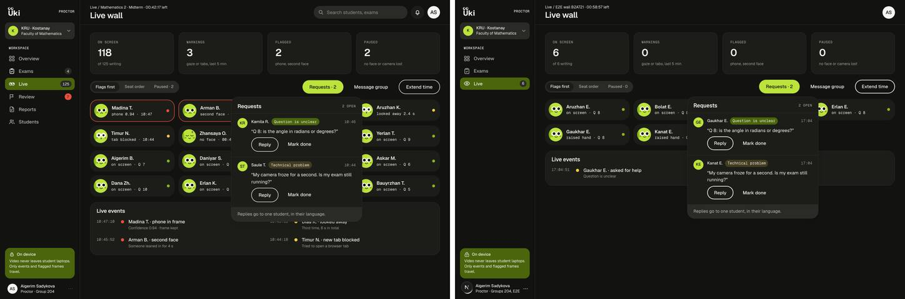 Requests · 2 (Button Brand) before Message group; the popover 420 wide under it with head, rows (lime avatar, name, reason pill on brand-subtle or warn-subtle, time, the note in quotes, Reply and Mark done) and the bg/subtle footer; "raised hand · Q 8" on the asking students' tiles. The popover sits 5 px right of the frame's because the toolbar's buttons are 5 px right (Phase 0) | 2026-10-08 |
| Figma 2.4d in Russian | pass | 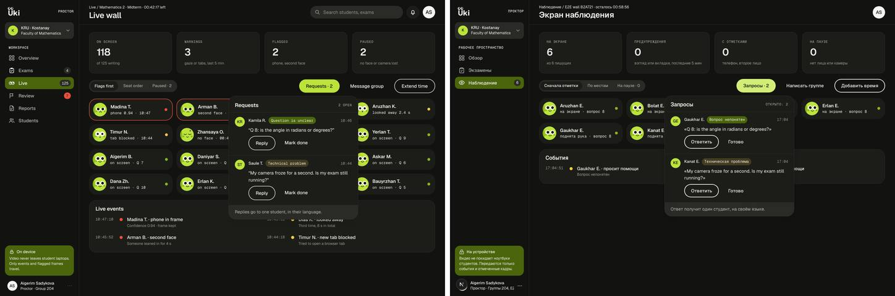 «Запросы · 2», «открыто: 2», Ответить and Готово fit | 2026-10-08 |
| Figma E.5a `152:11597` | pass | 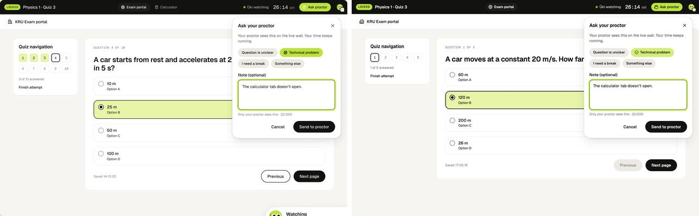 Ask proctor lime in the bar while the sheet is open; the sheet 24 px from the right, 11 px under the bar, 400 wide: title and close, body, four reason pills (the chosen one lime with the check), the note with its counter "32/200", Cancel and Send to proctor. The Calculator tab is E.5b's (WP 1.7); the app's floating widget in the frame is not the Lock's | 2026-10-08 |
| Figma 1.4a `87:8156` | pass | 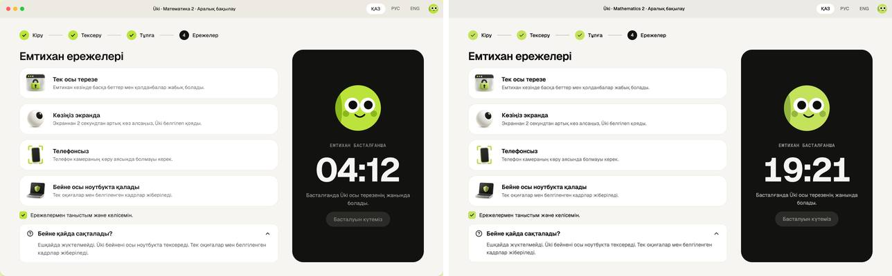 Kazakh, the box ticked and "Бейне қайда сақталады?" open in place; the disclosure's gap and the answer's opacity were fixed to the frame | 2026-10-08 |
| Figma 2.1 `51:2074`: Ask proctor | pass | 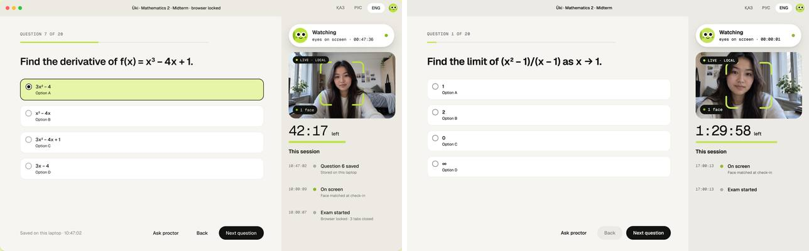 Ask proctor (Ghost) before Back in the footer | 2026-10-08 |
| Figma 2.2 `51:2076`: Ask proctor | pass | 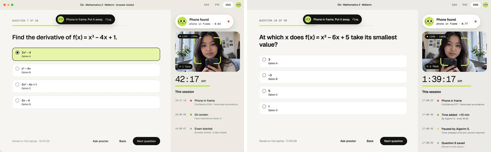 The same footer under the phone warning | 2026-10-08 |
| Figma 2.3 `51:2078`: Ask proctor | pass | 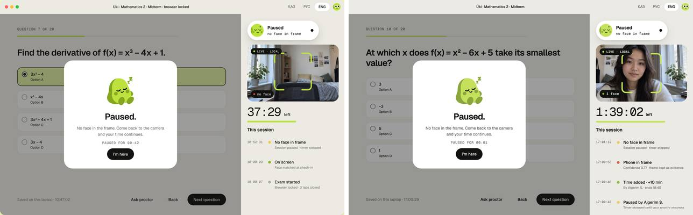 The same footer; the button sits above the veil and works there (decisions) | 2026-10-08 |
| Load test with 20 help requests | not-run | The plan's load row (120 sessions plus 20 help requests) needs `e2e/simulate` to send help requests; not built in this package. The 20-plus request measurement above stands in for it locally | |
| Ask proctor on the student machine in real Chrome and on a lab PC | pending | Hand check with the Demo Day script (step 8 and 11), you | |

## 1.7 Lock additions

Branch `wp/1.7-lock-additions` (PR #19). No migration and no stack: WP 1.1 already put `browser_rules` on `exams`, in `join_exam` and in `LockExam`. The Lock smoke runs the built extension in Chrome for Testing next to the desktop app's real relay in Node, with the mock portal on port 5191. The Figma comparisons put the frame on the left and the Lock on the right at the frame's size: E.5b as the 1280 × 800 browser window cut out of the 1440 × 960 frame, scaled to half; E.8 as the 360 px popup at full size. Choices are logged in `docs/decisions.md` under "1.7 Lock additions".

| Check | Status | Evidence | Date |
| --- | --- | --- | --- |
| `exam.state` carries `browser_rules` from the app | pass | `apps/desktop/src/renderer/flow/derive.ts` puts `join_exam`'s rules into `exam.state` (null from a server that sends none). `machine.test.ts` "sends the exam's browser rules (E.1) to Üki Lock in exam.state" parses the message with `AppToLock` | 2026-10-08 |
| Calculator unit tests (E.5b) | pass | `apps/lock/src/lib/calculator.test.ts`, 14 tests: E.5b's 2 × 25 ÷ 2 = 25 with the expression line, × and ÷ before + and −, 0.1 + 0.2 = 0.3, ±, % (200 + 10 % = 220), division by zero, C and Backspace, 12 digits, the keyboard, and a state with no history. `packages/ui/src/lock/lock-calculator.test.tsx`, 2 tests: the keypad in Figma's order, the key tones, the step down for long values and errors | 2026-10-08 |
| The calculator in the bar | pass | `lock-overlay.test.tsx` in kk, ru and en: the Calculator tab opens the page with the header and the student, computes from the keys and the keyboard, and Exam portal unmounts it, so it opens again at 0 with no expression. The division by zero shows `lock.calc.error`. With the calculator rule off there is no tab, and an open calculator closes. `blocked-page.test.tsx`: the block page opens the same calculator, and its text names the calculator only while the rule is on | 2026-10-08 |
| E.8 unit tests | pass | `popup-app.test.tsx` in kk, ru and en: time left with "left · ends 14:40", Exam portal and Calculator (built in), "NOTED · 4" with the latest three rows (title, time, host, kind or "Outside the exam window"), the footer, and Ask proctor. Also: no Calculator row with its rule off; an exam in the app with no sites and no Ask proctor; "Open the Üki app" while the link is down; the time standing still while paused. `controller.test.ts`: each blocked attempt is noted with its host or kind and the event's id, 25 attempts keep the latest 20 and count 25, the popup stays on while locked (and after a restart), and `popup.ask` brings the exam tab back and stamps `ask_at`. In an exam in the app it is refused. `index.test.tsx`: a newer `ask_at` opens E.5a's sheet, an older one does not | 2026-10-08 |
| E.1 rules, unit tests | pass | `controller.test.ts` "E.1 browser rules", 7 tests. Every switch off: no full screen, no exit noted, copy and print refused with no event, and the window left as it was at release. Copy and paste off with print on, and the reverse. Full screen switched on during the exam asks for it at once and counts the next exit. No `browser_rules` means every rule on. `guard.test.ts`: with copy and paste off the page keeps copy, cut, paste, the context menu and drag and drop; with print off it keeps Ctrl+P and the print style is gone. `index.test.tsx`: the content script follows a change of rules during the exam | 2026-10-08 |
| Lock smoke: E.5b offline, E.8, each rule on and off | pass | `SMOKE_PORT=5191 pnpm exec tsx apps/lock/scripts/smoke.ts`: PASS. **Rules on** (the first browser exam): E.4 says "Only the exam portal and the calculator stay open." The window is full screen right after the lock, the popup is `popup.html` while locked, and a copy and Ctrl+P are cancelled with the print style in place. The copy is noted once in its 10 s, and the print once. **E.5b offline:** with the context offline, the Calculator tab computes 2 × 25 ÷ 2 = 25 from the keys and 0.1 + 0.2 = 0.3 from the keyboard. The page makes no request, nothing new is in `chrome.storage.local` or the page's storage, and Exam portal then Calculator shows 0 again. **E.8:** the real toolbar popup, opened with `chrome.action.openPopup()` and read over the DevTools protocol, shows time left with the end, Exam portal `localhost:5191` and Calculator built in, and "NOTED · 4" with the latest three (Copy blocked/Print, New tab blocked/Outside the exam window, Site closed/127.0.0.1), matching the four attempts the relay received. Its Ask proctor opens E.5a's sheet in the exam tab. **Rules off** (a second browser exam): E.4 says "Only the exam portal stays open." There is no Calculator tab, a copy and Ctrl+P go through (`execCommand("copy")` is true) with no print style, and the window stays normal through a full screen and back. E.8 lists no calculator and nothing noted, and the relay received no event for that exam. One tab and the blocked sites still hold. The Phase 0 steps (pairing, E.5a, E.6, E.7, E.9, the exam in the app) still pass. Screenshots: 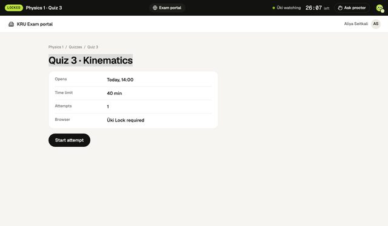 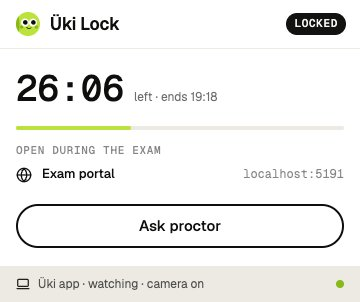 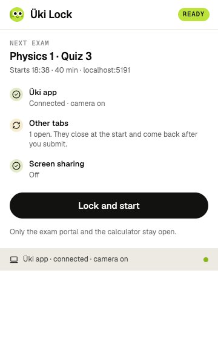 | 2026-10-08 |
| `pnpm check` | pass | Exit 0 on the branch rebased onto 1.8 (d6821a2): Biome 823 files, guards 852 files, turbo 22/22 tasks. Tests: lock 173 (129 before), ui 184, desktop 451 (2 skipped), web 244, contracts 443, i18n 48 (the shipped catalog now has 254 keys), detection 103, tokens 30, lms-mock 8, db 6; functions-unit 61; scripts 83. The smoke passed again after the rebase, on a host at load 32 from other agents' runs | 2026-10-08 |
| CI on the pull request | see the PR | The Linux build job runs the extended Lock smoke headless | |
| Figma E.5b `153:11724` | pass | 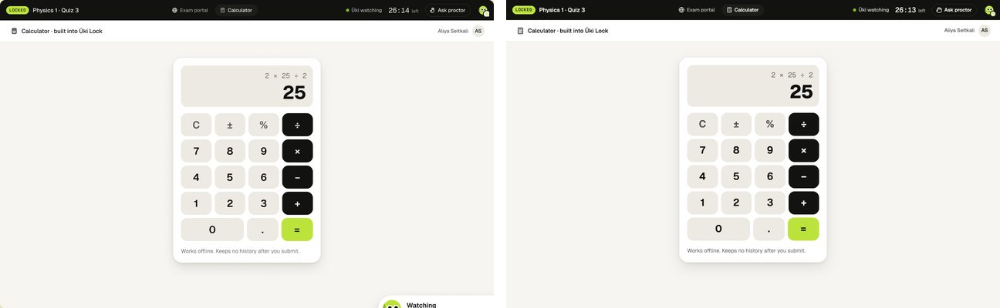 The bar with Calculator active and Exam portal dimmed; the header at 56 px; the card 384 wide, 40 px under the header, centred. The keys and the display match the frame to the pixel (edges measured at x 449 to 831). The times differ by a second. The app's floating widget in the frame is the app's, not the Lock's | 2026-10-08 |
| Figma E.8 `98:9927` | pass | 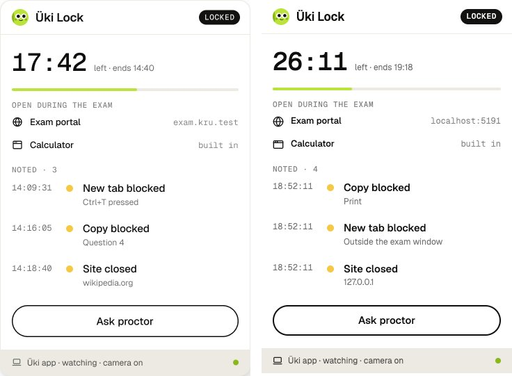 The real popup beside the frame's Ext/Popup · Locked: header, time and end, progress, OPEN DURING THE EXAM with two rows (the 2 px gap between rows was added to `LockPopupLocked` to match), NOTED with three Event rows, Ask proctor and the footer, within 2 px (Figma draws the popup's 1 px frame, which Chrome draws itself). The details are the Lock's (decisions) | 2026-10-08 |
| E.5b, E.8 and the rules in real Chrome on the MacBook, and in Chrome and Edge on a lab PC | pending | Hand check with Demo Day step 11 (calculator, E.8 with the noted attempts) and an exam with the rules off, you | |

## 1.8 Review

Branch `wp/1.8-review` (PR #14), built on the evening of 8 October against a second local stack, project `uki-w18` on ports 550xx, with `next dev` on port 3403. No migration: WP 1.1's `decide_session`, `add_session_note`, `review_queue` and `audit_read` carry the package. The choices are in `docs/decisions.md` under “1.8 Review”. The Figma comparisons put the frame on the left and the page on the right, both at 1440 × 960, scaled to half. The page shows the seeded History of Kazakhstan, where the frames show Mathematics 2. Seed v1's flags have no stills, so for the screenshots three History flags got the brand kit's evidence pictures as stills on the local stack only (`frames` rows and Storage objects, not in the seed); seed v2 (1.14) brings stills of its own.

| Check | Status | Evidence | Date |
| --- | --- | --- | --- |
| History of Kazakhstan's 7 flags review to `reviewed` | pass | `e2e/review.spec.ts` as Dana (exam office): 3.2 lists 5 sessions and “7 flags in total”, and the sidebar's Review count reads 5. Mark reviewed on 2.4a decides seat 33 (`no_issue`, reviewer Dana). Save and next on 3.3 decides the other four one after another (“1 of 4”, then “1 of 3”…) and lands on “Nothing to review”. All 5 sessions have a decision, and the exam is `reviewed` | 2026-10-08 |
| A flag after a decision puts the session back in the queue | pass | The same test inserts a `face.second` on seat 21 after its decision. 3.2 lists that one session as Needs review, and a new decision empties the queue again. Unit: `review-model.test.ts` (a later flag reopens only itself; compared on `received_at`, so an offline laptop's late flag counts). pgTAP `11_help_review` (WP 1.1) covers the same rule in SQL | 2026-10-08 |
| Notes show in 2.5 and 3.3 | pass | e2e: Add note in Madina's 2.5 drawer stores a `proctor.note` (source `proctor`, review `none`, Dana's id). It shows in the drawer's timeline through the exam channel, then on 3.3's timeline. Component: `timeline-drawer.test.tsx` (the note sent trimmed; the field kept and a toast on a refusal) | 2026-10-08 |
| Every read of student data writes its audit row | pass | e2e reads `audit_log` after the run. It finds `review.queue_viewed` (one per exam on 3.2), `review.session_viewed` for each session opened on 3.3, 6 `review.decide` and 1 `session.note`, all by Dana. Stills go through Phase 0's `stills` function, one `still.viewed` per still | 2026-10-08 |
| 3.2a filters through `?flag=`; 3.2b previews a still | pass | e2e: ticking Phone in frame and pressing “Show 2 flags” leaves 2 rows and `?flag=phone.detected`. `test/review.test.tsx`: nothing changes before Show, Clear and Show bring back every type, and the hover card asks `stills` for the top flag only when it opens | 2026-10-08 |
| Unit tests: queue rule, grouping, filters | pass | `apps/web/src/features/review/review-model.test.ts`, 22 tests: the queue rule (decided, reopened, receive time, non-flags), grouping and order, top-flag lines, tabs, the flag filter and its counts, `?flag=` parsing, the search, stat cards, median and durations, and Save and next with wrap-round. `wall-tile.test.tsx` covers Mark reviewed: a Flagged tile turns back, and the item is off without an open flag. `@uki/ui` gains `flag-preview.test.tsx` and `dropdown-filter.test.tsx` | 2026-10-08 |
| 3.2 and 3.3 render in Russian with no missing key | pass | `apps/web/test/review.test.tsx`, “3.2 and 3.3 in Russian”: 3.2 with tabs, the Reviewed tab and 3.2a open, and 3.3 with the decision form. Every test of the file fails on any next-intl error, and the Russian ones also fail on a raw `dashboard.*` key. 102 keys in `packages/i18n/dashboard-review.json`, Russian marked for P.18 | 2026-10-08 |
| `pnpm check` | pass | Exit 0 on the branch rebased onto main at 3873aad (after 1.6 and P.10): Biome 818 files, guards 847 files, turbo 22/22 tasks (web 244 tests, ui 182, contracts 443, desktop 450, lock 129, i18n 48 with 416 dashboard keys), functions-unit 61, scripts 83. The review component tests now use main's shared 20 s Vitest base (PR #18) instead of their own | 2026-10-08 |
| `pnpm e2e` against the second stack | pass | 8/8 after the rebase with `UKI_E2E_PORT=3403`, `supabase functions serve` on `uki-w18` and a clean `db reset` with all 15 migrations: the 4 Phase 0 tests, 1.6's help test, the language test and the two review tests (the History run 6.6 s, and a proctor of Mathematics 2 who sees no History row on 3.2 and gets a 404 on its 3.3). Wall p95 13 ms | 2026-10-08 |
| pgTAP 01 to 15 | pass | `supabase test db` on `uki-w18` after a clean `db reset` with all 15 migrations on main: 15 files, 771 tests. `11_help_review`'s audit-row count counts only its own transaction's rows (`at >= now()`), because the review e2e leaves `review.decide` rows on the stack (“pgTAP tests count only their own rows”) | 2026-10-08 |
| `pnpm test:integration` against the second stack | pass | 16 files, 86 tests after the rebase, with `supabase functions serve` on `uki-w18`. The functions are unchanged; the run checks that the wall's and the stills' functions still answer as 3.2b and 3.3 expect. `test/integration/stack.ts` asks `supabase status` in the repository, which names the main stack, so the run used a `supabase` shim that adds `--workdir` for the second stack | 2026-10-08 |
| CI on the pull request | pass | PR #14 at b89903f, rebased onto main after 1.6 and P.10: every job of the push run 37784562373 and the pull-request run 37784568782 passed (lint, guards, types and unit tests; database, functions, desktop flow and dashboard e2e with `review.spec.ts`; the web, portal and Lock builds; the macOS dmgs; Windows unit tests, zips, installer and launch test; the secret scan). An earlier run, 37774758913 at 48fbb5e, had passed too; its push twin timed one review component test out at 5 s, which main's shared 20 s base now covers. Merged as d6821a2 | 2026-10-08 |
| The review on the cloud project | pending | You, Sunday 11 (“Try the wizard and the review on the cloud project”), after P.2 | |
| Figma 3.2 `51:2092` | pass | 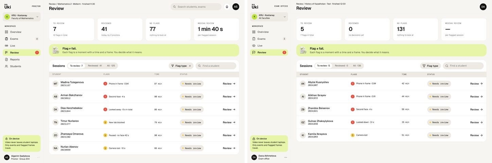 Same stat cards, “Flag ≠ fail.” with the 3D report art, Sessions card, tabs, filter pill, search, header row and Row/Session rows. Data differs: History has 5 sessions to review and no decisions, so Reviewed reads “no decisions yet” and Median “—”. The Flag type pill shows no count without a filter. Search and the bell stay hidden (Phase 0) | 2026-10-08 |
| Figma 3.2a `87:8275` | pass | 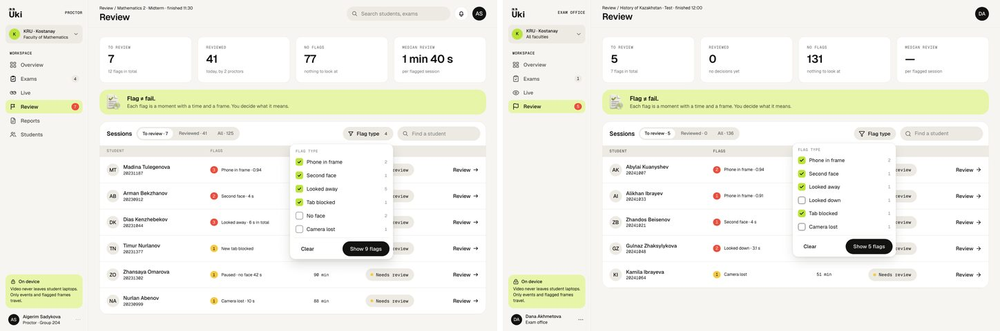 Same panel under the pill: FLAG TYPE header, checkbox rows with counts, separator, Clear and “Show N flags”. History has no No face flag but a Looked down, so the rows differ | 2026-10-08 |
| Figma 3.2b `87:8524` | pass | 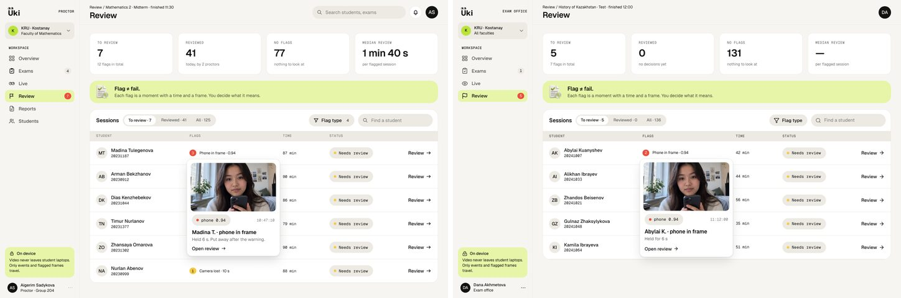 Same card 9 px left of the first row's flags: frame, chip, time, “name · phone in frame”, detail and Open review. The detail reads “Held for 6 s” as on 2.5; Figma's “Put away after the warning” has no data | 2026-10-08 |
| Figma 3.3 `51:2094` | pass | 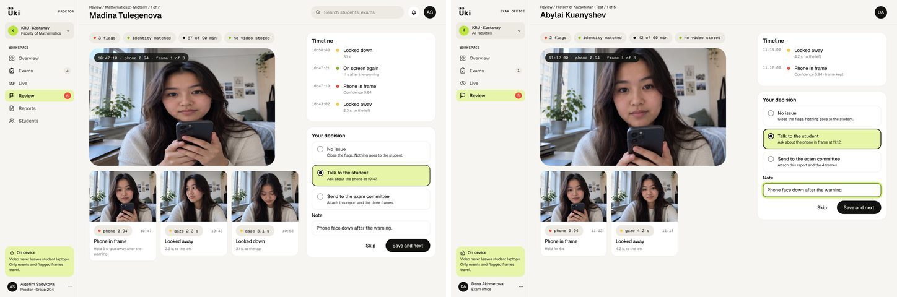 Same summary chips, large frame with its stamp, evidence cards, Timeline card, decision card, Note field, Skip and Save and next. History's seat 7 has 2 flags (Figma: 3). Talk to the student reads “the phone in frame at 11:12”; committee counts the frames as a number | 2026-10-08 |
| Figma 3.2 and 3.3 in Russian | pass | 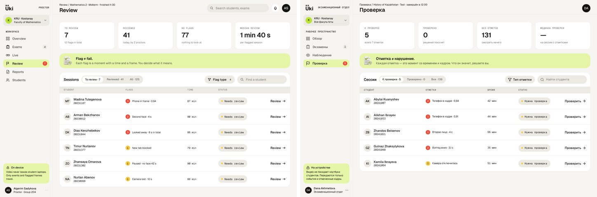  Layout as in English; the evidence cards' times wrap under the longer Russian chips | 2026-10-08 |
| Figma 2.4a `85:6504` (Mark reviewed) | pass | 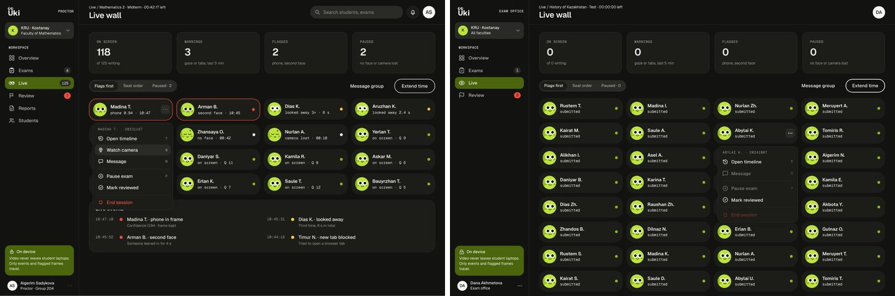 Mark reviewed with icon/check after Pause exam, as in the frame. History's tiles are all Done (the exam is over), where the frame shows a live Mathematics 2 | 2026-10-08 |
| Figma 2.5 `51:2082` (Add note) | pass | 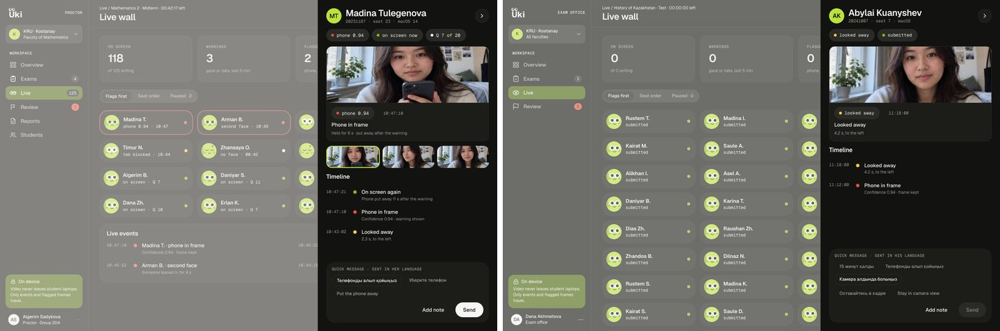 Ghost Add note beside Send, as in the frame (Send is off: the session is submitted). 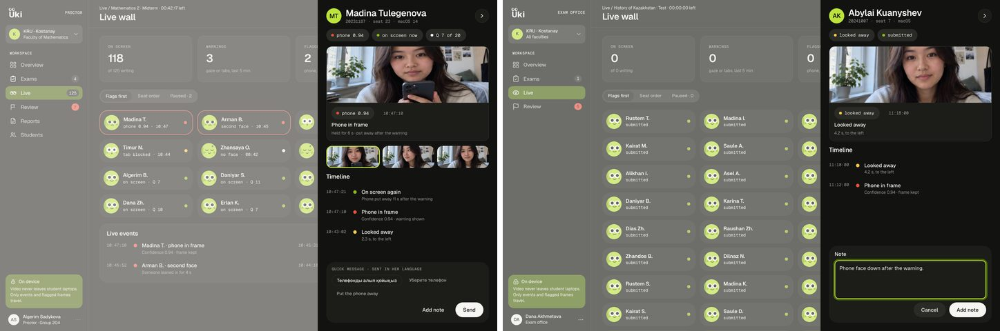 The note field that Add note opens has no frame of its own | 2026-10-08 |

## 1.4 Invites

Branch `wp/1.4-invites` (PR #23). Ran on the development MacBook against a fourth local Supabase stack, project `uki-w14` on ports 549xx with CLI 2.107.0 and supabase-edge-runtime 1.74.1, so the main stack on 547xx stayed untouched. `supabase functions serve` loaded an env file whose `RESEND_BASE_URL` pointed at the Resend stub on port 54990; no real email left the machine. The Figma comparisons put the frame on the left and the email on the right. Choices are logged in `docs/decisions.md` under "1.4 Invites".

| Check | Status | Evidence | Date |
| --- | --- | --- | --- |
| `send-invites`: who may call | pass | `test/integration/send-invites.test.ts`: no token 401; a student, a proctor of the exam and another workspace's exam office get 403 for a send and for a test invite, and the stub receives nothing; a body outside `SendInvitesInput` is 400 | 2026-10-08 |
| A full send in batches of up to 100, each email in its student's language | pass | 103 students in kk, ru and en: the stub got two batches, 100 and 3, with the function's key. Each email has its student's language (`lang`, subject, title, footer), the code, the student number, the name (HTML-escaped for `Aisha O'Neil & <Co>`) and a plain-text part. Every invite is `sent` with the stub's id and `sent_at`; every `exam_students.invite_status` is `sent`; one `invites.send` audit row with the counts. 103 emails in 930 ms on the first run and 317 ms on the second (the laptop's load average was about 30) | 2026-10-08 |
| Nothing goes twice; a resend by student id | pass | A second call sends nothing (`{ sent: 0, failed: [] }`). `student_ids` sends a sent and a failed invite again and names an id with no invite in `failed` | 2026-10-08 |
| A failed batch marks its rows failed | pass | The stub refuses the second batch with 422 "Invalid `to` field.": `{ sent: 100, failed: [3 × "Resend 422: Invalid `to` field."] }`, those 3 invites are `failed` with the message and no provider id, `invite_status` `failed`; the next call sends exactly those 3. A 500 marks its batch `failed` too | 2026-10-08 |
| The test invite | pass | Goes only to the signed-in exam office's address (or the sink), in their first language (kk), with "Test invite ·" in the subject, written for seat 1; `invites` unchanged; an `invites.test` audit row. On a draft it shows the code `buildExamCode` predicts, while a real send on the draft answers 409. A refused test invite comes back as `failed: [{ student_id: null, … }]` | 2026-10-08 |
| `UKI_EMAIL_SINK` redirects every recipient, the content stays the student's | pass | The same 15 tests again with `UKI_EMAIL_SINK` in the served env file: every `to` is the sink, the test invite included; each email keeps its student's language, name, number and group. CI runs the file a second time with a sink (`ci.yml`) | 2026-10-08 |
| Deno renders what Node renders | pass | The function's email for one student equals `renderInvite` under Node byte for byte, HTML and text, so the unit snapshots are what Resend receives | 2026-10-08 |
| No tracking | pass | `email.test.ts` and the integration test: three image addresses, the same for everyone, with no query string; one link (the download button); no web font. Resend's open and click tracking stays off (decisions) | 2026-10-08 |
| Unit tests | pass | `supabase/functions/send-invites`: `email.test.ts` 14 (0.8 in kk, ru and en as HTML and text file snapshots in `__snapshots__/`, Asia/Almaty times across midnight, the Kazakh letters as text under the system font stack, images, the roster footer, the test subject, the template fill equal to a direct render), `messages.test.ts` 7 (the formatter equals use-intl for every email key, language, weekday and month), `resend.test.ts` 8 (ids in order, 422, 502, a network error as status 0, a short reply, one retry after a 429), `config.test.ts` 5; `deno-config.test.ts` 8 (send-invites pins React and React Email to the workspace's versions); contracts `invites.test.ts` 10 | 2026-10-08 |
| `pnpm check` | pass | Exit 0 after the rebase onto 1.8: turbo 22/22 tasks (contracts 453, i18n 48, web 244, desktop 450, ui and the rest as on main), functions-unit 97, scripts 83. Before the rebase: Biome 815 files, guards 847 files | 2026-10-08 |
| `pnpm test:integration` against the fourth stack | pass | 21 files, 137 tests. In the first full run 136 passed: `ingest.test.ts` "allows at most 10 calls a second per session" failed with the laptop's load average at 30 to 34 (25 parallel calls all answered 200, so no 1 s window held 10 of them). After the rebase onto 1.8, `ingest.test.ts` and `send-invites.test.ts` passed together (2 files, 23 tests) at a load of 19. This package does not touch ingest or its rate limit. In CI the whole suite passes, and `send-invites.test.ts` runs a second time with a sink | 2026-10-08 |
| pgTAP | pass | `supabase test db` on the fourth stack: 15 files, 771 tests. WP 1.4 adds no migration | 2026-10-08 |
| CI on the pull request | see the PR | | |
| Figma 0.8 `161:13438`, desktop, English | pass | 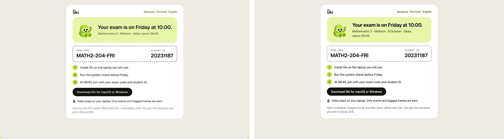 The frame's email stage (1280 × 718, under the mail viewer's header) and the email at 1280 × 718, scaled to half. Same card, hero, dashed code box, steps, button, privacy line and footer. Differences: the system font instead of Geist; the date in the hero's second line, which wraps; the footer names the student and leaves out the address (decisions). The card is 587 px tall against the frame's 588 | 2026-10-08 |
| Figma 0.8, the card at 1:1 | pass | 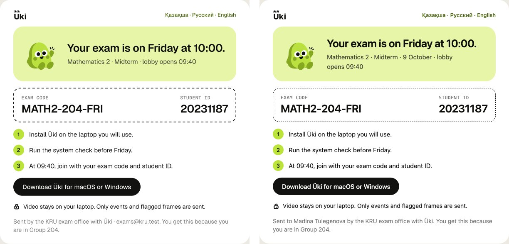 600 × 588 each. Chrome draws the 1.5 px dashed border 1 px wide at 1x and with shorter dashes than Figma | 2026-10-08 |
| Figma 0.8 in Kazakh and Russian | pass | 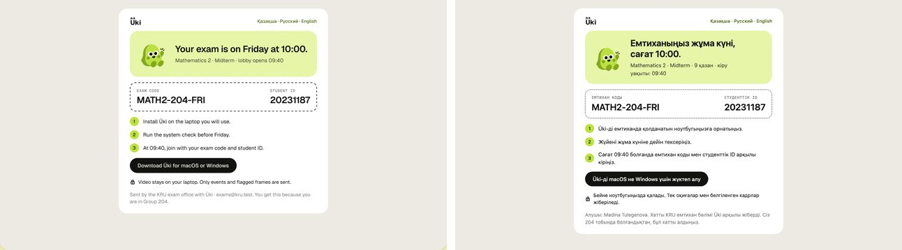 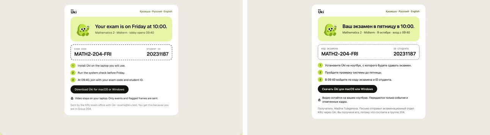 The Kazakh title takes two lines; every Kazakh letter is drawn by the system font | 2026-10-08 |
| 0.8 at a 390 px phone width | pass | 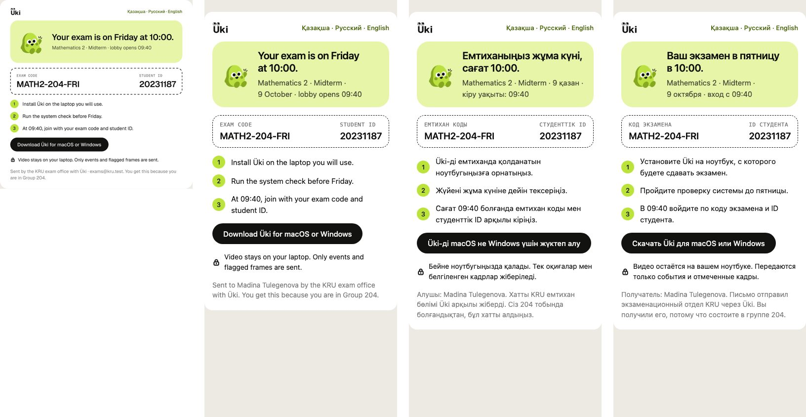 The frame's card scaled to 390, then en, kk and ru at 390 × 844: no sideways scroll, the mascot at 64 px, the title at 21 px, the time and the date kept on one line | 2026-10-08 |
| Test and real invites in Gmail (web) and Apple Mail, in Kazakh and Russian | pending | Hand check for you on the cloud project, after `pnpm supabase:deploy` (or the deploy workflow): set `RESEND_API_KEY`, `UKI_EMAIL_SINK` (your inbox) and `UKI_WEB_URL` (the dashboard's address, for the images) with `supabase secrets set` (`docs/runbooks/cloud-setup.md`), then send a test invite from 0.5 with your staff language set to kk and then ru | |
| `send-invites` deployed on the cloud project | pending | P.2. The bundle now carries React and React Email; check the deploy log for its size against the 20 MB limit | |
| 0.5, 0.3 and 0.3b call `send-invites` | pending | WP 1.3 turns on `SEND_INVITES_READY` and imports `SendInvitesInput` and `SendInvitesOutput` from `@uki/contracts` | |

## 1.5 Proctor home and lobby

Branch `wp/1.5-proctor-home` (PR #20). Ran on the development MacBook against the main local stack (547xx, all migrations on main and the seed); no migration was needed. `next dev` on port 3405. The Figma comparisons put the frame on the left and the page on the right at 1440 × 960, scaled to half. The pages show the local stack's data: one assignment for Nurlan where 0.9 draws three, and a throwaway lobby whose names copy 1.5a's. Data differences are not listed. Choices are logged in `docs/decisions.md` under "1.5 Proctor home and lobby".

| Check | Status | Evidence | Date |
| --- | --- | --- | --- |
| Proctors land on 0.9 (`/my-exams`) after sign-in | pass | `PROCTORS_LAND_ON_MY_EXAMS = true` in `apps/web/src/features/shell/shell-model.ts`. `shell-model.test.ts` covers a proctor going to `/my-exams` and the exam office to `/overview`. `sign-in/actions.test.ts`: a proctor's sign-in redirects to `/my-exams`. `my-exams-page.test.tsx`: the exam office is sent to `/overview`, and a failed lookup shows Try again. e2e: Nurlan's sign-in lands on `/my-exams` | 2026-10-08 |
| 0.9 lists the proctor's assignments with the banner and the stat cards | pass | `my-exams-model.test.ts` (9): rows, chips, the banner's choice, the four cards on 0.9's own data (146 students, 3 exams this week and next, 1 to confirm), Today, weekday or date. `my-exams-view.test.tsx` (5): 0.9's texts row by row, Confirm seats as a button only where it applies, the empty list | 2026-10-08 |
| 0.9a: `confirm_seats` without text confirms, with text asks for a change | pass | `my-exams-view.test.tsx`: Confirm seats from the chip sends `{ exam_id }`, then the row reads Confirmed and the banner goes. Review, Ask for a change, Back and Send request send the trimmed note, then the row reads Change requested. A failure keeps the dialog open. `my-exams-page.test.tsx`: the server action checks its input with Zod (bad id, 501 characters), maps `forbidden`, refuses an unexpected reply and revalidates `/my-exams` | 2026-10-08 |
| A change request reaches the exam office | pass | Not on 0.5 or the wizard's proctor table: those are WP 1.3 (#16), not merged. Until then it shows on 0.1's exam row (chip "Change requested") and in the lobby (a banner with the proctor, the seats and the note), for the exam office only. `lobby-card.test.tsx` covers the banners and `proctor-russian.test.tsx` the 0.1 chip; the e2e checks both on Dana's screens | 2026-10-08 |
| 1.5a: the student card on a lobby row | pass | `lobby-card.test.tsx` (8): opens after the pointer rests 300 ms and closes 200 ms after it leaves; stays open while the pointer moves onto the card; moves to the next row's card; opens by click; takes the focus from the keyboard and gives it back on Escape, but never on hover. It shows the step and its bar, retry 2 of 3 or 3 of 3 tries, the Problem and the Device, and Identity help only for a student held by the card check. `lobby-card-model.test.ts` (7): the bar per state, the tries, the problem fact, who gets Identity help, the log | 2026-10-08 |
| 1.5b: Send hint issues a `message` command | pass | `lobby-card.test.tsx`: the drawer from the card with the student, the device, "3 of 3 tries", the log (help request and message with their Almaty times), the 200-character hint and its helper "Sent in English, Madina’s app language · 37/200". Send hint sends `{ session_id, type: "message", payload: { text, scope: "student" } }` and toasts; a failed command keeps the drawer and the text | 2026-10-08 |
| Dashboard e2e (`e2e/proctor.spec.ts`) | pass | `UKI_E2E_PORT=3405 pnpm exec playwright test -c e2e/playwright.config.ts proctor.spec.ts`: 2 of 2, three times (alone, in the full run below, and with `dashboard.spec.ts` after the rebases onto WP 1.7 and WP 1.4, 6 of 6 each time). (1) Nurlan signs in and lands on 0.9. On Mathematics 2 he asks for a change, which lands in `proctor_assignments.change_request`. Dana's 0.1 row reads Change requested, and her lobby shows "Nurlan Bekov asked to change seats 65–128" with the note. Nurlan then confirms seats 65 to 128: `confirmed_at` is set, the request cleared, and the audit rows read `seats.change_request` then `seats.confirm`. (2) On a throwaway lobby, hovering a row opens 1.5a, and moving to the next row opens that row's card. Identity help opens 1.5b with the help request in the log. Send hint writes one `session_commands` row `message` `{ text, scope: "student" }` issued by Aigerim, the student's next ingest reply carries it in `pending_commands`, and one `identity_help.read` audit row is written. The main stack's Mathematics 2 had started, so the test moved it back to scheduled and restored it after; checked afterwards | 2026-10-08 |
| The hint reaches the student machine as 2.1e | pass, hand check pending | The command reaches the app's channel: the ingest reply in the e2e above. The app showing a `message` as 2.1e over 1.3a is WP 1.6's flow test ("a message over 1.3a") and its desktop e2e. A hint seen on the real student machine is a hand check with the Demo Day script, step 5, you | 2026-10-08 |
| Full dashboard e2e (`pnpm e2e`) | pass, 1 not this package | `UKI_E2E_PORT=3405 pnpm e2e`: 9 of 10 pass: dashboard 4 (the proctor tests now open the overview after landing on 0.9), language 1, proctor 2, review 2. `help.spec.ts` failed at its first ingest with `events.0.data.topic: Invalid option`. The shared main stack's edge runtime serves the coordinator's checkout, whose `supabase/functions/_shared/contracts` predates WP 1.6's topics (it needs `pnpm functions:sync` there); this package changes neither the functions nor the contracts. CI runs it on a fresh stack | 2026-10-08 |
| 0.9, 0.9a, 1.5a and 1.5b in Russian with no missing key | pass | `apps/web/test/proctor-russian.test.tsx` (3): 0.9 with the banner and rows, 0.9a in both steps, the lobby row, 1.5a on hover, 1.5b and the change-request banner, and 0.1's Change requested chip, all in `ru`. Each fails on any next-intl error or raw `dashboard.*` key | 2026-10-08 |
| The network type on the lobby row | not-run | The data does not exist. `sessions.device` holds os, app version, browser and Lock version; `status.detail` has only network problems at the system check. The app collects neither the network type nor the OS version, so the rows keep "macOS · Üki 1.4.2" (decisions). Call stays hidden | 2026-10-08 |
| `pnpm check` | pass | Exit 0 on the branch rebased onto WP 1.4 (ad8db6b): Biome 859 files, guards 891 files, turbo 22/22 tasks. Tests: web 284, ui 188 (Drawer, Dialog `onCancel`, the Row/Exam status button), contracts 453, desktop 451, lock 173, i18n 48; functions-unit 97; scripts 83 | 2026-10-08 |
| `pnpm i18n:build` | pass | 486 dashboard keys in en and ru. `dashboard-proctor.json` holds 70 keys with first-pass Russian for P.18 | 2026-10-08 |
| pgTAP and `pnpm test:integration` | not-run locally | No migration, function or contract changed: `confirm_seats` and `issue_command` are WP 1.1's and Phase 0's, covered by `10_wizard` and `06_commands`. CI runs both | |
| CI on the pull request | pass | At 8dec3ae (on WP 1.7): every job of the pull-request run 37791603155 and the push run 37791611177 passed: lint, guards, types and unit tests; database, functions, desktop flow, dashboard smoke test (with `proctor.spec.ts` on a fresh stack) and demo scripts; the web, mock portal and Lock builds; the macOS and Windows jobs; the secret scan. After the rebase onto WP 1.4: see the PR | 2026-10-08 |
| Figma 0.9 `164:13518` | pass | 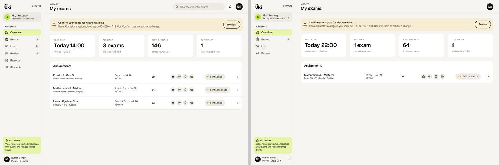 Same banner (Banner Warn with Review), four stat tiles, Assignments card with Row/Exam rows: seats and languages, when, students, checks, the chip ("Confirm seats" a button) and the chevron. Search and bell hidden (Phase 0); the user line is the shell's | 2026-10-08 |
| Figma 0.9 in Russian | pass | 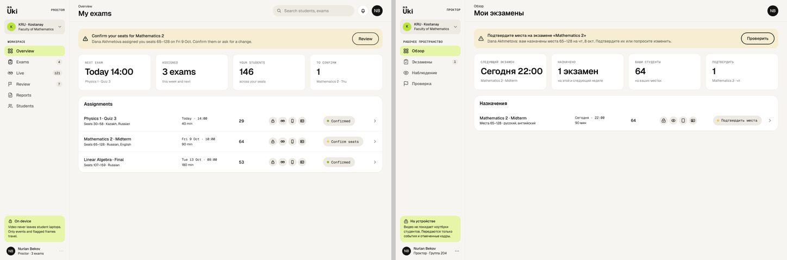 «Сегодня 22:00» on one line; «Подтвердить места» fits the chip | 2026-10-08 |
| Figma 0.9a `164:15836` | pass | 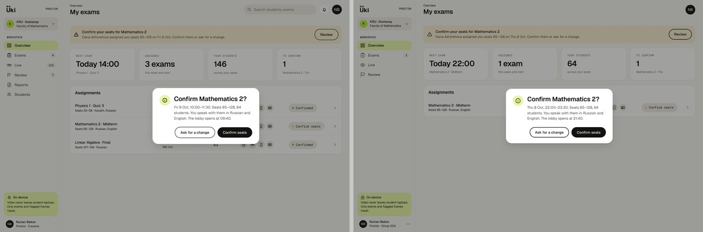 Dialog 440 wide over the page beside the sidebar (moved there from the window's centre); info badge, title, the sentence with the times, seats, students, languages and lobby; Ask for a change (Secondary) and Confirm seats | 2026-10-08 |
| Figma 0.9a in Russian | pass | 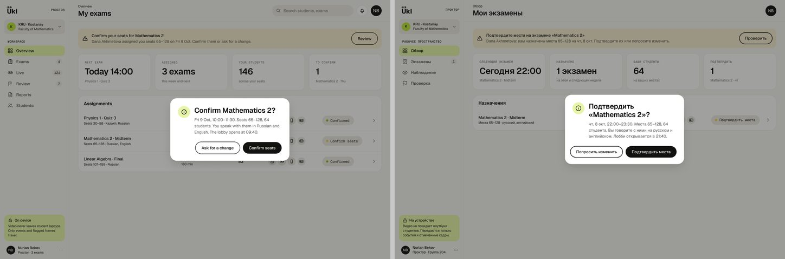 «Вы говорите с ними на русском и английском» | 2026-10-08 |
| Figma 1.5a `85:6412` | pass | 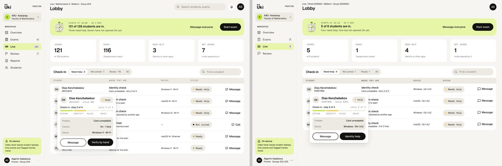 Popover/Student at the frame's place under Dias's row: avatar, name, number · group, the help chip, "Check-in · step 2 of 4" with retry 2 of 3, the bar (lime, yellow, two grey) with the step names, the facts and two buttons. Camera is left out and Verify by hand is Identity help (decisions) | 2026-10-08 |
| Figma 1.5a in Russian | pass | 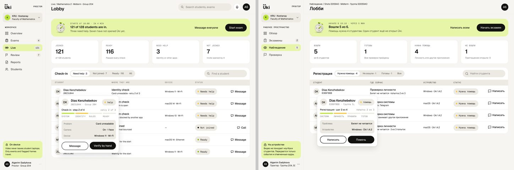 «Написать» and «Помочь» fit side by side | 2026-10-08 |
| Figma 1.5b `156:12176` | pass | 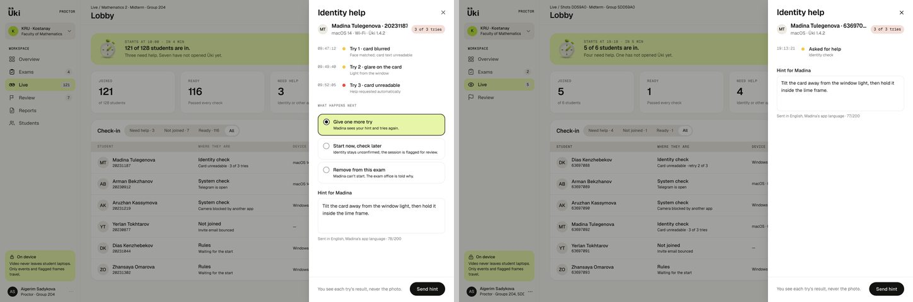 Drawer 460 wide over the scrim: Identity help with the close icon, the student with the device and "3 of 3 tries" on flag-subtle, the log, "Hint for Madina" with the helper, and the footer line with Send hint. What happens next is hidden, and the per-try rows are the help request and the messages (decisions) | 2026-10-08 |
| Figma 1.5b in Russian | pass | 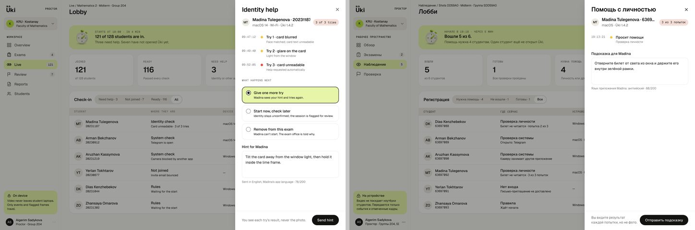 «Помощь с личностью»; the footer line wraps beside «Отправить подсказку» | 2026-10-08 |
| Act 2 and step 5 on the cloud project | pending | `pnpm demo:reset` must re-open Nurlan's seats (1.14, seed v2); then the Demo Day script on the Vercel dashboard, you | |
| Native Russian read-through of the new strings | pending | P.18, you, Wed 14 | |

## 1.11 Students and settings

Branch `wp/1.11-students-settings` (PR #22). Ran on the development MacBook against the main local stack (547xx), which has every migration on main and the seed; no migration was needed. `next dev` on port 3411. The Figma comparisons put the frame on the left and the page on the right, both at 1440 × 960, scaled to half. The pages show the local stack's data, so names, numbers and rows differ from the frames: the seed has no programme or year (seed v2, WP 1.14), and Madina has no session of her own until the e2e's throwaway exam. Choices are logged in `docs/decisions.md` under "1.11 Students and settings".

| Check | Status | Evidence | Date |
| --- | --- | --- | --- |
| Search finds Madina by name and by 20231187 | pass | `e2e/students.spec.ts`: Dana opens A.2 from the sidebar; "Madina" and "tulegenova madina" find her row, "20231187" leaves exactly her row; the address keeps `?q=20231187`, a reload renders the same single row on the server, and Back from her profile returns to it | 2026-10-08 |
| A.3 shows when and in which language Madina accepted the rules | pass | Same spec: Madina joins a throwaway KRU exam with `join_exam` and her number, and the ready status with `rules_locale: "ru"` stamps `rules_accepted_at` once through `ingest_batch` (the function behind `ingest`). A.3's Consent card reads "Exam rules · Русский" and "Accepted <day> <month>, <HH:MM>" in Almaty time from the stamp, then «Правила экзамена · Русский» in Russian; the exam is in her history and her laptop under Devices ("Üki 0.0.0-e2e · seen …"). Every fixture row, the anonymous user and its audit rows are removed | 2026-10-08 |
| A changed default reaches the next new exam | pass | Same spec: on A.4 Dana sets Default duration 120 min, Lobby opens 30 min before the start, Gaze threshold 3 seconds and switches Identity check off; each change saves at once ("Settings saved" toast) and a reload shows them. `save_exam_draft({})` as Dana (what `/exams/new` calls) then returns a draft with `duration_min` 120, `checks.gaze_s` 3, `checks.identity` false and `lobby_opens_at` 30 minutes before `starts_at`. The settings are restored and the draft removed afterwards | 2026-10-08 |
| Every read writes its audit row | pass | The spec finds Dana's `students.list` rows (one per A.2 view, two with the reload), a `student.read` row with Madina's id for each A.3 view, and four `settings.update` rows on the workspace, then removes them. `students-data.test.ts`: the audit row is written before the read, and a failed audit write fails the page with nothing read | 2026-10-08 |
| Dashboard e2e, the new spec | pass | `UKI_E2E_PORT=3411 pnpm exec playwright test -c e2e/playwright.config.ts students.spec.ts`: 3 of 3 in each of the last three runs and in the whole-suite run below. An earlier run timed out after 15 s waiting for `next dev` to compile `/settings` on its first visit; the spec now allows a route 90 s for that | 2026-10-08 |
| Dashboard e2e, the whole suite on the main stack | fail (environment) | `UKI_E2E_PORT=3411 pnpm e2e` after the rebase onto WP 1.8: 10 of 11 (dashboard 4, language 1, review 2, students 3). `help.spec.ts` (WP 1.6) failed at its first `ingest` call: "events.0.data.topic: Invalid option: expected one of identity, question, technical". The main stack's edge runtime serves `supabase/functions` of the main checkout, whose synced `_shared/contracts` date from 03:17 on 8 October, before WP 1.1 and 1.6 (they also drop `rules_locale`, which is why this package's spec stamps the rules through `ingest_batch`). Not caused by this branch; CI serves the branch's own synced contracts. Needs `pnpm functions:sync` in the main checkout | 2026-10-08 |
| Unit and component tests | pass | web 336 tests after the rebases onto WP 1.4, 1.5, 1.7 and 1.8, 52 of them new: `students-model` 12 (status, flag colour, search by name and number, filters, address, order, choices, pages, tiles, term), `student-profile-model` 7 (history, the in-review rule, tiles, devices, consent, data kept), `students-data` 5 (audit first, faculty and term filters, a failed audit or read fails), `student-format` 2, `settings-model` 4, `students-view` 8 (A.2 and A.3 as drawn, search, filters, address, paging, empty states), `settings-view` 4 (fixed rows, save, revert on refusal or error), `students-pages` 7 (lookup failure, proctors get a 404, a bad id, the faculty scope, the settings action refusing proctors and bad input, RLS and CHECK answers) and `shell-model` updated for the Students and Settings flags | 2026-10-08 |
| A.2, A.3 and A.4 in Russian with no missing key | pass | `apps/web/test/students-russian.test.tsx`: A.2 with the Year filter open, A.3 and A.4 in `ru`; no next-intl error (`intlErrors`) and no raw `dashboard.*` key | 2026-10-08 |
| `pnpm i18n:build` | pass | 239 catalog keys and 528 dashboard keys in en and ru after the rebase; `dashboard-students.json` adds 112 | 2026-10-08 |
| `pnpm check` | pass | After the rebase onto WP 1.4, 1.5, 1.7 and 1.8, exit 0: Biome 887 files, guards 919 files, turbo 22/22 tasks. Tests: web 336, contracts 453, desktop 451 (2 skipped), ui 188, lock 173, detection 102 (1 skipped), tokens 30, lms-mock 8, db 6; functions-unit 97; scripts 83. One earlier run failed `lobby-view.test.tsx`'s slow-clock test (WP 0.7) under the parallel turbo load; it passed three times alone and in every full run since |
| pgTAP | not-run | No migration or database function changed. A.2 reads WP 1.1's `student_overview` and `term_sessions`, and A.4 writes `workspaces.settings` under the column grant, policy, CHECK and audit trigger that `09_phase1_rls`, `10_wizard` and `13_privacy` already cover; CI runs every file | |
| CI on the pull request | pass | Run 37793894960 at b37f8b7 (after the rebase onto WP 1.4): every job passed, Linux checks, the stack job (pgTAP, integration, desktop flow and the dashboard e2e with `students.spec.ts`), the builds, the macOS installers, Windows and the secret scan. Main then moved to WP 1.5; the run after that rebase is on the PR | 2026-10-08 |
| Sidebar flags | pass | `NAV.students` and `NAV.settings` are built, for the exam office and admins only; a proctor's sidebar is unchanged (`shell-model.test.ts`) | 2026-10-08 |
| Phase 2 and 3 entry points hidden | pass | A.4's Integrations and Team (A.4a to A.4d), A.2's READY and NEED SETUP tiles and Import CSV, A.3's Message, Export data and readiness badge, and the top bar's search and bell are not drawn (`settings-view.test.tsx`, `students-view.test.tsx`) | 2026-10-08 |
| Figma A.2 `104:10579` | pass | 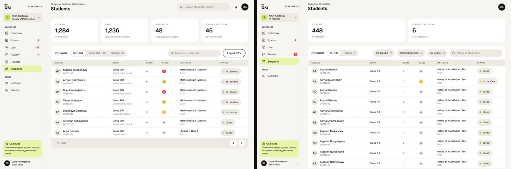 Same top bar, tile row, table card, header row with title and tabs, column widths, 58 px rows with the paper avatar, name and number, group, exams, the flags Count and the status chip. Two tiles instead of four, the Group, Programme and Year pills before the search field, and no Import CSV (decisions). Another agent's live fixture students lead the list | 2026-10-08 |
| Figma A.2 in Russian | pass | 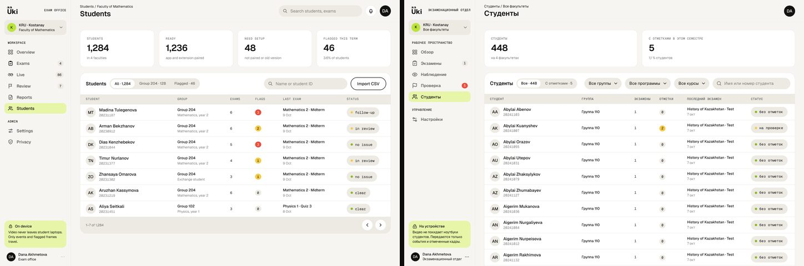 «Все группы», «Все программы», «Все курсы» and the search fit on one line at 1440. The first Russian render pushed the search past the card's edge; the search now starts at 160 px and grows to the frame's 300, and below that the row wraps with the search on the right (checked at 1440, 1280 and 1024 in both languages) |
| Figma A.2, the search for 20231187 | pass | 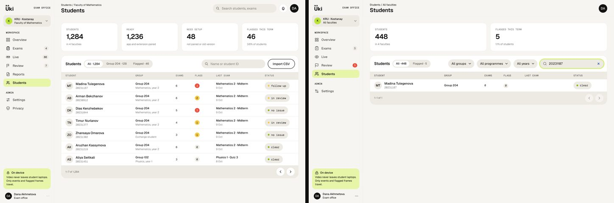 One row, Madina Tulegenova, "1–1 of 1" | 2026-10-08 |
| Figma A.3 `105:10746` | pass | 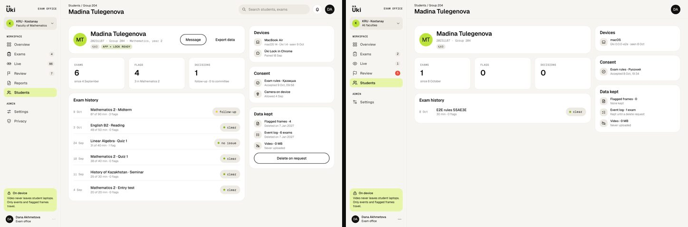 Same columns (left, and 360 px on the right), profile header with the 56 px lime avatar and the language badge, three tiles, Exam history rows 12 px apart, and the Devices, Consent and Data kept cards with 32 px icon wells. The history row spacing was fixed to the frame (rows 12 px apart). Message, Export data, the readiness badge, the camera row and Delete on request are not drawn (decisions) | 2026-10-08 |
| Figma A.3 in Russian | pass | 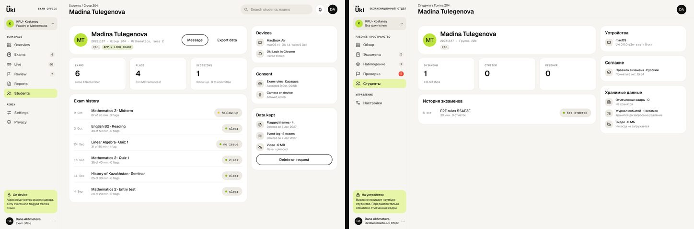 «Правила экзамена · Русский» and «Приняты 8 окт, …» with the stamp's time; everything fits | 2026-10-08 |
| Figma A.4 `106:10905` | pass | 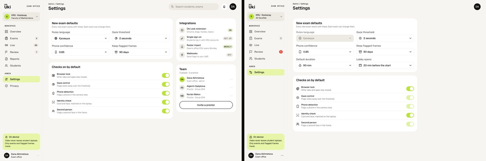 Same card, head and caption, select fields 42 px high with their icons, and the five check rows 53 px apart with their toggles. A third row of selects (Default duration, Lobby opens), the fixed Rules language and the lighter fixed switches, and the empty right column in place of Integrations and Team (decisions) | 2026-10-08 |
| Figma A.4 in Russian | pass | 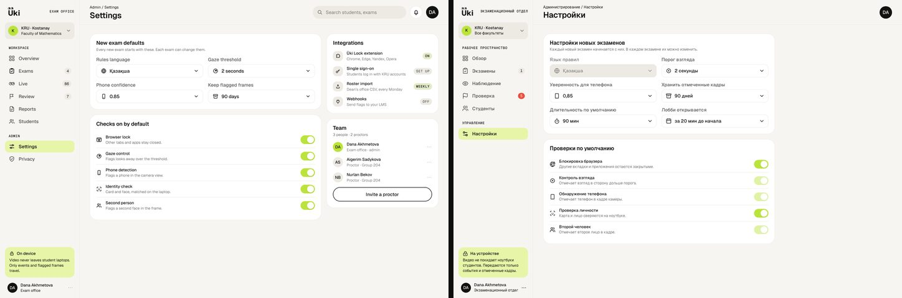 «Настройки новых экзаменов», «за 20 мин до начала», «0,85» and the five checks fit |
| A.2, A.3 and A.4 on the cloud project with seed v2 | pending | Waits for P.2 and WP 1.14 (programme and year for every seeded student); then the A.2 and A.3 comparisons again | |

## 1.13 Landing site

Branch `wp/1.13-landing` (PR #6), rebased on `origin/main` at e15f477 (WP 1.1, 1.2, 1.4, 1.5, 1.6, 1.7, 1.8, 1.11 and P.10 merged). Ran on the development MacBook against a fourth local Supabase stack, project `uki-w113` on ports 551xx with CLI 2.107.0, so the main stack on 547xx stayed untouched; `supabase functions serve` with that stack's own copy of WP 1.4's `supabase/functions/local.env` (stub port 55190), with and without `UKI_EMAIL_SINK`, `next dev` on port 3313. The Figma comparisons put the frame on the left and the page on the right, both full page at the frame's width, scaled to fit (0.32 for the 1440 landing, 0.6 at 390, 0.45 to 0.5 for the others); the frames are the cached screenshots in `.figma-cache/`. The Russian comparisons put the English frame beside the Russian page, since the frames are English. Choices are logged in `docs/decisions.md` under "1.13 Landing site".

| Check | Status | Evidence | Date |
| --- | --- | --- | --- |
| `/` matches Landing `114:2039` at 1440 | pass | 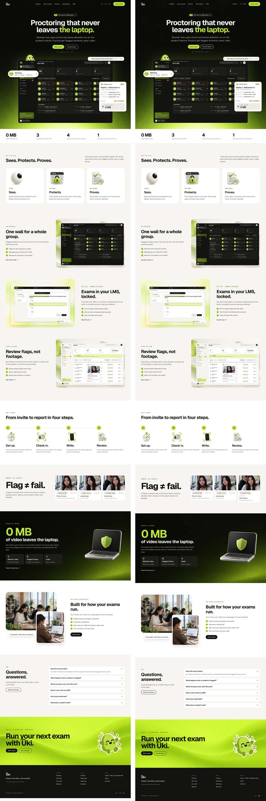 8,819 px against the frame's 8,789. Differences on purpose: Sign in in the header and ҚАЗ hidden in the switch (decisions). The third Flag ≠ fail card shows its time on a second line: the frame cuts it off (`10:45:5`), and the kit's Evidence card now wraps it (WP 1.8), which makes that section 23 px taller. Compared again after the rebase and after the 1024-to-1280 fixes below, which leave 1440 as it was (bezel 1057 wide, as the frame) | 2026-10-08 |
| `/` matches Mobile 390 `192:3586` | pass | 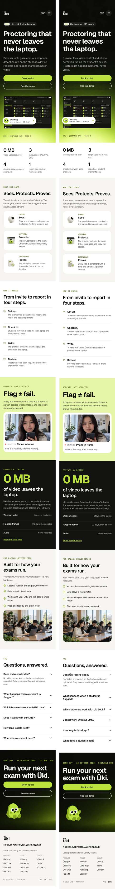 6,176 px against 6,158 | 2026-10-08 |
| `/pilot` matches Book a pilot `194:4014` at 1440 | pass | 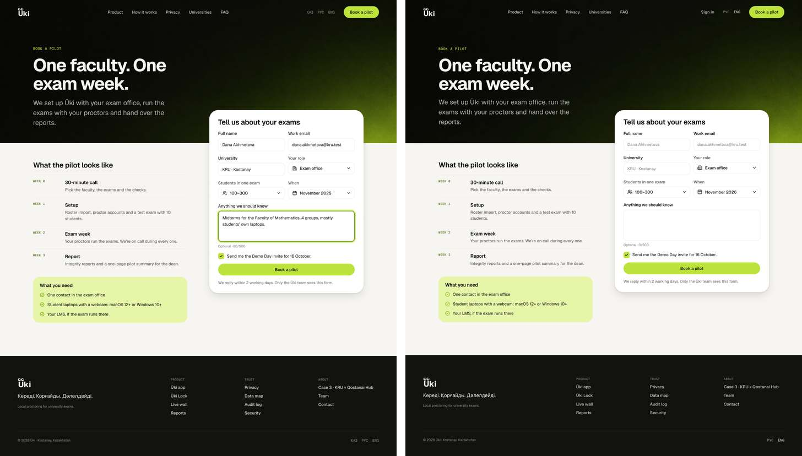 1,656 px against 1,657; the frame's filled values are the form's placeholders | 2026-10-08 |
| Sent matches `195:4090` | pass | 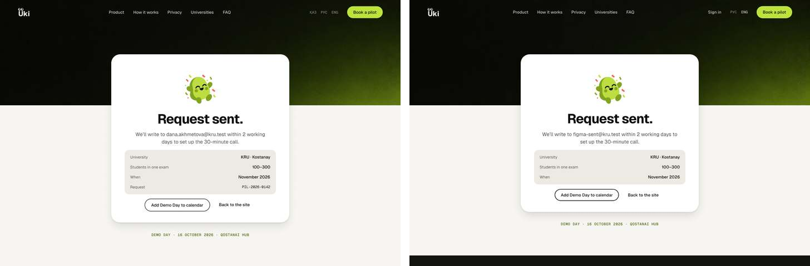 Through the form and the real `request_pilot` on `uki-w113` (the row deleted afterwards), at 1440 × 960. Card, mascot, title, summary, actions and the Demo Day line line up; the Request row (PIL-2026-0142) is left out because `request_pilot` returns no reference (decisions), so the card is shorter and the footer starts inside the 960 | 2026-10-08 |
| `/privacy` matches `196:4125`, `/terms` matches `197:4144` at 1440 | pass | 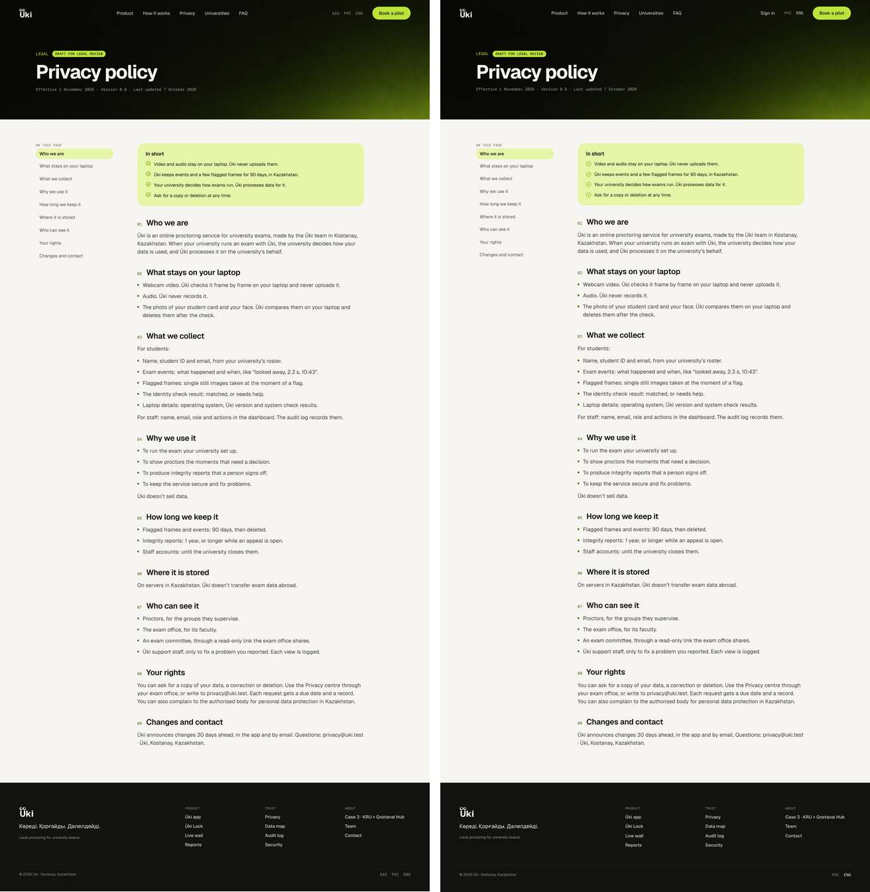 2,987 px against 2,985. 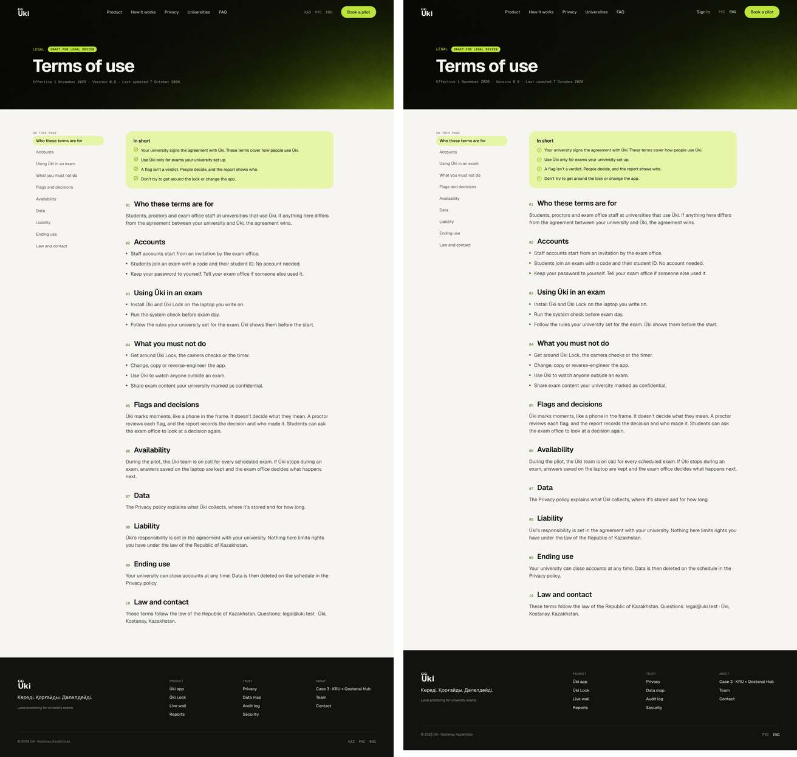 2,744 against 2,769: three Terms paragraphs (Availability, Liability, Ending use) take a word more per line than in the frame, so the page is 25 px shorter | 2026-10-08 |
| The pages in Russian beside the frames | pass | 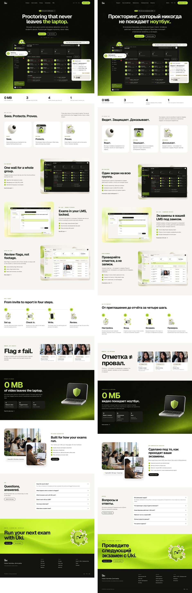 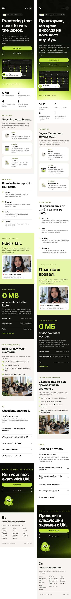 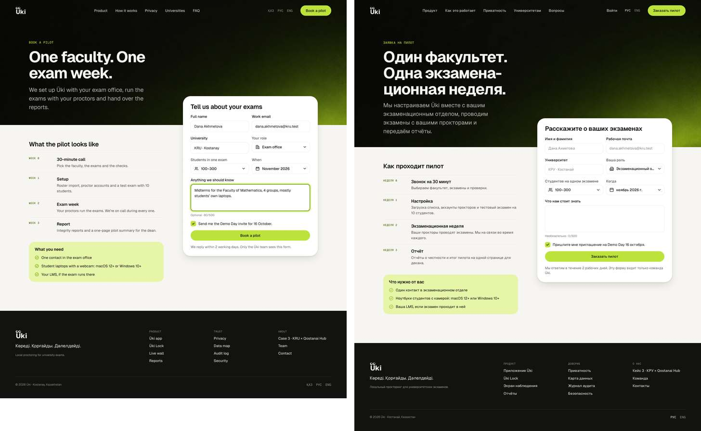 Fixed here: the Russian /pilot lead ran off the dark art onto the light page (the band now grows from its 520); «экзаменационная» and «конфиденциальности» ran out of the 390 window in the /pilot and /privacy headings (long Russian words hyphenate now). The Evidence cards on Flag ≠ fail cut the time after the longer Russian chip (`10:47:1`) until WP 1.8's change to the kit card, now on main, wrapped it under the chip | 2026-10-08 |
| Between 1024 and 1440; `/pilot`, `/privacy`, `/terms` at 390 (no frames) | pass | A Playwright probe in English and Russian at 390, 1024 and 1440 on all four pages finds no text box outside the window, and on `/` at 1024, 1180, 1280, 1366, 1440 and 1920 no hero card outside it, no header link on two lines and Book a pilot in view. Before the fixes, 1024 cut the hero's Watching widget, Lock toast and report card, wrapped How it works and Sign in, pushed the Russian Book a pilot out of the window, and squeezed the Flag ≠ fail cards, the Universities text (184 px) and the footer's brand column; 1280 cut the report card by 31 px. Between 1280 and 1440 the Evidence cards' time wraps under the chip (WP 1.8's card), as in Russian | 2026-10-08 |
| Every background, image and animation is a generated asset exported from Figma | pass | 20 WebP files in `apps/web/public/landing/` (792 KB), each listed with its node in `.figma-cache/114-2039/design-context.md`; mascots from `@uki/ui`. Nothing drawn in CSS, SVG or canvas | 2026-10-08 |
| Public pages need no session; staff go home | pass | `e2e/landing.spec.ts` opens all four pages without cookies; `proxy.ts` passes requests without an auth cookie straight through; nothing under `(marketing)` calls `requireStaff`. `/` sends staff through WP 1.2's `staffHomePath`: the exam office to the overview, proctors to `/my-exams` now that WP 1.5 has it (`landing-model.test.ts`, `staff-gate.test.tsx`) | 2026-10-08 |
| `pnpm e2e` with the landing pages at 1440 and 390 | pass | `UKI_E2E_PORT=3313 pnpm e2e` on `uki-w113` after each rebase (onto WP 1.7, 1.8, 1.4, 1.5 and 1.11): all passed, 37 after WP 1.11. Phase 0's 4, the language, 2.4d, review, proctor and students tests, and 12 landing tests in each of `chromium` (1440) and `landing-390`. Twice, the first full run against a freshly started `next dev` failed once in WP 1.6's 2.4d test (the Reply dialog stayed open with "Could not reach Üki", a client call to the stack); each time it passed alone and in the full rerun. In CI, Phase 0's `command.test.ts` missed a session broadcast in 2 of 8 stack jobs on this branch ("reaches the student's session channel within 1 s"); the same commits passed in the other run | 2026-10-08 |
| The Russian pages through the real `uki_locale` cookie | pass | `e2e/landing.spec.ts` adds the cookie as the switch and 3.4a write it: `/`, `/pilot`, `/privacy` and `/terms` have `lang` ru, the Russian h1, no raw `dashboard.*` key and no sideways scroll, at 1440 and at 390; Book a pilot's field lines and Sent in Russian; the footer's РУС sets the cookie and `/privacy` renders again in Russian. `apps/web/test/landing-russian.test.tsx` (3 tests) renders Book a pilot's form, field lines, refusal, failure and Sent in Russian and fails on any next-intl error (`intlErrors`) | 2026-10-08 |
| `/pilot` stores a request, Sent replaces the form, a refusal shows the form's error line, a fourth request from one address in a day is refused | pass | `e2e/landing.spec.ts` at both widths: three requests through the form show Sent with the address, the fourth shows the refusal line, and `pilot_requests` holds exactly three rows for the address; the test deletes them. The round trip no longer skips: `pilot_requests` is on main | 2026-10-08 |
| `pilot-notify` against the Resend stub | pass | `test/integration/pilot-notify.test.ts` with the functions served with a sink: one email to `UKI_EMAIL_SINK` with the visitor as Reply-To, `Bearer` the stub key, plain text only (`from`, `to`, `reply_to`, `subject`, `text`), every answer of the form and the request id in the body; 401 for the publishable key, for a signed-in user's token and for no key, and nothing sent; `not_found` for an unknown id, `bad_request` for a body without one; a Resend 422 answers `internal` and the request stays stored. Served without `UKI_EMAIL_SINK` (the default `local.env`), the sending tests skip and pilot-notify answers `internal` and sends nothing: 3 passed, 3 skipped; with the sink: 5 passed, 1 skipped | 2026-10-08 |
| The trigger path: `request_pilot` → `pilot_requests_notify` → pg_net with the key from Vault → `pilot-notify` → Resend stub | pass | The same file: with the Vault secrets set for the run (`http://kong:8000` and the stack's secret key), three requests from one address through `request_pilot` as a visitor reach the stub as three emails, each with its request id, and pg_net's `_http_response` holds 200 `{"id":"stub-N"}` for each call; the fourth is `rate_limited`, stored nowhere and emailed to no one. The secrets are deleted afterwards. Passed on `uki-w113`, and in CI on Linux (run 37785369977, before the sink phase was split out), where the edge runtime reached the stub through `host.docker.internal`; CI now runs it in the stack job's sink step, beside WP 1.4's send-invites tests | 2026-10-08 |
| A pilot request reaches your inbox on the cloud project | pending | Needs `RESEND_API_KEY` and `UKI_EMAIL_SINK` in Supabase secrets (you), the Vault secrets `uki_project_url` and `uki_secret_key` (WP 1.1's Vault step in `docs/runbooks/cloud-setup.md`) and the deploy (P.2); then one request from `/pilot` on Vercel | |
| `pnpm test:integration` on the new stack, and CI's sink step | pass | After the rebase onto WP 1.4, with the functions served with `local.env`'s settings: 24 files, 146 passed and 3 skipped (pilot-notify's sending tests and the trigger path, which need the sink). Served again with `UKI_EMAIL_SINK`, as CI's stack job does: `send-invites.test.ts` and `pilot-notify.test.ts`, 20 passed and 1 skipped (the no-sink check). `SUPABASE_WORKDIR` and `UKI_FUNCTIONS_ENV_FILE` point at `uki-w113` | 2026-10-08 |
| `supabase test db` | pass | 15 files, 771 tests on `uki-w113`; this package adds no migration | 2026-10-08 |
| `pnpm check` | pass | Exit 0 after the rebase onto WP 1.4, 1.5, 1.7, 1.8 and 1.11: Biome 933 files, guards 965 files, turbo 22/22 tasks. Tests: web 365 (`landing-model`, `pilot-model`, `pilot-action`, `pilot-screen`, `legal-content` and `landing-russian` among them), contracts 453, ui 188, desktop 451, lock 173, detection 102, i18n 48, tokens 30, lms-mock 8, db 6; functions-unit 103; scripts 83 | 2026-10-08 |
| `next build` | pass | `pnpm --filter web build`: `/`, `/pilot`, `/privacy` and `/terms` render per request | 2026-10-08 |
| Strings | pass | `pnpm i18n:build`: 313 keys in `dashboard-landing.json`, English and Russian (729 dashboard keys in all) | 2026-10-08 |
| CI on the pull request | see the PR | Run 37785369977 on a1c378c (the rebase, the cookie e2e and the pilot-notify tests) passed all six jobs on Linux, macOS and Windows; the layout fixes after it: see PR #6 | |
| You read the landing copy, including the drafted FAQ answers, form options and error lines | pending | Monday 12 | |
| Kazakh on the public pages (ҚАЗ is hidden in the switch until there is Kazakh landing copy) | pending | A question for you (decisions) | |
| The landing page on your phone | pending | Hand check | |

## 1.9 Report and sharing

Branch `wp/1.9-report-sharing` (PR #21), built on the evening of 8 October against the second local stack `uki-w18` (ports 550xx, CLI 2.107.0) with `supabase functions serve` on it and `next dev` on port 3403. No migration: WP 1.1's `get_report`, `create_share`, `open_shared_report` and `verify_report` carry the package. New: the `shared-report` Edge Function, 3.4 at `/review/[sessionId]/report`, 3.5 at `/r/[token]`, `/verify/[code]` and the share link's not-found page. The choices are in `docs/decisions.md` under “1.9 Report and sharing”. The Figma comparisons put the frame on the left and the page on the right: 3.4 at 1440 × 960; 3.5 at 1280 × 710, the page area cut out of the frame's browser window. The pages show History of Kazakhstan's seat 7, where the frames show Mathematics 2, with the brand kit's evidence pictures attached as stills and a “talk to the student” decision on the local stack only (not in the seed).

| Check | Status | Evidence | Date |
| --- | --- | --- | --- |
| `shared-report`: valid, expired, revoked and unknown tokens, with audit rows | pass | `test/integration/shared-report.test.ts`, 5 tests: a share opens with no apikey and no token; the reply passes `SharedReportResponse`; its still URL is on the public API origin, signed for exactly `STILL_VIEW_URL_TTL_S` (300 s) and returns the uploaded JPEG; each view writes one `report.share_view` row (`actor_kind` `share`, no actor, the share id in `meta`, the token nowhere), two views two rows. Expired and revoked shares and an unknown token answer the same 404 `no such share` and write no row; a malformed token is a 400. `report_shares` holds only the SHA-256 of the token. Unit: `_shared/share-token.test.ts` (2). The test tokens are made at run time (`randomBytes`, `"T".repeat(43)`), since gitleaks' generic-api-key rule flags a literal one | 2026-10-08 |
| The code verifies, and a changed report does not | pass | Same file: `verify_report` as an anonymous caller finds the code with or without `UKI-RPT-`; after `add_session_note` it reads `intact: false`; the next view issues a new code, and the old one is no longer found. The e2e below does the same through `/verify/[code]` | 2026-10-08 |
| Unit tests: verify code, rows, CSV, share link | pass | `apps/web/src/features/report/report-model.test.ts`, 13 tests, and `report-data.test.ts`, 5 (the share link's loader: the function's refusals are not found, an outage is an error, a malformed token is never sent): the printed code through `printedVerifyCode` (one function, `formatVerifyCode`), the code cut from SHA-256 of `<report id>:<content hash>`, reading a printed code back; short names, time used with added time, identity, flag order, one still per flag; CSV quoting, line breaks, the formula guard, header, order, Almaty time across midnight and the file name; the share URL and days left | 2026-10-08 |
| 3.4, 3.5, `/verify` and the not-found page render in Russian with no missing key | pass | `apps/web/test/report.test.tsx`, 11 tests. English: 3.4's rows, flags, stills from the `stills` function with `referrerpolicy`, Data kept; Download PDF calls `print()`; Export CSV saves `eventsCsv` under the printed code; Share link calls `create_share` once, shows the link, copies it, and shows the error line on a refusal; 3.5's banner, stills and This copy; `/verify` intact, changed and unknown; the not-found page. Russian: each of the four, failing on any next-intl error or raw `dashboard.*` key. 59 keys in `packages/i18n/dashboard-report.json`, Russian marked for P.18 | 2026-10-08 |
| Review to report to share, in the browser | pass | `e2e/report.spec.ts` on History's seat 33 with a still attached by the test: Dana decides on 3.3 and opens 3.4 from its new link; `get_report` wrote `report.view`; the code on the page is the stored one; the still loads; Export CSV downloads `uki-report-UKI-RPT-…-events.csv` with the header and one line per event; Share with the committee shows a 43-character token whose SHA-256 is the only thing stored | 2026-10-08 |
| 3.4 prints on A4 from Chrome | pass | The same test prints with print media through Chromium (`page.pdf` with the page's `@page`): one page, MediaBox 594.96 × 841.92 pt, only the report page on it, 40 pt margins, stills at 72 × 48. 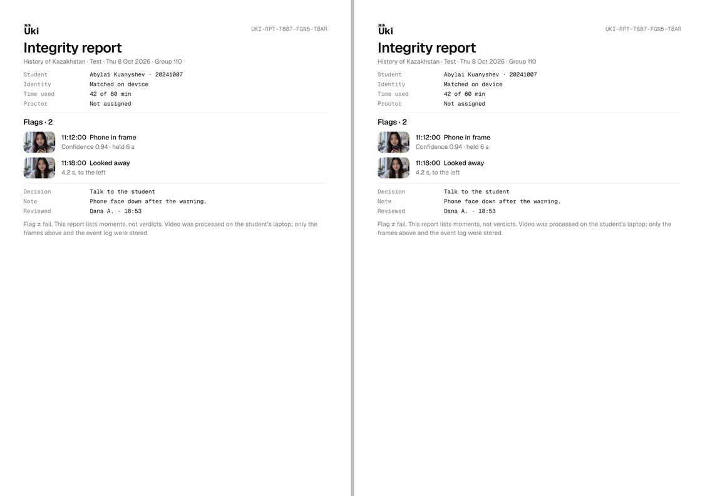 3.4 (left) and 3.5 (right) printed. Chrome's own Print dialog is the hand check below | 2026-10-08 |
| The link opens without sign-in, its stills load, every view is audited | pass | The same test opens the link in a new browser context with no cookies: 200, `Referrer-Policy: no-referrer`, `Cache-Control: no-store`, `X-Robots-Tag: noindex, nofollow`, the robots and referrer meta tags, no `sb-` cookie, the still loaded; one `report.share_view` row per view (1, 2 after a reload, 3 from a 390 × 844 phone context, where nothing is wider than 390 px). A production build (`next build`, `next start -p 3404`) sends the same three headers on `/r/…`, its 404 and `/verify/…` (curl) | 2026-10-08 |
| An expired link gets the not-found page | pass | The same test moves `expires_at` into the past: 404 and “This link is not available”, and no new audit row | 2026-10-08 |
| `/verify/[code]` confirms the printout, and a changed report does not | pass | The same test: the printed code reads “intact” with no session; after a note the old code reads “not verified”, 3.4 shows a new code, which verifies, and the old one still does not | 2026-10-08 |
| `pnpm check` | pass | Exit 0 on the branch rebased onto main at 24feac0 (after 1.8, 1.7, 1.4, 1.5, 1.11, 1.13 and the Resend stub's port): Biome 956 files, guards 987 files, turbo 22/22 tasks (web 394 tests, ui 188, contracts 453, desktop 451, lock 173, i18n 48 with 270 catalog and 970 dashboard keys), functions-unit 106, scripts 83. pgTAP, integration and the e2e below were run again after each rebase with the same results | 2026-10-08 |
| `pnpm test:integration` against the second stack | pass | 26 files, 154 tests and 3 skipped (pilot-notify's sending tests, which run only with a sink, as WP 1.13 set them up) on the latest main, including the new `shared-report.test.ts` and `share-token.test.ts`, with `supabase functions serve` on `uki-w18` and the `supabase` shim that adds `--workdir`. The functions ran with a copy of `supabase/functions/local.env` whose Resend stub listens on 25090 (`UKI_FUNCTIONS_ENV_FILE`; under 32768, as “The Resend stub's port” requires), so no email left the machine and the stub port of other runs stayed free. The integration and e2e global setups now also wait for `shared-report`, which answers an empty body with 400 | 2026-10-08 |
| `pnpm e2e` against the second stack | pass | 38/38 with `UKI_E2E_PORT=3403` on the latest main: Phase 0's 4, 1.6's help test, the language test, 1.5's two proctor tests, 1.8's two review tests, 1.11's three, 1.13's landing tests at 1440 and 390, and `report.spec.ts` (13.6 s; 5.5 s on a quiet host). Wall p95 16 ms. One rerun failed first: after `supabase functions serve` was restarted, a `next dev` started before it answered every share link with the not-found page, while the function answered the same token with 200 to curl and to the page's own loader run under tsx. A fresh `next dev` passed 9/9; the cause was not found. Since then the page treats only the function's own `not_found` and `bad_request` as not found, and anything else (a gateway 404 included) as an error (`report-data.test.ts`, 5 tests), so such a failure can no longer pass for an expired link | 2026-10-08 |
| pgTAP 01 to 15 | pass | `supabase test db` on `uki-w18`: 15 files, 771 tests. `12_reports`' four audit-row counts now count only the test's own rows (`at >= now()`): with earlier shares of seat 7's report on the stack they had counted those too | 2026-10-08 |
| NAV flag | pass | None to set: 3.4 lives under Review (built in 1.8); Reports (A.1) stays hidden until 1.10. 3.5 and `/verify` are public pages without the shell | 2026-10-08 |
| CI on the pull request | see the PR | PR #21 | |
| Figma 3.4 `51:2096` | pass | 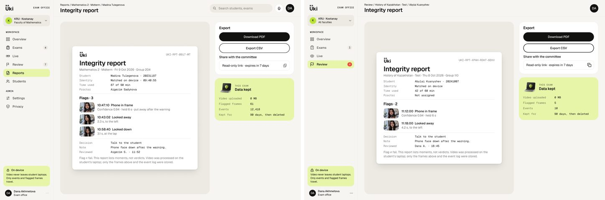 Same preview, report page (head and code, title, subtitle, mono rows, flags with 72 × 48 stills, decision rows, footnote), Export card (Download PDF, Export CSV, the share field with its copy icon) and Data kept with the 3D laptop shield (Figma's asset, byte-identical to the desktop app's). Review is active and the breadcrumb starts with Review (Reports is not built); search and bell hidden. The local session has 2 flags, no assigned proctor and no identity event, so it reads “Not assigned” and “Matched on device” | 2026-10-08 |
| Figma 3.4 in Russian | pass | 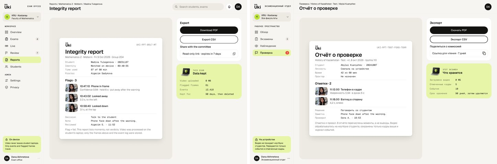 Layout as in English; the share field's Russian was shortened to fit | 2026-10-08 |
| Figma 3.5 `162:13464` | pass | 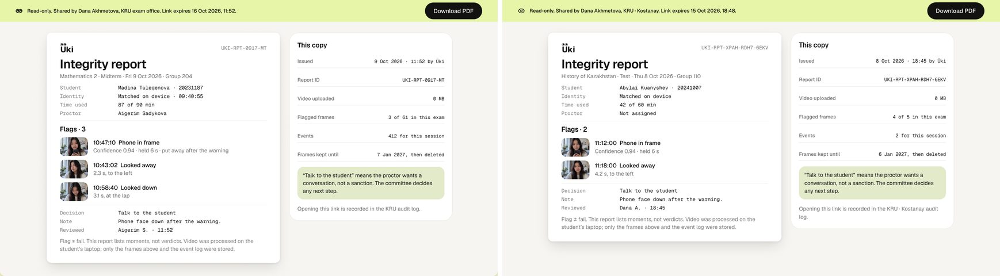 Same banner (eyes, the line, Download PDF), report page at 120 px and This copy at 744 px from the left, rows, decision note and audit line. The banner and footer name the workspace (“KRU · Kostanay”) where Figma writes “KRU exam office” and “KRU” | 2026-10-08 |
| Figma 3.5 in Russian | pass | 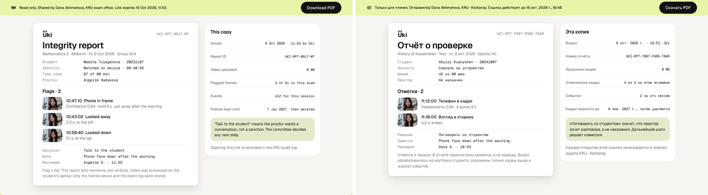 The banner fits on one line at 1280 | 2026-10-08 |
| 3.5 at 390 px | pass | 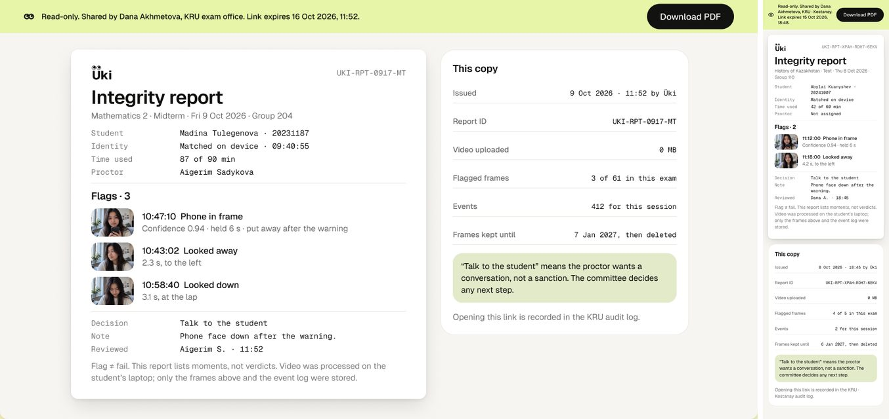 The frame (left) against the page on a 390 px phone, full height: one column, the banner wraps beside Download PDF, labels at 112 px. Figma has no 390 frame of 3.5 | 2026-10-08 |
| `/verify/[code]` and the not-found page | pass | 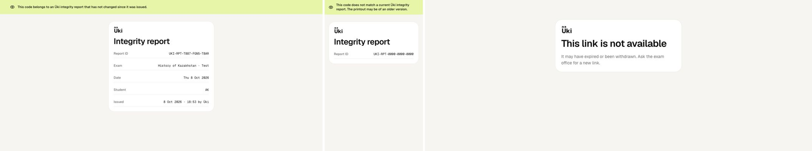 An intact code at 1280, an unknown code at 390, an unknown token's 404. No frame of their own: 3.5's banner and This copy rows | 2026-10-08 |
| 3.4's Download PDF from Chrome's Print dialog on A4 | pending | Hand check on the MacBook, you | |
| The share link on your phone over mobile data | pending | Hand check (the plan's list), you, once the cloud project runs `shared-report` | |
| The report and sharing on the cloud project | pending | P.2: `pnpm supabase:deploy` deploys `shared-report` (`verify_jwt = false` in `config.toml`), then the Vercel dashboard | |
| Verify code format | pending | The frames print `UKI-RPT-0917-MT`; WP 1.1 prints `UKI-RPT-XXXX-XXXX-XXXX`. Your choice; one function prints it (decisions) | |

## 1.3 Exam wizard

Branch `wp/1.3-wizard` (PR #16). Rebased onto main at 5e434ed (WP 1.4 Invites, WP 1.5 Proctor home, WP 1.11 Students and settings, WP 1.13 Landing site, the Resend stub's port below the ephemeral range, then WP 1.9 Report and sharing) and checked again on the development MacBook against a third local Supabase stack, project `uki-w13` on ports 548xx with CLI 2.107.0 and supabase-edge-runtime 1.74.1, so the main stack on 547xx stayed untouched. `supabase functions serve` loaded an env file whose `RESEND_BASE_URL` pointed at the Resend stub on port 25890 (54890 before main moved the stubs below 32768), and the integration tests, the e2e and the screenshot run started that stub (`test/integration/resend-stub.ts`): no email left the machine. `next dev` ran on port 3401. The Figma comparisons put the frame on the left and the page on the right, both at 1440 × 960, scaled to half. The page shows the local stack's data: the demo roster has 24 students where the frames show 128, and only built sidebar items show. Every other difference is listed in the evidence column and logged in `docs/decisions.md` under “1.3 Exam wizard”.

| Check | Status | Evidence | Date |
| --- | --- | --- | --- |
| Routes `/exams/new` and `/exams/[examId]/edit/{details,checks,browser,roster,review}` with one draft row from step 1 | pass | Thin pages under `apps/web/src/app/(app)/exams/`; logic in `apps/web/src/features/wizard/` (`wizard-data.ts`, `wizard-model.ts`, `roster-csv.ts`, the views). A proctor gets a 404, a scheduled exam only its roster page, a live one its lobby (`allowedStep`, unit-tested) | 2026-10-08 |
| Every step saves; a refresh loses nothing | pass | `e2e/wizard.spec.ts`: Identity check switched off on 0.2 is in `exams.checks` and still off after a reload; Back to 0.4 shows the title typed before | 2026-10-08 |
| The demo CSV shows its bad rows on 0.3a and nothing is written | pass | `demo/roster.csv`: 24 students of group 204 from the seed, six with 0.3a's problems (a 7-digit number, an empty group, an unknown group 240, an address without @, a number twice, an empty name). e2e and `wizard-views.test.tsx` see the six rows with their messages and no `exam_students` row | 2026-10-08 |
| Fixed through Edit (0.3b's panel), then imported; importing twice adds no duplicates | pass | e2e: the six fixes import 24 students; the fixed file imported again leaves 24 roster rows, and both `roster.import` audit rows read inserted 0, updated 24, seats 24, removed 0. `16_wizard_1_3` imports the same 24 twice | 2026-10-08 |
| Proctors: `assign_proctors`, gaps and overlaps refused | pass | e2e: Aigerim 1–12 and Nurlan 13–24 stored; moving Nurlan to 10 shows "Seats 10–12 are given to two proctors." and nothing changes. Unit tests for `seatProblem`, `parseSeatError`, `nextSeatRange` | 2026-10-08 |
| `assign_proctors` works through PostgREST | pass | Found while building 0.3: the API refused it ("DELETE requires a WHERE clause", pg-safeupdate). Migration `20261011090000_assign_proctors_safeupdate.sql` (renamed from `20261010010000_…` before the merge, so it sorts after main's `20261010060000_help_topics.sql`); `16_wizard_1_3` checks no function in `public` deletes without WHERE | 2026-10-08 |
| Schedule exam returns to 0.1 with a code; errors link to their step | pass | e2e: the toast reads "Exam scheduled. Students join with the code MATH2-204-FRI2." (MATH2-204-FRI is the seed's) and the exam is `scheduled` with that code. `wizard-views.test.tsx`: `roster_empty` shows with a link to the Students step | 2026-10-08 |
| Schedule exam sends every invite through `send-invites` | pass | e2e: the stub receives one batch of 24 emails, one to each address of the fixed demo file, each with the code in its text; all 24 `invites` rows are `sent`; 0.1 shows no "did not go out" toast | 2026-10-08 |
| Invites that did not go out are counted on 0.1 and lead to the roster | pass | With the stub refusing the batch (422): 0.1 shows "24 invites did not go out. The roster says why." with Open roster, which opens the exam's 0.3 at Needs a fix · 24, each row Not sent · error with Fix email (comparisons below). `parseScheduledNotice` and `scheduledHref` unit-tested, including a forged query string | 2026-10-08 |
| Send a test invite (0.5) | pass | e2e: one email, to Dana's sign-in address only, with the exam's title in the subject; every invite of the exam is still `pending`. The button is disabled with its reason on an empty roster (send-invites writes the test for seat 1), and a failed send says so (`wizard-views.test.tsx`) | 2026-10-08 |
| Resend (0.3) | pass | e2e: Resend on Aigerim Baimukhanova's sent invite: exactly one more email, to her address; the toast reads "The invite went out again to Aigerim Baimukhanova." A refused resend says so (`wizard-views.test.tsx`) | 2026-10-08 |
| A bounced address fixed through 0.3b is resent | pass | e2e, on the scheduled exam: Kairat's invite set to `bounced` (the webhook is Phase 2), Fix email with the scheduled helper, Save: one email to the new address, the invite `sent` with it, the row Sent · not opened | 2026-10-08 |
| The seeded bounced address, reached from 0.1, fixed through 0.3b and resent | pass (local) | Screenshot run on `uki-w13`: 0.1's readiness card for Mathematics 2 reads "Roster 127 of 128" and "Fix 1 address" (exam office only, `overview-view.test.tsx`); it opens Mathematics 2's roster; Yerlan Tokhtarov's Fix email saves `yerlan.tokhtarov@student.kru.test` and the stub receives his invite; the row reads Sent · not opened and Needs a fix · 0 (comparison below) | 2026-10-08 |
| The same with real email, in your inbox | pending | You, on the cloud project after `pnpm supabase:deploy` and the secrets in `docs/runbooks/cloud-setup.md` (WP 1.4's hand check): a test invite from 0.5, then the seeded bounced address fixed from 0.1 | |
| A proctor's change request shows on 0.5 | pass | `wizard-views.test.tsx`: Nurlan's row reads "Seats 13–24 · Russian, English · change requested: “Only seats 13 to 20, please.”", and the same in Russian. No frame draws it (decisions) | 2026-10-08 |
| 0.5 promises no reminder | pass | The footer reads "Nurlan Bekov hasn’t confirmed yet. You can schedule now." in English and "…Можно планировать сейчас." in Russian; no reminder email exists in Phase 1 (decisions). `wizard-views.test.tsx` checks the line and that no "reminder" shows | 2026-10-08 |
| Untitled drafts stay off 0.1 | pass | `overview-model.test.ts`: a draft with an empty title is left out, a titled draft and a scheduled exam stay. Screenshot run: New exam, then back to 0.1: the same five rows and Upcoming 2 | 2026-10-08 |
| Timed: New exam to the code | pass (automated) | e2e 6.2 s on a warm `next dev` with every step, both imports, the overlap check and the test invite, 8.3 s for the whole test with 0.3b and Resend; 38.7 s in the first run after the rebase, while `next dev` compiled each page on a loaded laptop. The exit criterion's 5 minutes by hand is the next row | 2026-10-08 |
| The exam office creates and schedules an exam by hand in under 5 minutes | pending | You, on the cloud project after the deploy, with `demo/roster.csv` | |
| New exam for the exam office on 0.1; Phase 2's 0.6 and 0.7 stay hidden | pass | `overview-view.test.tsx`: New exam shows for the exam office and not for a proctor; a draft's row opens its wizard for the office. Import CSV stays hidden; no exam detail (0.6) or question bank (0.7) link exists. The Exams item is current on the wizard's routes (`activeNav`) | 2026-10-08 |
| Every wizard page renders in Russian with no missing key | pass | `apps/web/src/features/wizard/wizard-views.test.tsx` (20 tests, 10 in Russian): 0.4 with the date picker open, 0.2 with 0.2a and the preview in Kazakh, E.1, 0.3 with 0.3b, 0.3a with Edit open, Add proctor, 0.5 with a schedule problem, 0.1 after Schedule exam with invites that did not go out and the roster link, 0.3's Resend toast, and 0.5 with a change request. Each fails on any next-intl error or raw key | 2026-10-08 |
| The wizard's schemas come from `@uki/contracts` | pass | `features/wizard/send-invites.ts` and `SEND_INVITES_READY` are gone; `SendInvitesInput` and `SendInvitesOutput` (WP 1.4), `FixInviteEmailInput` and `ResendInviteInput` (`wizard.ts`, tested in `wizard.test.ts`) check each call before it leaves and each reply | 2026-10-08 |
| Unit tests | pass | `wizard-model.test.ts` 32 (steps, Almaty dates, choices, proctors, invites, review, the code, the scheduled notice), `roster-csv.test.ts` 10, `overview-model.test.ts` 15, `overview-view.test.tsx` 8 | 2026-10-08 |
| A clean reset with the renamed migration | pass | `supabase db reset --workdir` on `uki-w13`, before and after each rebase: 13 Phase 0 migrations, `20261009000000_phase1.sql`, `20261010060000_help_topics.sql`, `20261011090000_assign_proctors_safeupdate.sql`, then `seed.sql`, no error | 2026-10-08 |
| pgTAP 01 to 16 | pass | `supabase test db` on `uki-w13` after the rebase onto 5e434ed: 16 files, 781 tests; `16_wizard_1_3` adds 10 | 2026-10-08 |
| `pnpm check` | pass | Exit 0 after the rebase onto 5e434ed: Biome 983 files, guards 1016 files, turbo 22/22 tasks (contracts 455 tests, web 461), functions-unit 106, scripts 83. The first run had one failure in WP 1.5's lobby clock test (`lobby-view.test.tsx`, "Starts at 10:00 · in 4 min") with the laptop's load average at 32; it passed twice on its own and in the full rerun, and this package does not touch the lobby | 2026-10-08 |
| `pnpm test:integration` against the third stack | pass | 26 files, 154 tests and 3 skipped (pilot-notify's sends, which need a sink) after the rebase onto 5e434ed, with `supabase functions serve` on `uki-w13` and the stub on 25890 (`UKI_FUNCTIONS_ENV_FILE`) | 2026-10-08 |
| `pnpm e2e` | pass | 39/39 against `next dev -p 3401` and `uki-w13`, after a fresh `db reset` and `seed:staff`: the dashboard, help, language, proctor, review, students and wizard tests, and WP 1.13's landing tests at 1440 and 390, and WP 1.9's report test (New exam to the code in 19.4 s on a cold `next dev`). No React warning in the browser console (the wizard's selects stay controlled) | 2026-10-08 |
| CI on the pull request | see the PR | | |
| The cloud project has the migration | pending | `pnpm supabase:deploy` after the merge (P.2) | |
| Figma 0.4 `158:12473` (details, date picker open) | pass | 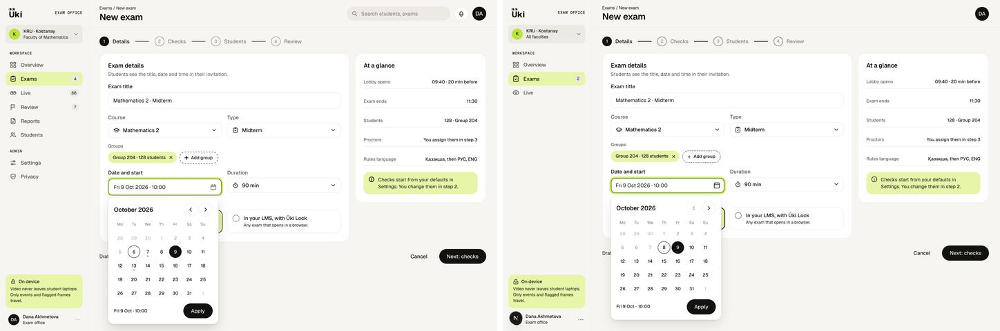 Same cards, fields, chips, radio cards, At a glance and picker. Differences: the picker's footer time is a typed field; search and bell hidden (Phase 0) | 2026-10-08 |
| Figma 0.4 in Russian | pass | 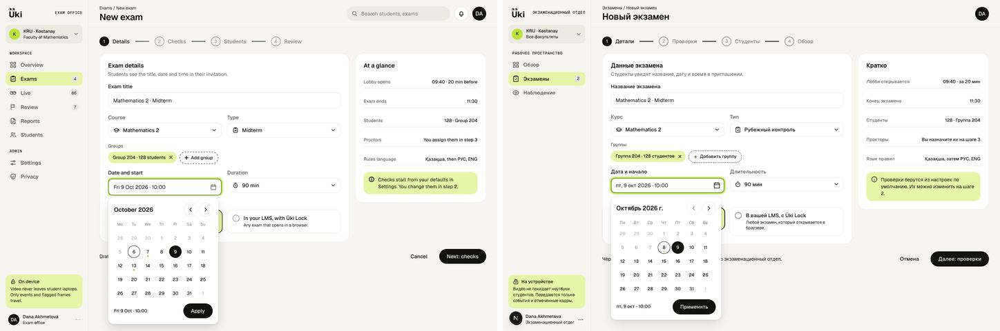 Fits; the month reads «Октябрь 2026 г.» from Intl | 2026-10-08 |
| Figma 0.2 `51:2048` (checks) | pass | 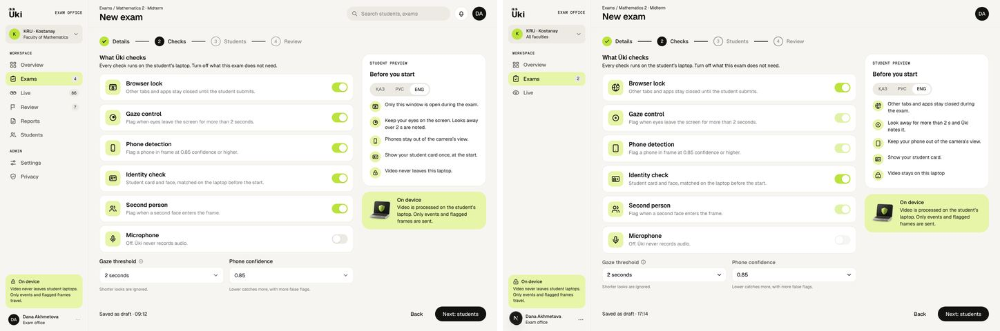 Same rows, thresholds, preview and privacy card. Differences: the gaze, phone and second-person switches are fixed and drawn disabled; the preview lines are the app's own 1.4 strings; the browser-lock icon is the kit's GlobeLock | 2026-10-08 |
| Figma 0.2a `85:6315` (gaze threshold info) | pass | 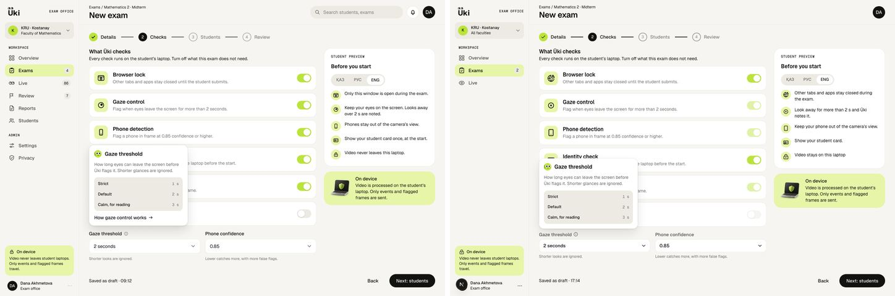 Popover/Info over the gaze field with Strict, Default and Calm. "How gaze control works" is hidden (no page) | 2026-10-08 |
| Figma E.1 `99:10209` (browser rules) | pass | 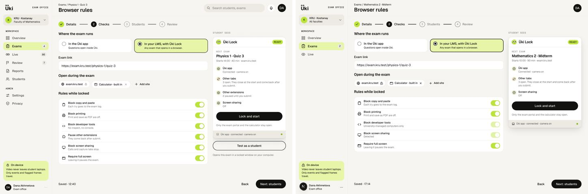 Same sections, chips, rules card and Lock popup. Differences: developer tools and screen sharing are fixed with Phase 0's labels; Pause other extensions, the popup's Other extensions row and Test as a student are hidden (Phase 2, Phase 0, no Phase 1 path) | 2026-10-08 |
| Figma 0.3 `51:2050` (roster and proctors) | pass | 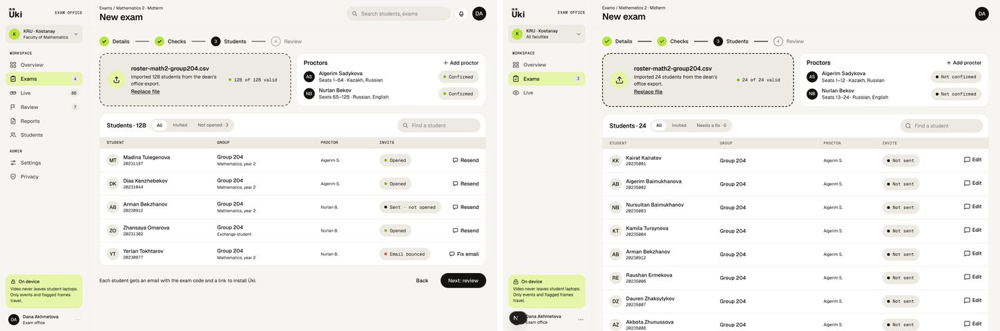 Same file card, proctors card and table. Differences: 24 rows; the third tab is Needs a fix; chips read Not sent before the invites go out and Not confirmed until 0.9a | 2026-10-08 |
| Figma 0.3 on the scheduled exam | pass | 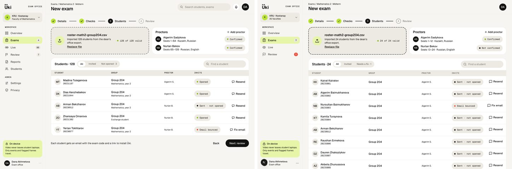 After Schedule exam, with one invite set to bounced: Sent · not opened chips with Resend, Email bounced with Fix email, as the frame draws them. Differences: Opened never shows (opens are not tracked); the demo file's new students have no programme line | 2026-10-08 |
| Figma 0.3 after a refused send | pass | 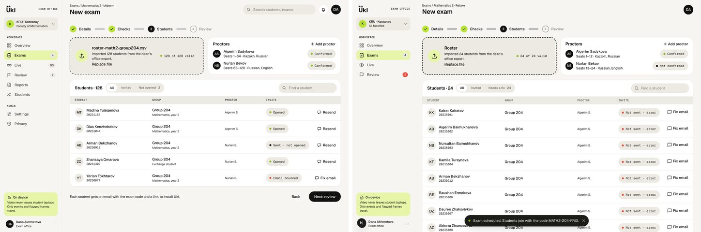 Reached from 0.1's Open roster: Needs a fix · 24, each row Not sent · error with Fix email. No frame draws a failed send | 2026-10-08 |
| Figma 0.3a `160:12932` (roster errors) | pass | 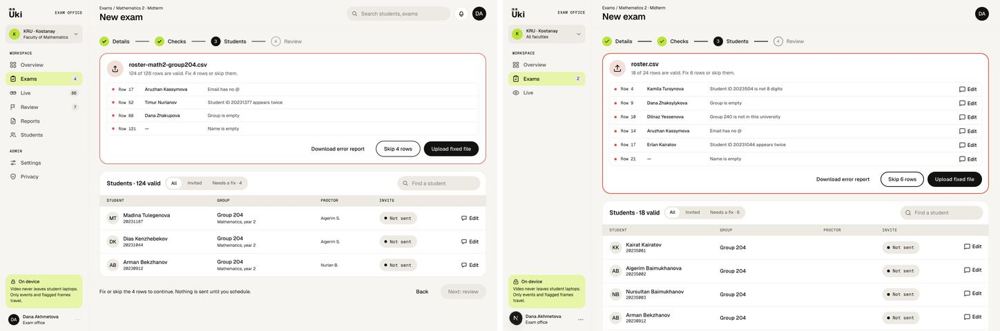 Same error card, rows, actions and disabled Next: review. Difference: each bad row has Edit (the plan's 0.3b panel) | 2026-10-08 |
| Figma 0.3a in Russian | pass | 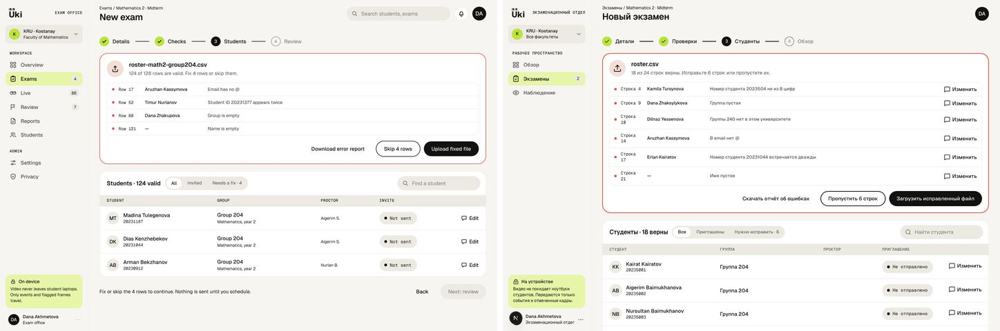 | 2026-10-08 |
| Figma 0.3b `160:13301` (fix email) | pass | 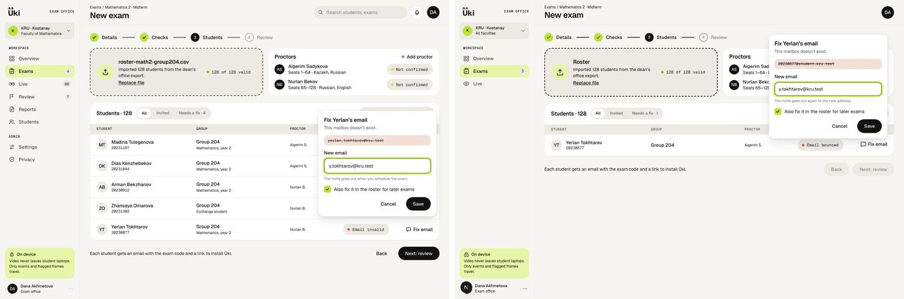 On the seeded Mathematics 2, searched to Yerlan's row: same panel, struck address, field, helper, checkbox and buttons. The helper is the scheduled exam's | 2026-10-08 |
| Figma 0.3b, after Save on the seeded bounced address | pass | 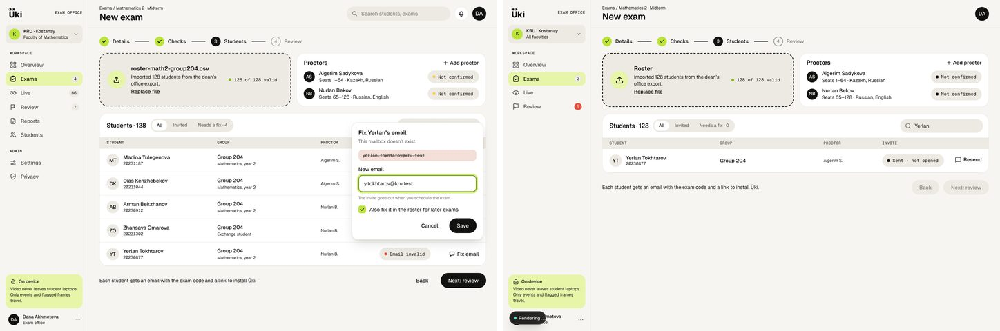 Frame left with the panel open; page right after Save: Yerlan's invite went out again and his row reads Sent · not opened with Resend | 2026-10-08 |
| Figma 0.5 `159:12771` (review) | pass | 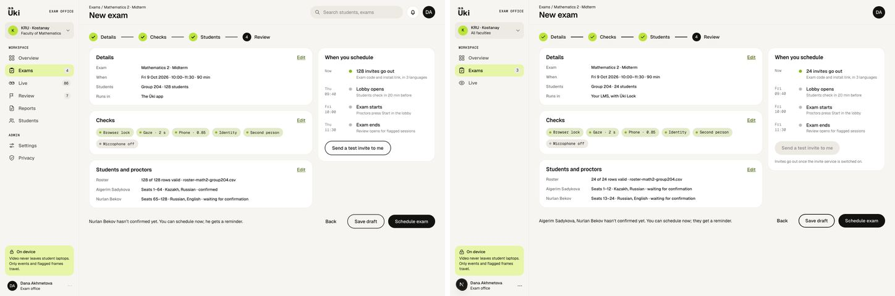 Compared again with the invites on: same three summaries, chips, timeline, the enabled Send a test invite to me and the footer's buttons. Difference: the footer ends at "You can schedule now." (no reminder in Phase 1); the frame's lobby time reads Thu, the exam's day is Fri | 2026-10-08 |
| Figma 0.5 in Russian | pass | 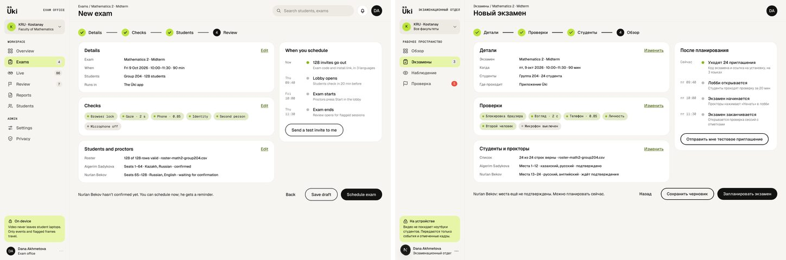 The test invite button fits on one line | 2026-10-08 |
| Figma 0.1 `51:2046` with the roster link | pass | 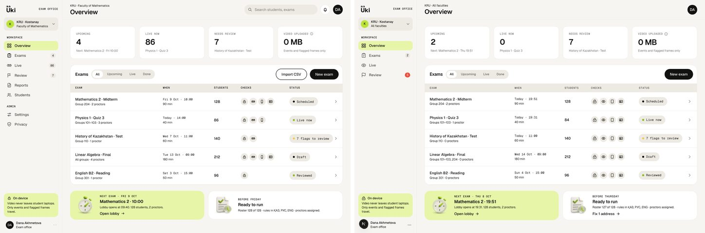 The readiness card counts Yerlan's bounced invite (127 of 128) and ends with "Fix 1 address →", drawn like Open lobby; the card keeps its height. Not in the frame, whose roster is complete (decisions). Import CSV stays hidden | 2026-10-08 |
| Figma 0.1 in Russian | pass | 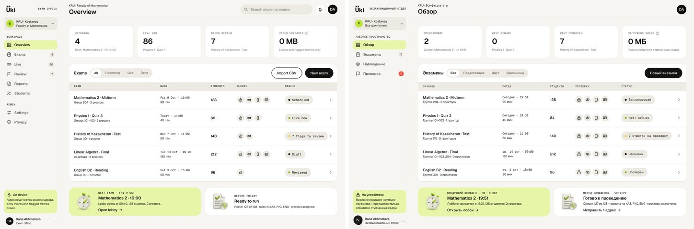 «Исправить 1 адрес» fits | 2026-10-08 |
| Figma 0.1 after a send that failed | pass | 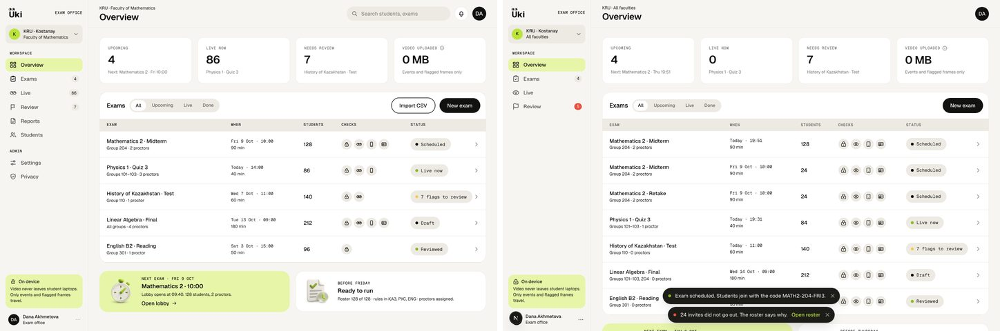 The code toast and, under it, the error toast with Open roster, the kit's Toast with its action | 2026-10-08 |

WP 1.4's open row "0.5, 0.3 and 0.3b call `send-invites`" is answered by the rows above. Left for you: the timed run by hand and the real inbox, both on the cloud project after the deploy.

## 1.9 Report and sharing: user decisions 8 Oct

Branch `wp/1.9-verify-revoke` (PR #30): the user's decisions of 8 October on verify codes, `/verify` lookups and share links, recorded in `docs/decisions.md` under “1.9 Report and sharing: decided by the user, 8 Oct”. Migration `20261012160000_verify_codes_share_revoke.sql`, pgTAP `19_verify_revoke`. Under the rules of 8 and 9 October the Mac runs no database: pgTAP, the integration tests and the dashboard e2e ran in GitHub Actions only, and nothing touched the cloud project. Locally: `pnpm check`, and screenshots of 3.4, 3.5, `/verify` and the not-found page rendered by `next dev` from throwaway fixture-only routes (never committed) with the unit tests' report fixture, the stills served by Playwright route interception from the brand kit's evidence pictures, and every other request refused, so the pages reached no Supabase at all. The Figma comparisons put the frame on the left and the page on the right: 3.4 at 1440 × 960, 3.5 at 1280 × 710 against the page area of the frame's browser window.

| Check | Status | Evidence | Date |
| --- | --- | --- | --- |
| Verify code `UKI-XXXX-XXXX`: 8 Crockford base32 characters, unique, a redraw on a clash | pass in CI | `19_verify_revoke`: 2000 draws are all 8 characters of the alphabet, with no I, L, O or U, all 32 characters used and no two alike; `get_report` makes an 8-character code and the row holds it; a row inserted without a code gets one from the column default; any other form is refused by `reports_verify_code_format`, a shared code by the unique index; a generator that first returns a taken code draws once more; one that only clashes gives up after 20 draws with `conflict` | 2026-10-09 |
| A typed code: case, prefix, spaces and hyphens do not matter; O reads as 0, I and L as 1 | pass | `normalize_verify_code` (`19_verify_revoke`, `12_reports`, in CI) and `normalizeVerifyCode` (`packages/contracts/src/review.test.ts`, 19 tests, locally) agree on the same cases: `uki-7k2m-9qxd`, ` 7k2m 9qxd `, `UKI-O1IL-9QXD`; U, the old 12-character form and any other length are refused | 2026-10-09 |
| Every existing `reports` row gets a code in the new form at the migration | pass in CI | `19_verify_revoke` writes two rows back into the old 12-character form, then `convert_verify_codes()` converts exactly those two: every code is 8 characters and different, a code already in the new form stays, the converted rows keep their `issued_at` and content hash, a second run changes nothing, and the format constraint is added over them. The migration runs the same function once, before it adds the constraint; on the cloud project it runs at the merge | 2026-10-09 |
| A changed report: found but not intact, then a new code | pass in CI | `19_verify_revoke` and `12_reports`: after a note or a decision the printed code reads `intact: false`, the next `get_report` issues a new code and the old one is not found | 2026-10-09 |
| `/verify` answers 10 lookups a minute per client, then the try-again state | pass in CI | `19_verify_revoke`: lookups 1 to 10 are answered, malformed codes counted; the 11th raises `rate_limited` with SQLSTATE `PT429` and the seconds to wait, and is not counted; another client is answered; a client that is not a SHA-256 is `bad_request`; a minute later the client is answered again and the old rows are gone; the one-argument `verify_report` is gone. `test/integration/shared-report.test.ts`: through PostgREST the 11th answer is HTTP 429 `rate_limited`. `e2e/report.spec.ts`: a visitor with its own `x-forwarded-for` gets 10 answers, typed in lower case with and without `uki-`, then the try-again banner with a Try again link to the same code; another visitor is still answered | 2026-10-09 |
| `verify_lookups` for each role | pass in CI | `19_verify_revoke`: row-level security on and no policy; anonymous visitors, a student, a proctor and the exam office can neither read nor write it; the secret key reads it. Only the SHA-256 of the address is kept (`clientHash`, `report-data.test.ts`), for a minute | 2026-10-09 |
| `revoke_share` for each role, with an audit row | pass in CI | `19_verify_revoke`: anonymous callers have no execute right; a student, another exam's proctor and another workspace's exam office get `forbidden`; an unknown share is `not_found`; staff still cannot set `revoked_at` directly; the exam office revokes and one `report.share_revoke` row is written (staff actor, the report, the share id); `open_shared_report` then answers `not_found:revoked`; the exam's proctor may revoke too, a second revoke keeps the first time and writes no second row. `staff_may_share()` is true for the exam office, a proctor and an admin, false for a signed-in non-staff user and a student, closed to anonymous callers, and both `create_share` and `revoke_share` ask it (decisions: judge mode's read-only role). Integration: a link revoked through `revoke_share` gets the same 404 from `shared-report` as an unknown one | 2026-10-09 |
| Share links last 30 days | pass in CI | `19_verify_revoke`: `create_share`'s reply and row expire 30 days ahead; integration: `SHARE_TTL_DAYS` (30) days; e2e: 3.4's field reads “Read-only link · expires in 30 days” and the stored expiry is 30 days ahead | 2026-10-09 |
| Revoke on 3.4, and the revoked link gets the not-found page | pass in CI | `e2e/report.spec.ts`: no Revoke while the report has no open link; a second link opens (one view row); after a reload of 3.4 the field counts “1 active link”, Revoke withdraws it with the toast “1 link revoked”, Revoke disappears, `revoked_at` is set with one audit row for that link and none for the expired one, and the link answers 404 “This link is not available” with no new view row. `apps/web/test/report.test.tsx`: Revoke sits outside the label, revokes every open link and says how many, the error line on a refusal, then a second try | 2026-10-09 |
| 3.4, 3.5, `/verify` (all three states) and the not-found page render in Russian with no missing key | pass | `apps/web/test/report.test.tsx`, 14 tests, Russian failing on any next-intl error or raw `dashboard.*` key, 3.4 with an open link included. New keys in `packages/i18n/dashboard-report.json`: `share.revoke`, `share.revokeLabel`, `share.active`, `share.revoked`, `share.revokeFailed`, `verify.limited`, `verify.tryAgain` | 2026-10-09 |
| `pnpm check` | pass | Exit 0 on the branch rebased onto main at ce12ed0: Biome, guards, turbo 22/22 tasks (web 469 tests, contracts 460, ui 190 with `Field`'s new `action`, desktop 451, lock 173, i18n 72), functions-unit 106, scripts 103 | 2026-10-09 |
| CI on the pull request | see the PR | PR #30: pgTAP 01 to 19, the integration tests and the e2e run there, on Linux; Windows and macOS jobs as usual | |
| NAV flag | pass | None to set: no new page; 3.4 stays under Review, `/verify` is public | 2026-10-09 |
| Figma 3.4 `51:2096` | pass | 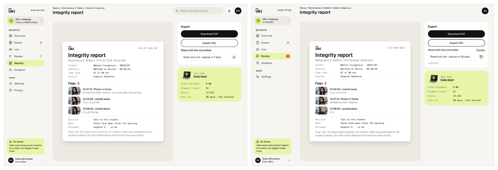 Fixture data, Madina's report as in the frame: the code prints as `UKI-7K2M-9QXD` in the report head; the share field reads “expires in 30 days”; Revoke at the end of the “Share with the committee” row in danger text; “1 active link” under the field. Review is active (Reports is A.1), search and bell hidden, the flags in time order, as in 1.9's first comparison | 2026-10-09 |
| Figma 3.4 in Russian | pass | 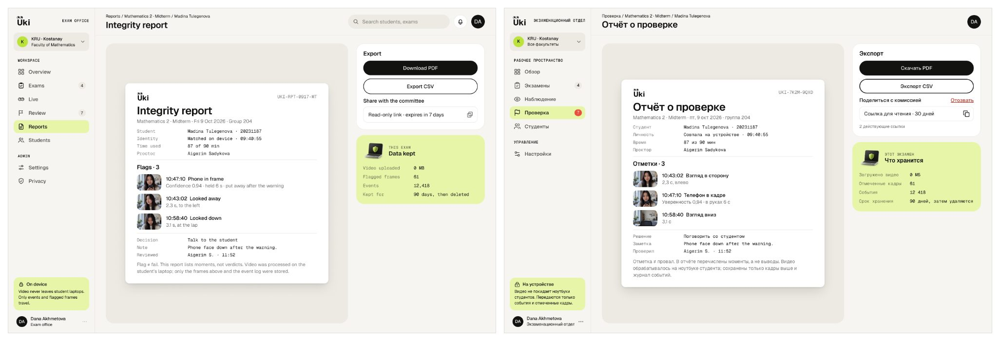 «Отозвать» fits beside «Поделиться с комиссией»; «2 действующие ссылки» under «Ссылка для чтения · 30 дней» | 2026-10-09 |
| 3.4's share field, four states | pass | 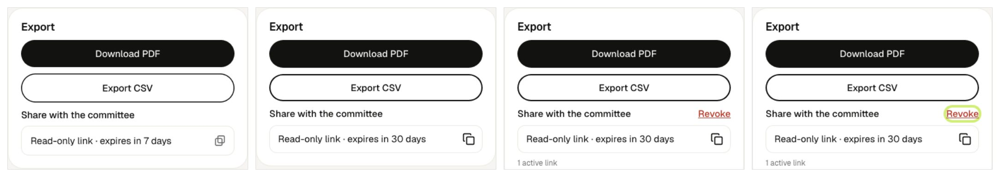 The frame; no open link (no Revoke); one open link; Revoke with the keyboard focus ring. No frame draws Revoke (a frame gap, decisions) | 2026-10-09 |
| Figma 3.5 `162:13464` | pass | 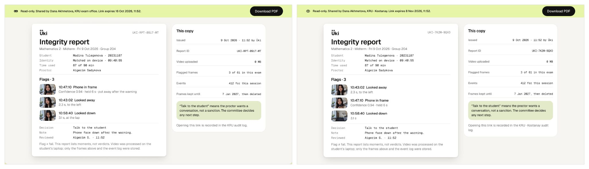 The code `UKI-7K2M-9QXD` in the report head and This copy's Report ID; the banner's expiry is 30 days after sharing | 2026-10-09 |
| `/verify/[code]` | pass | 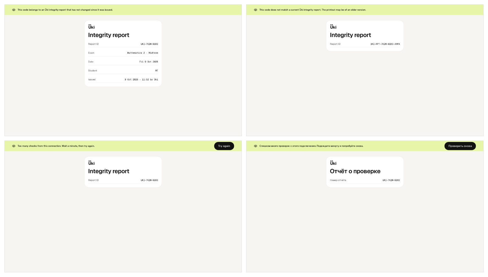 At 1280: a code typed in lower case, intact; an old `UKI-RPT-…` printout, not matched; the try-again state in English and Russian. No frame of their own: 3.5's banner and This copy rows | 2026-10-09 |
| The try-again state at 390 px, 3.5 at 390 px and a revoked link | pass | 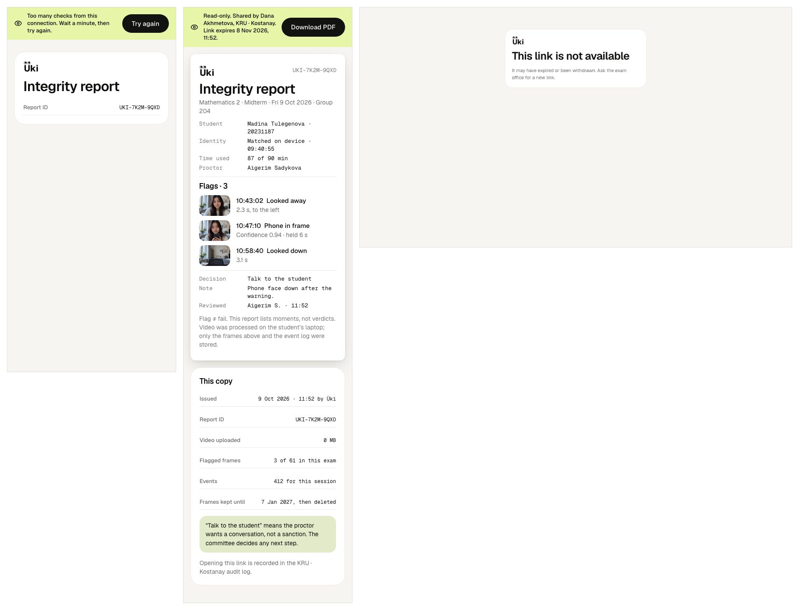 The banner wraps beside Try again; 3.5 in one column; the not-found page a revoked link gets | 2026-10-09 |
| The conversion on the cloud project | pending | Runs by itself at the merge (`deploy-supabase.yml`). After it, the coordinator: every report has an `UKI-XXXX-XXXX` code on 3.4, and a printout of an older 12-character code reads “does not match” | |
| `/verify`'s limit behind Vercel | pending | Hand check on the deployed site: the 11th lookup in a minute from one phone shows the try-again state, another network is still answered. Vercel sets `x-forwarded-for` itself | |
| Revoke on the deployed site | pending | Hand check, you: share, open on the phone, Revoke on 3.4, the phone's reload shows “This link is not available”, and A.6 lists the revoke | |

## Dev defaults to the cloud (VPS plan, step 0)

`pnpm dev` runs the apps against the cloud demo project from the public lines of `.env.cloud`; `pnpm dev:local` is the local stack, slimmed; the scripts that need the local database stop at once without it (docs/decisions.md, 2026-10-09; `docs/runbooks/development.md`). No screen changed, so no frame was compared.

| Check | Result | Evidence | Date |
|---|---|---|---|
| No secret name reaches an app process | pass | `scripts/lib/dev-env.test.ts`: with every secret in the shell, in `.env.cloud` (one hidden in a multi-line value) and in `.env`, neither the names nor the values reach the app environment, in both modes; a secret key in a public line, a missing address or key, and a local or `http` address each stop `pnpm dev` with the variable's name and never its value | 2026-10-09 |
| The scripts that need the database fail fast | pass | `scripts/lib/local-stack.test.ts` runs `node scripts/lib/local-stack.ts` on closed ports (exit 1, one line ending "needs pnpm dev:local, or runs in CI") and on listening ports (exit 0, silent), and checks every gated script in both `package.json` files. By hand without a stack: `pnpm db:reset` stopped in 0.25 s with that line | 2026-10-09 |
| `pnpm dev` without `.env.cloud` | pass | Stops before starting anything and prints the two lines to write, with placeholders only | 2026-10-09 |
| `pnpm dev` for 30 s with no Docker | pass (without the desktop app) | `docker` and `supabase` replaced on `PATH` by shims that log each call and fail, `DOCKER_HOST` pointing nowhere: 0 calls. The run printed the cloud line. Web answered `/sign-in` 200 after 4 s, then `/` 200 and `/sign-in` 200 (read-only GETs; nobody signed in). `next dev` compiled the cloud address into 10 files and `127.0.0.1:54721` into none; its environment had `NEXT_PUBLIC_SUPABASE_URL` and no name containing SECRET, PASSWORD, TOKEN, PRIVATE, SERVICE_ROLE or API_KEY, and no `SEED_*`. The log had no `sb_secret_`. Stopped with Ctrl+C (SIGINT) after 37 s: ports 3000, 5180 and 5183 free and no process left. Ran with `--only web,lms-mock,lock` | 2026-10-09 |
| The desktop app under `pnpm dev` | blocked here | The full `pnpm dev` stopped after 5 s because another project's Vite dev server held port 5173, which the desktop renderer needs (`strictPort`), and turbo stopped the other apps with it. That process was not this repository's and was left alone. Pending: you, `pnpm dev` with port 5173 free; the Electron window opens on 1.1 against the cloud | |
| The slim stack and the checks in CI | pass (CI) | Not run on the MacBook (no Docker). CI's stack job on PR #32 started the stack with `pnpm db:start` (`supabase start -x studio,postgres-meta,imgproxy,mailpit,logflare,vector,supavisor,edge-runtime`, no warning about the names), and each gated script passed its stack check: `pnpm db:reset` applied 16 of 16 migrations and the seed (5 exams), `pnpm db:test` 16 files and 781 tests PASS, `pnpm test:integration` 26 files, 154 passed and 3 skipped, `pnpm test:integration:desktop` 3 passed, `pnpm e2e` 39 passed, the demo scripts, and the sink step 20 passed and 1 skipped | 2026-10-09 |
| `pnpm dev:local` on a laptop | pending | Needs Docker, so not on the MacBook: whoever runs the local stack, `pnpm dev:local` once (it starts the same slim stack and serves the functions) | |
| `pnpm check` | pass | Exit 0: Biome 996 files, guards 1029 files, turbo 22/22 tasks (web 461 tests, desktop 451), functions-unit 106, scripts 157 in 13 files (`dev-env.test.ts` and `local-stack.test.ts` new) | 2026-10-09 |
| CI on the pull request | pass | PR #32: Linux (lint, guards, types, unit tests; the stack job; the builds), Windows and macOS green. A push run's Windows job once timed out in `packages/contracts/src/exam-code.test.ts`, which this branch does not touch; the pull request run of the same commit passed | 2026-10-09 |

## 1.10 Reports page

Branch `wp/1.10-reports` (PR #25). A.1 at `/reports` for the exam office, from WP 1.1's `term_*` views under RLS, with SVG charts from the kit's Chart parts in a new `charts` group of `@uki/ui`, the term and faculty pickers, Export PDF through an A4 print stylesheet, and the Reports sidebar item. One migration, `20261012180000_term_views_per_exam.sql` (after WP 1.9's `20261012160000`), makes the views check access once per exam, with pgTAP `18_term_views`. From 9 October nothing that needs a database runs on the development MacBook: pgTAP and the dashboard e2e run in CI only, and the Figma comparisons use the development-only route `/reports/frame`, which draws A.1 inside the shell with the frame's numbers (`apps/web/src/features/reports/test-fixtures.ts`: 38 exams, 4,912 sessions, six weeks from 11.6 down to 8.4 flags per 100, 485 flags, 298 flagged sessions decided 214, 61 and 23, review medians from 2:30 to 1:40), served by `next dev` from this worktree on port 3410 and captured with Playwright at 1440 × 960. The comparisons put the frame on the left and the page on the right, both at 1440 × 960, scaled to half; the Russian one puts the English frame beside the Russian page, since the frame is English. Choices are logged in `docs/decisions.md` under "1.10 Reports page".

| Check | Status | Evidence | Date |
| --- | --- | --- | --- |
| A.1 shows the term from the term views | pass | `e2e/reports.spec.ts` (CI run 37834659647 at 5f333b9, on seed v1, 5.6 s; the whole e2e suite 41 passed and 1 skipped, the seed v2 test below): Dana opens Reports from the sidebar; the breadcrumb and the term picker name the term (today's term when it ran exams, else the newest that did), and Exams run and Sessions equal `term_kpis`'s all-faculties row read with the secret key; the weekly chart is drawn. The expectations come from the views, so the test holds on any seed | 2026-10-09 |
| The faculty picker narrows A.1 to one faculty | pass | Same spec (CI): the faculty with the most sessions this term, then All faculties again; the tiles follow `term_kpis`'s rows for that faculty and for all. `reports-view.test.tsx`: the chosen faculty goes through the workspace menu's cookie action, the chosen term into the address | 2026-10-09 |
| Every view of A.1 writes its audit row | pass | Same spec (CI): Dana's `reports.read` rows on the workspace with ids `<term>` and `<term>:<faculty>`, removed afterwards. `reports-data.test.ts`: the row is written before any view is read, and a failed audit write reads no number | 2026-10-09 |
| Export PDF prints A.1 alone on one A4 sheet | pass | Same spec (CI): Export PDF calls `print()` once; with print media the sidebar and the button are hidden, the printout names the workspace, faculty and term, and Chromium's PDF has one page with a 595 × 842 pt MediaBox. On `/reports/frame` with the frame's numbers: one page, MediaBox 594.96 × 841.92, in English and in Russian (below) | 2026-10-09 |
| A proctor gets the not-found page and no Reports item | pass | Same spec (CI), as Aigerim: no Reports link, and `/reports` answers 404. `reports-page.test.tsx`: a proctor's 404 reads nothing, and a failed staff lookup shows the error and reads nothing | 2026-10-09 |
| Unit and component tests | pass | web: `reports-model` 14 (rows, terms, the term rule, weekly series with gaps, the rate tile, headlines, flag groups and shares, decisions with the undecided part, review times), `reports-data` 4, `reports-view` 4 (A.1 as drawn, Export PDF, the pickers, an empty term), `reports-page` 3, `frame-page` 2 (`/reports/frame` answers 404 in production), `shell-model` updated for the Reports flag. ui: `chart-geometry` 19 and `charts` 12 | 2026-10-09 |
| A.1 in Russian with no missing key | pass | `apps/web/test/reports-russian.test.tsx`: A.1 with the frame's numbers and an empty term in `ru`, the term menu open; no next-intl error (`intlErrors`) and no raw `dashboard.*` key | 2026-10-09 |
| `pnpm i18n:build` | pass | 270 catalog keys and 1316 dashboard keys in en and ru after the rebase; `dashboard-reports.json` adds 38 | 2026-10-09 |
| `pnpm check` | pass | After the rebase onto main at dcf0a3e (WP 1.9's verify codes and the cloud dev defaults): Biome 1026 files, guards 1062 files, then turbo 22/22 tasks, the function, script and e2e type checks, functions-unit 106 and scripts 157. Tests: web 498, ui 221, contracts 460, desktop 451 (2 skipped), lock 173, detection 102 (1 skipped), i18n 72, tokens 30, lms-mock 8, db 6. Two full `pnpm check` runs on the shared MacBook (load average 23 to 26) failed in tests this branch does not touch: a vitest worker for two Lock files did not start in time, and `popover.test.tsx` timed out at 30 s; it passed alone in 2.5 s, and `turbo run typecheck test --concurrency=2` passed every task | 2026-10-09 |
| `next build` | pass | `pnpm --filter web build`: `/reports` and `/reports/frame` render per request; `next start` on that build answers 404 for `/reports/frame` (and `/gallery`) | 2026-10-09 |
| pgTAP `18_term_views` | pass | The exam office reads its workspace's term, a proctor only their exams, another workspace and a student nothing, anon is refused, and the secret key reads every row and flag type, with the same numbers as WP 1.1's views gave. CI only: 17 files, 809 tests in run 37834659647 at 5f333b9, after a clean `db reset` of 17 migrations | 2026-10-09 |
| The term views fit the statement timeout | pass | On 8 October, before the no-Docker rule, on a loaded local stack with a term of 42 exams and 5,142 sessions: `term_kpis` for the exam office took 8.6 s with WP 1.1's views (past the 8 s timeout of `authenticated`) and 0.16 s after the migration | 2026-10-08 |
| Sidebar flag | pass | `NAV.reports` is built, for the exam office and admins only; a proctor's sidebar is unchanged (`shell-model.test.ts`) | 2026-10-09 |
| Phase 2 and 3 entry points hidden | pass | The frame's "All exams" pill, the top bar's search and the bell are not drawn (`reports-view.test.tsx`) | 2026-10-09 |
| Figma A.1 `102:10454` | pass | 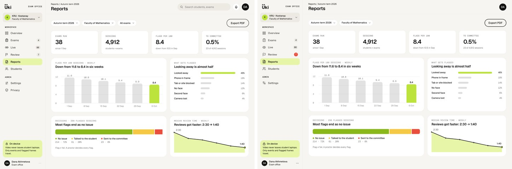 Same top bar, pickers, four tiles, the two rows of cards at the frame's widths (41 : 28) and heights, the weekly bars with the value labels and the lime latest week, the quiet type bars, the decisions bar and legend, and the review line with its two end labels. Not drawn on purpose: "All exams", the search and the bell (decisions). The kit's Export PDF button is 43.5 px high where the frame's is 46 (the kit draws its border as an inset ring), so everything below the pickers sits 2 px higher. The sidebar is WP 1.2's: Privacy is still hidden (WP 1.12), Review's count is coral (WP 1.8) and Live has the kit's eye icon | 2026-10-09 |
| Figma A.1 in Russian | pass | 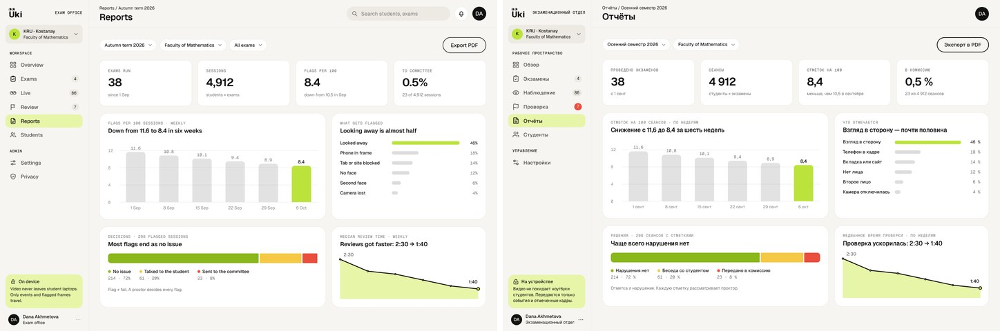 Fixed here: «Вкладка или сайт заблокированы» was cut off in the type bars' label column; the row now reads «Вкладка или сайт» (decisions). Everything else fits at 1440. The sidebar's user line cuts «Экзаменационный отдел» (WP 1.2's shell, on every page) | 2026-10-09 |
| A.1 printed on A4 | pass | 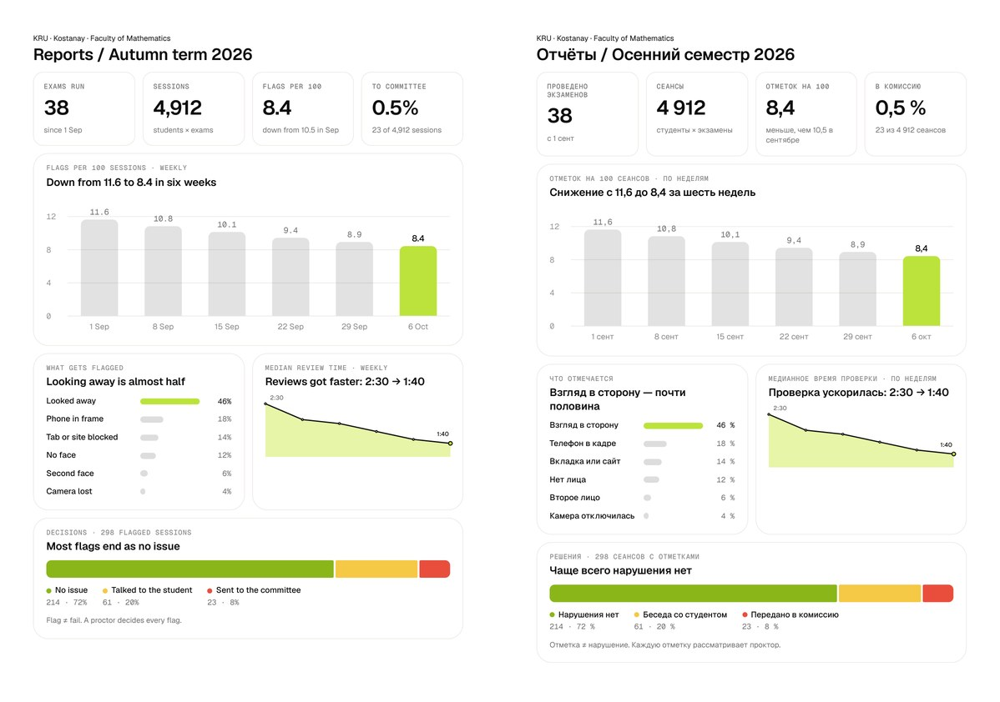 English and Russian, Chromium's print to PDF with print media: the workspace, faculty and term, the tiles, the weekly bars across the sheet, the types beside the review time, the decisions across. One sheet each | 2026-10-09 |
| The kit's Chart parts beside Figma | pass | 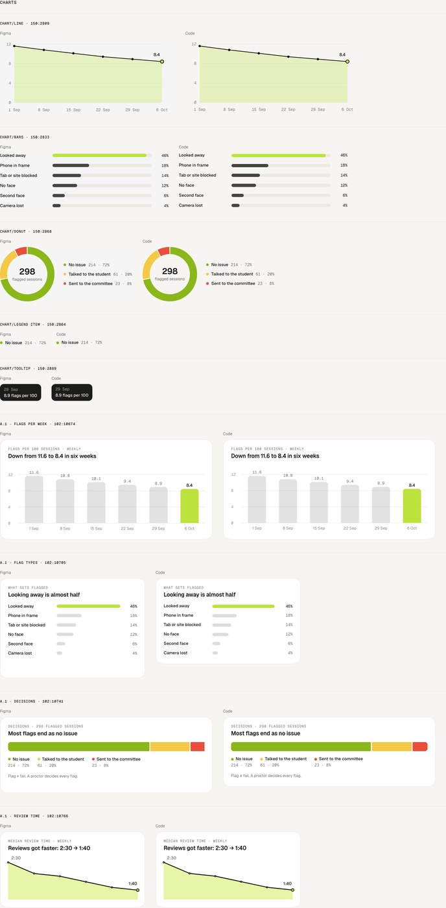 The development gallery's Charts section: Chart/Line `150:2809`, Chart/Bars `150:2833`, Chart/Donut `150:2868`, Chart/Legend item `150:2864`, Chart/Tooltip `150:2889` and A.1's four cards (`102:10674`, `102:10705`, `102:10741`, `102:10766`), each Figma screenshot on the left and the component on the right | 2026-10-09 |
| Chart/Tooltip on A.1 | pass | 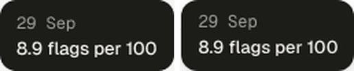 The kit's part on the left, the page's tooltip over the 29 Sep bar on the right, both at 2× | 2026-10-09 |
| A.1 on seed v2 matches its frame | pending | `e2e/reports.spec.ts`'s seed v2 test opens `/reports?term=2026-autumn` with the Faculty of Mathematics chosen and checks every number and headline of the frame: the four tiles and their captions, the six weekly bars with their dates, the six type shares, the decisions with their legend and the review time. It skips until seed v2's term data is in `supabase/seed.sql` (WP 1.14, `wp/1.14-seed-v2`, which tunes the faculty to the frame); its assertions pass on `/reports/frame` | |
| A.1 on the cloud project | pending | After the merge and the coordinator's `demo:reset` with seed v2 | |
| Export PDF from Chrome on A4, by hand | pending | Hand check (plan, Testing) | |
| CI on the pull request | see the PR | | |

## 1.12 Privacy

Branch `wp/1.12-privacy` (PR #26). New: `20261012190000_privacy_requests.sql` (the 7-day due date and the five functions the `data-request` function calls with the secret key), the `data-request` and `retention` Edge Functions (both `verify_jwt = false`), A.5 with A.5a and A.5b at `/privacy-centre`, A.6 at `/privacy-centre/audit-log`, the Privacy sidebar item, 0.1b's "Open privacy centre" and A.3's Delete on request and Export data. WP 1.1 had already made `data_requests`, the `exports` bucket, `retention_due` and `retention_nightly`. From 9 October the MacBook runs nothing that needs a database: pgTAP, the integration tests and the dashboard e2e ran in GitHub Actions on the pull request, and locally only Biome, the guards, the type checks, the unit tests and the screenshots below. The Figma comparisons put the frame on the left and the page on the right, both at 1440 × 960, scaled to half; the page is the development-only `/gallery/privacy` (`?frame=a5|a5a|a5b|a6`, a 404 in production), which renders the real views inside the shell with the component tests' fixture rows, written after the frames, so names and numbers match. There the sidebar has no active item, because the shell marks the item of the address, and Next.js's development indicator is hidden. Choices are logged in `docs/decisions.md` under "1.12 Privacy".

| Check | Status | Evidence | Date |
| --- | --- | --- | --- |
| Delete removes stills, frames, events, identity score and device record, and keeps the answers and the receipt | pass | `test/integration/data-request.test.ts` (CI): with stills uploaded through the frames function, one confirmed and one never confirmed, Delete removes both objects from Storage, then the `frames` and `events` rows, clears `identity_score` and `device`, and keeps the session, its answers and `receipt_id`; the request is `done` with one `data_request.delete` audit row holding the counts; a second Delete answers `conflict`; while the student writes a live exam it answers `conflict` (`in_exam`) and removes nothing. `e2e/privacy.spec.ts` (CI) does it in the browser from A.3's Delete on request: A.5a lists "1 frame from 1 exam", Delete 3 items, "Deleted on request", the still is gone from Storage, no frames or events rows remain, and the session keeps its receipt with `identity_score` null and `device` empty | 2026-10-09 |
| Copy gives a 7-day link | pass | Same integration file: one JSON file at `exports/<workspace>/<request>.json` with the student, exams, the flag with its still as base64, consent and devices; the signed link's token expires 7 days ahead and downloads the file; one `data_request.copy` row with its size. The e2e asks for the copy from A.3's Export data: A.5b shows the link once, it downloads with status 200, `uki.data-copy.v1`, the student's number and the uploaded still's bytes | 2026-10-09 |
| Both show on A.6 | pass | The e2e opens A.6 from A.5: Dana's delete and copy rows, newest first, with "Deleted a student's data on request" and her name; the Deletions tab (`?tab=deletions`) shows only the delete | 2026-10-09 |
| Reply with a reason | pass | Integration: the reason is stored, the request turns `replied` with one `data_request.reply` row (its length, not its text) and can no longer be deleted. `privacy-views.test.tsx`: the drawer sends it and shows "Answered with a reason" | 2026-10-09 |
| A manual retention run removes a 91-day-old still | pass | `test/integration/retention.test.ts` (CI), 3 tests: only the secret key may call; called with it, the function removes a still captured 91 days ago from Storage and from `frames`, keeps one captured 89 days ago and both flag events, and writes one `retention.run` row for the workspace as the system; then `retention_nightly`, scheduled every few seconds for the test, calls it through `pg_net` with the URL and key from Vault and removes the next 91-day-old still | 2026-10-09 |
| The exam office only | pass | Integration: no token 401, a proctor and a student 403, an unknown request 404. `17_privacy_requests` (pgTAP, CI): staff and anonymous users cannot execute the five functions; a proctor and another workspace's exam office are refused as the actor, an admin is allowed. `privacy-pages.test.tsx`: a proctor gets a 404 on both pages and nothing is read; a failed staff lookup shows the error; the two server actions refuse a proctor and input that does not parse before they touch the database | 2026-10-09 |
| Every read writes its audit row | pass | `privacy-data.test.ts`, 7 tests: `privacy_centre.read`, `data_request.read` with the student's id and `audit.read` are written before each read, and a failed write fails the page with nothing read; a request the caller may not see writes nothing. The e2e finds Dana's `privacy_centre.read` and `data_request.read` rows. A.6's Export CSV writes `audit.export` first (`privacy-views.test.tsx`, `privacy-pages.test.tsx`) | 2026-10-09 |
| pgTAP | pass (CI) | New `17_privacy_requests`: the 7-day default, the delete plan's folders and paths, the delete's counts, what stays (session, answers, receipt, decision, report), the live-exam refusal, the copy package, `privacy_export_done`'s path check, the reply, the audit rows and the grants. `13_privacy` now expects 7 days. CI run 37832769014 (before WP 1.9's merge): 17 files, 836 tests; run 37838880275 at 978d88d, after it: 18 files, 915 tests, PASS. That run first failed on `17_privacy_requests`: WP 1.9 added a format check on `reports.verify_code`, and the file's report row named a code of its own; it now takes the column's default | 2026-10-09 |
| Unit and component tests | pass | web 549 tests after the rebases, 51 of them this package's: `privacy-model` 15, `privacy-data` 7, `privacy-views` 16, `privacy-russian` 5, `privacy-pages` 8; `shell-model` and `students-view` changed for the flag and A.3's links; contracts 464 (`privacy.test.ts` adds the WP 1.12 shapes); functions-unit 115 (`copy-file` 4, `runs` 3, the import maps of both functions) | 2026-10-09 |
| A.5, A.5a, A.5b, A.6 and 0.1b in Russian with no missing key | pass | `apps/web/test/privacy-russian.test.tsx`: each page in `ru`, no next-intl error (`intlErrors`) and no raw `dashboard.*` key; 0.1b's «Открыть центр конфиденциальности» leads to `/privacy-centre`. The e2e also opens A.5a and A.5b with the `uki_locale` cookie set to `ru` | 2026-10-09 |
| `pnpm check` | pass | Exit 0 on the MacBook after the rebase onto main at 112a372 (WP 1.9's revoke, the cloud dev defaults, WP 1.10 and the Windows smoke build): Biome 1057 files, guards 1096 files, turbo 22/22 tasks (web 549, contracts 464, desktop 458, ui 221, lock 173, detection 102, i18n 72, tokens 30, lms-mock 8, db 6), functions-unit 115, scripts 157 | 2026-10-09 |
| `pnpm i18n:build` | pass | 270 catalog keys and 1511 dashboard keys in en and ru after the rebases onto WP 1.9 and 1.10; `dashboard-privacy.json` adds 195 | 2026-10-09 |
| CI on the pull request | pass | Runs 37832762687 and 37832769014 at ce803fe (rebased onto main at ce12ed0), and run 37838880275 at 978d88d (rebased onto WP 1.9's revoke; the dashboard e2e 42 tests): every job passed, Linux checks, the stack job (pgTAP, integration with `data-request` and `retention`, the desktop flow, the dashboard e2e with `privacy.spec.ts`, 41 tests) and demo scripts, the builds, the macOS installers, Windows and the secret scan. The run at the merged head, after the rebase onto 112a372, is on the PR and was green before the merge. One local `pnpm check` after the rebase onto WP 1.9 failed three web tests by the 20 s timeout and one worker that did not start, with the Mac's load average at 20 to 25 from other agents' work; the same tests passed alone and in every full run since | 2026-10-09 |
| Sidebar flag | pass | `NAV.privacy.built` is on for the exam office and admins; a proctor's sidebar has no Privacy item (`shell-model.test.ts`) | 2026-10-09 |
| 0.1b's link and A.3's buttons | pass | 0.1b shows "Open privacy centre" to `/privacy-centre` (`privacy-russian.test.tsx`); A.3's Delete on request and Export data open A.5a and A.5b for that student (`students-view.test.tsx`, and the e2e clicks both) | 2026-10-09 |
| Phase 2 and 3 entry points hidden | pass | A.5's Processing record (PDF) (A.5c) and A.5b's Format choice are not drawn; the top bar's search and bell stay hidden, as on every page (`privacy-views.test.tsx`) | 2026-10-09 |
| Figma A.5 `107:11102` | pass | 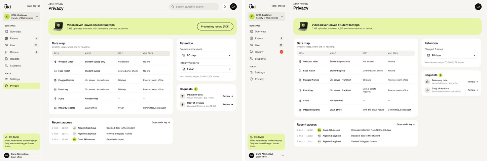 Taken after WP 1.10 turned Reports on, so the sidebars match. Same banner with the 3D laptop shield, Data map columns (DATA at 321, WHERE 505, KEPT 701, WHO SEES 851, as in the frame) and rows 55 px apart (within 1 px of the frame's), Recent access rows with the 24 px avatars, Retention and Requests cards 360 px wide with the 32 px icon wells and Review links. Differences, all logged: no Processing record button; "Üki server · Frankfurt"; "Until a delete request", which wraps to two lines in the 150 px KEPT column, and "With the exam result"; one retention select, "Flagged frames"; Recent access lists the three newest entries in order (the frame's are not) | 2026-10-09 |
| Figma A.5 in Russian | pass | 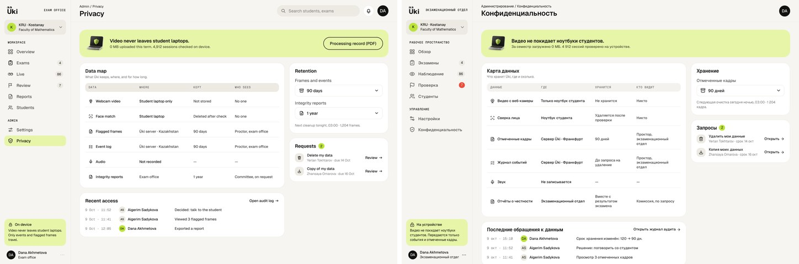 The longer Russian wraps inside the Data map cells and the cleanup line; nothing is cut off, and the page scrolls to Recent access | 2026-10-09 |
| Figma A.5a `165:14035` | pass | 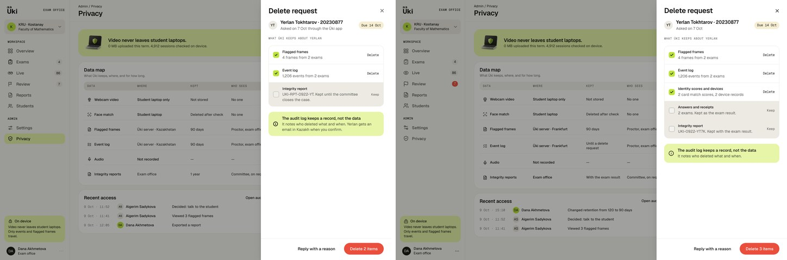 Same 480 px drawer over the scrim, head, student row with the paper avatar and the Due pill, the mono label, list rows about 68 px apart with the lime checkboxes and the grey Keep rows, the info banner, the footer with Reply with a reason and the danger button. The list adds Identity scores and devices and Answers and receipts, so the button reads "Delete 3 items"; "Asked on 7 Oct" without the channel; the banner without the email line | 2026-10-09 |
| Figma A.5a in Russian | pass | 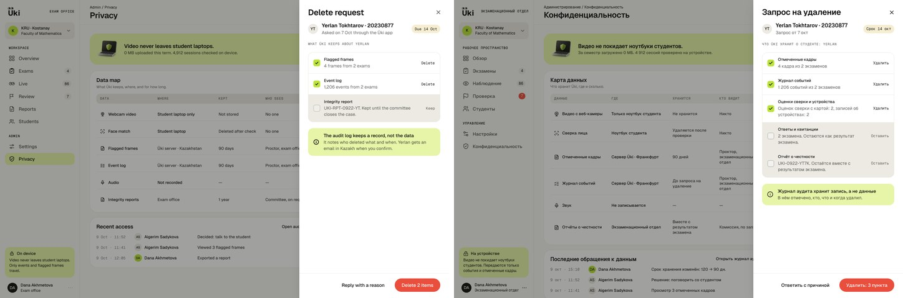 «Удалить: 3 пункта»; the Keep rows' details wrap to two lines | 2026-10-09 |
| Figma A.5b `165:16241` | pass | 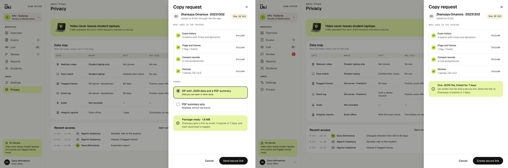 Same drawer, the four Include rows with their counts ("4 exams with times and decisions", "1 flag, 1 frame", "4 rule acceptances", "1 laptop, Üki 1.4.2"). No Format choice and "Create secure link" for "Send secure link"; the banner says the exam office sends the link (decisions) | 2026-10-09 |
| Figma A.5b in Russian | pass | 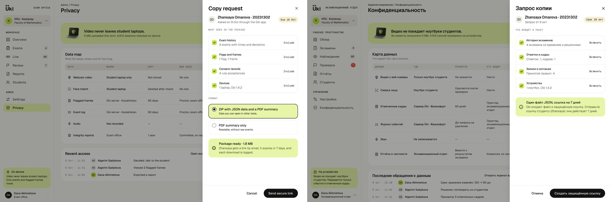 Everything fits | 2026-10-09 |
| Figma A.6 `108:11296` | pass | 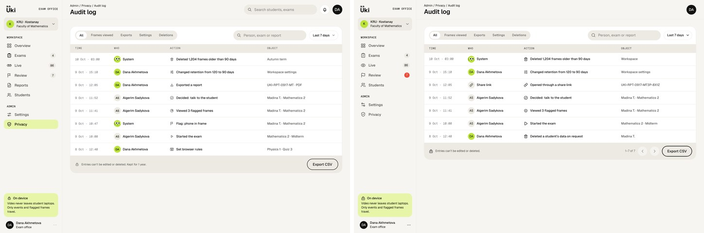 Same card, tabs, search 300 px and range pill, header row, 53 px rows with the 28 px avatars and the Face for System, icons per action, and the footer with Export CSV. Fixed here: the WHO, ACTION and OBJECT columns started 20 px left of the frame's (469, 699, 1099); a cell's width includes its padding, so the time cell is now 180. The footer adds "1–7 of 7" with the paging buttons and leaves out "Kept for 1 year."; the retention row's object is "Workspace" where the frame writes "Autumn term" | 2026-10-09 |
| Figma A.6 in Russian | pass | 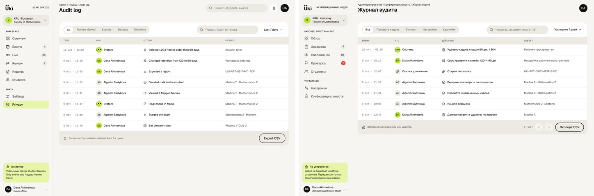 The tabs, the search and «Последние 7 дней» fit on one line at 1440 | 2026-10-09 |
| The privacy delete of Act 5 on the cloud project | pending | After the merge deploys the migration and both functions, and seed v2's `pnpm demo:reset` (WP 1.14) seeds the delete request: open it on A.5a, delete, and find the row on A.6 | |
| The seeded 91-day-old still and the first nightly run on the cloud | pending | `demo:reset` (WP 1.14) adds the still; `retention_nightly` needs the Vault secrets `uki_project_url` and `uki_secret_key` on the cloud project (`docs/runbooks/cloud-setup.md`). Then a `retention.run` row on A.6 the next morning | |

## 1.13 Landing: user decisions and judge path

Branch `wp/1.13-jury-guide` (PR #29) on `origin/main` at 6a195dd (WP 0.15's release, WP 1.9's verify and revoke, dev against the cloud, WP 1.10, the Windows smoke build and WP 1.12 merged). Two sets of user requests, neither drawn in Figma:

- 8 October: Sign in to `/sign-in`, Book a pilot to the form at `/pilot` (no contact link), Download to the latest published GitHub release, and a jury guide with the mascot.
- 9 October, the judge path: the Live demo button, `?email=` and a safe `?next=` on sign-in, `/demo/live` and the public jury page `/demo`.

Both are logged in `docs/decisions.md` under "1.13 Landing: user decisions 8 Oct" and "1.13 Landing: the judge path". The work ran on the development MacBook with `next dev` on port 3420 and no database, as the user's rule of 8 to 9 October requires: no Docker and no local stack on this Mac. The public pages need no stack for a visitor. The tests that sign in run only in CI's stack job. The Figma comparisons put the cached frame (`.figma-cache/`) on the left and the page on the right. The 8 October images are full pages at the frame's width, scaled to 0.32 at 1440 and 0.6 at 390; the judge path images are crops at the scale named in their row.

| Check | Status | Evidence | Date |
| --- | --- | --- | --- |
| `/` outside the guide still matches Landing `114:2039` at 1440 | pass | 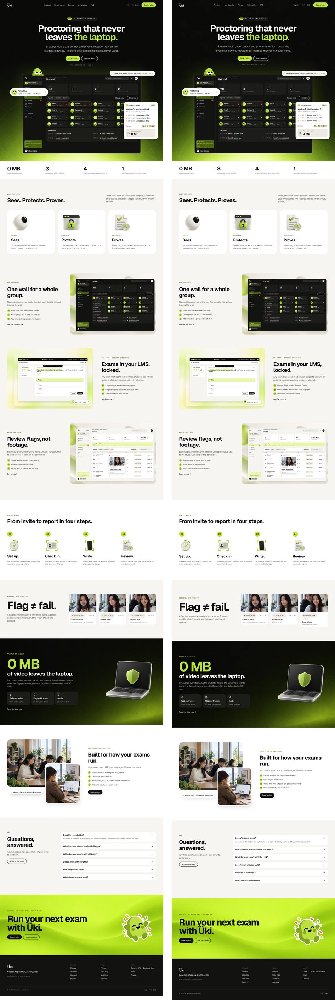 With the guide's button and the new download block hidden, the page is 8,819 px, the height recorded for WP 1.13, and every section lines up with the frame as before. 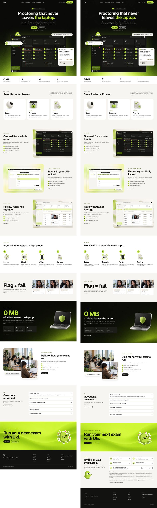 With the block: 9,509 px, the block's 690 px between the CTA band and the footer | 2026-10-08 |
| `/` outside the guide still matches Mobile 390 `192:3586` | pass | 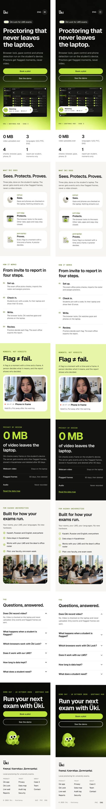 6,176 px without the button and the block, as recorded for WP 1.13. 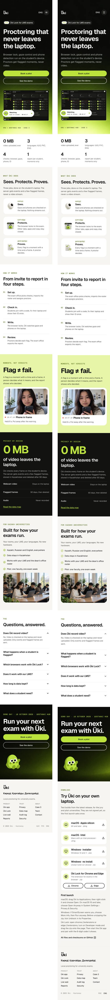 7,397 px with it | 2026-10-08 |
| The download block (no frame) | pass | 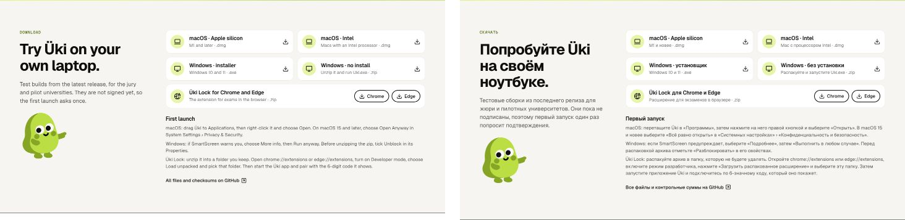 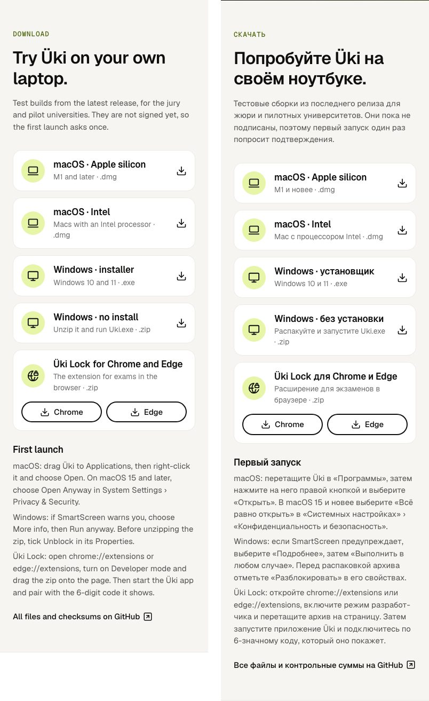 English and Russian at 1440 and 390: five cards, Üki Lock with Chrome and Edge, the first-launch notes and the release page link; nothing scrolls sideways at 390 | 2026-10-08 |
| The jury guide (no frame) | pass | 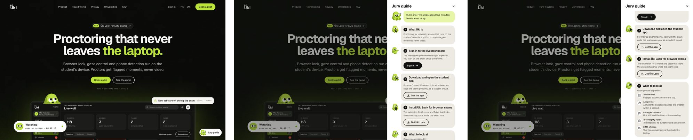 The button in the corner, the guide open, and its end. 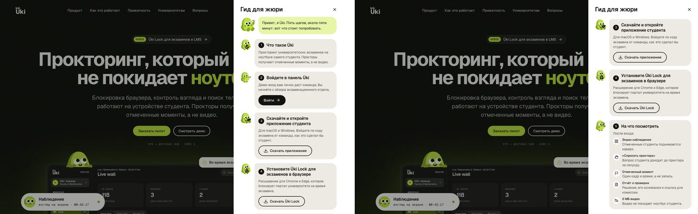 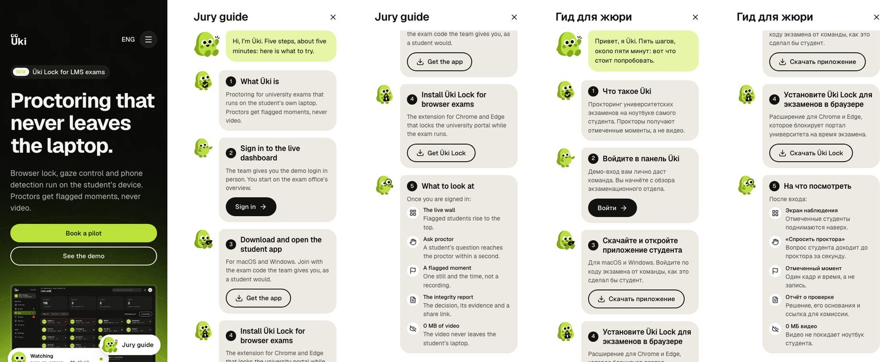 The button, then the guide in English and in Russian at 390, full width. Mascot poses from `packages/ui/src/art` (hello, shield, pointing, laptop, lock, magnifier), not recoloured; bubbles from tokens | 2026-10-08 |
| Asset names match the release workflow | pass | `download-model.test.ts`: the six names and `releases/latest/download/<name>` URLs, and since 9 October the names read from `scripts/lib/release.ts` on `main` (WP 0.15 merged), so a renamed release file fails the unit tests: `Uki-mac-arm64.dmg`, `Uki-mac-x64.dmg`, `Uki-Setup-win-x64.exe`, `Uki-win-x64.zip`, `Uki-Lock-chrome.zip`, `Uki-Lock-edge.zip` | 2026-10-09 |
| Playwright: the destinations and the guide at 1440 and 390 | pass | `e2e/landing.spec.ts`, "the landing: user decisions of 8 October", in `chromium` (1440) and `landing-390`: Sign in opens `/sign-in` (the header at 1440, the menu at 390); every Book a pilot link is `/pilot` and opens the form; the block's seven links are the six release files and the release page, and the footer's Üki app scrolls to it; the guide opens from its button with five steps, fits the window, shows no address or password, closes with the close icon and with Escape and gives the focus back to the button, opens with Enter with the focus on the close icon and keeps Tab inside, closes on Get the app with the block in view, and Sign in in it opens `/sign-in`; with `prefers-reduced-motion: reduce`, the button and the panel have no transform and no animation and transition only opacity and colour. Plus, in Russian through the `uki_locale` cookie, the guide and the block with no raw key. Run against `next dev -p 3420` with a local config without the stack's global setup: the 32 landing tests that need no database passed (the two that store pilot requests need the stack and run in CI's stack job) | 2026-10-08 |
| Russian render test | pass | `apps/web/test/landing-guide.test.tsx` (6 tests): the guide opened and the download block render in Russian and in English with no next-intl error (`intlErrors`) and no raw key; the guide's steps, links and points come from the messages, it has no address or password, and it closes with the close icon and on a link | 2026-10-08 |
| `pnpm check` | pass | Exit 0: Biome 990 files, guards 1023 files, turbo 22/22 tasks (web 473 tests, contracts 455, ui 188, desktop 451, lock 173, detection 102), functions-unit 106, scripts 83 | 2026-10-08 |
| `next build` | pass | `pnpm --filter web build`: `/` renders per request with the block and the guide | 2026-10-08 |
| Strings | pass | `pnpm i18n:build`: 1319 dashboard keys in English and Russian; the download block's and the guide's 48 keys in `dashboard-landing.json` | 2026-10-08 |
| The file links download the release's files | pass | A HEAD request to each of the six `releases/latest/download/<name>` links answers 302 to that file of v0.1.2, the latest release (for example `releases/download/v0.1.2/Uki-Lock-edge.zip`). Clicking each one on Vercel is still a hand check below | 2026-10-09 |
| You read the guide's and the download block's copy | pending | Monday 12, with the rest of the landing copy | |
| The guide on your phone | pending | Hand check | |
| `/` with Live demo still matches Landing `114:2039` at 1440 | pass | 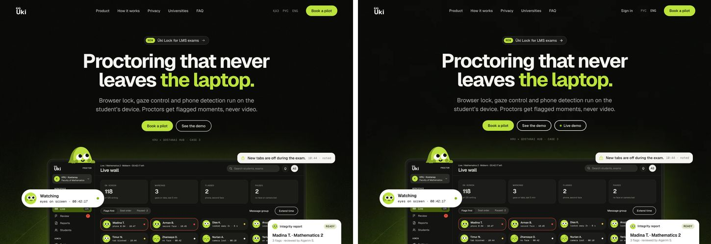 The hero's first 1,000 px, frame left, page right, at 0.5: Live demo is a third button in the row beside See the demo, with a green dot, and the row keeps its height. Without the guide's button and the download block the page is still 8,819 px; with the block, 9,509 px, as on 8 October. Sign in and the hidden ҚАЗ are WP 1.13's differences | 2026-10-09 |
| `/` with Live demo against Mobile 390 `192:3586` | pass | 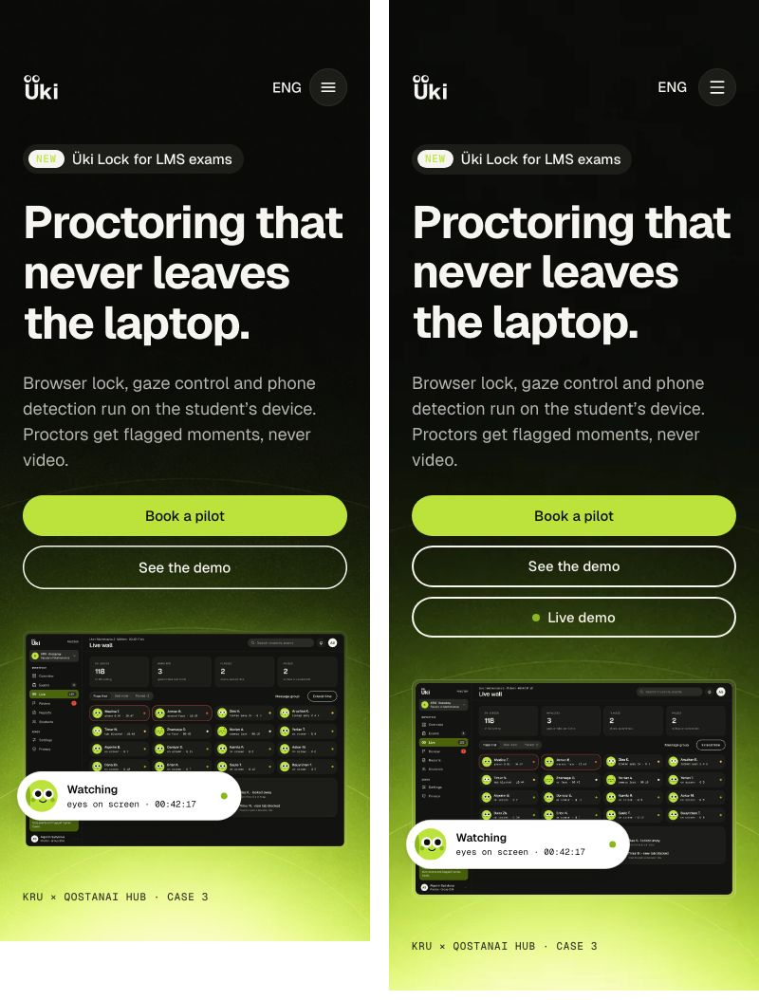 The hero at full size: Live demo stacks under See the demo, so the page is 6,230 px against 6,176, 54 px taller, and everything below moves down by that. The 390 menu has Live demo after Sign in | 2026-10-09 |
| The hero and the 390 hero in Russian | pass | 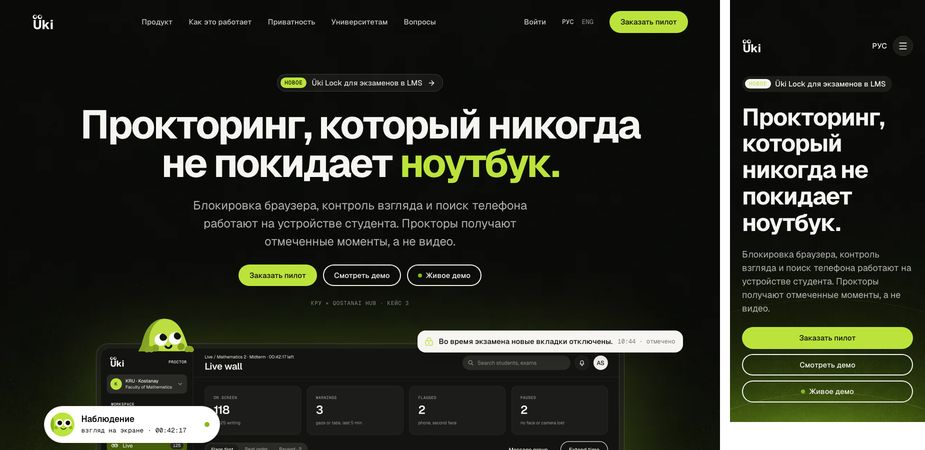 «Живое демо» fits the 1440 row and the 390 stack | 2026-10-09 |
| A.0 Sign in from Live demo, beside `177:15946` | pass | 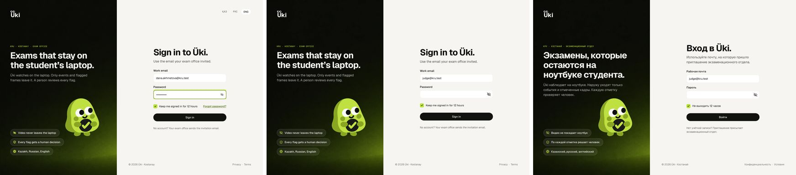 Frame, then `/sign-in?email=judge%40kru.test&next=/demo/live` in English and Russian at 1440 × 960, at 0.4: the email is filled in, the password is empty, and nothing else moves. Forgot password? and the language switch stay hidden, as in Phase 0 | 2026-10-09 |
| `/demo`, the jury page (no frame) | pass | 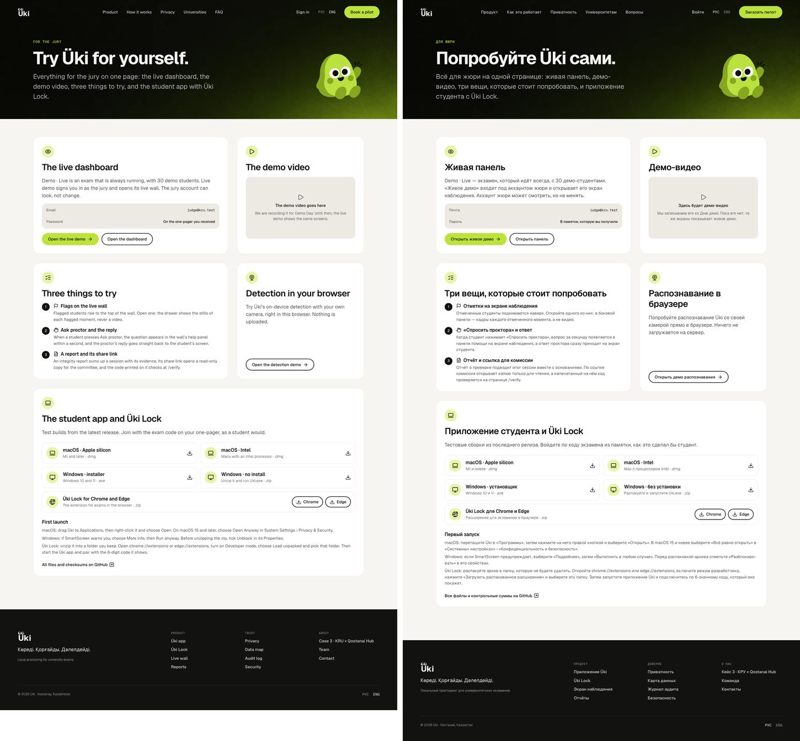 English and Russian at 1440 (2,578 and 2,690 px), at 0.5. 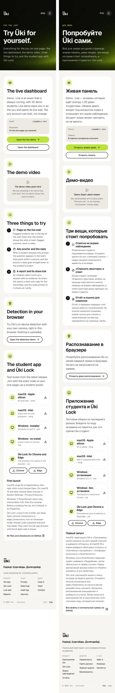 The same at 390 (4,214 and 4,792 px), at 0.6. The live dashboard card shows Live demo, Open the dashboard, `judge@kru.test`, and "On the one-pager you received" for the password. Then the video placeholder, three things to try, the detection demo link to `/try`, and the release's files. Nothing scrolls sideways | 2026-10-09 |
| `/demo/live` when the exam is not there, and when Üki does not answer (no frame) | pass | 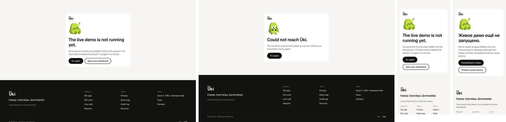 Not running yet at 1440, Could not reach Üki at 1440, Not running yet at 390 in English and in Russian, at 0.5. These need a staff session and a database, so they were rendered for the picture by a temporary route that was never committed. The real 404 runs in CI (next row) | 2026-10-09 |
| The guide with the Live demo step and the `/demo` link | pass | 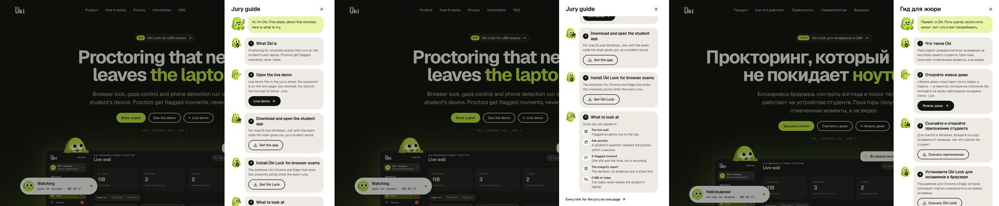 At 1440: the top with step 2 "Open the live demo", the end with "Every link for the jury on one page", and Russian, at 0.45. 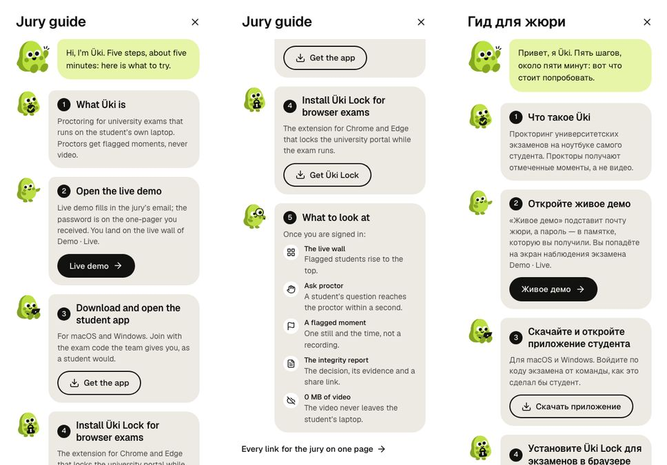 The same at 390, at 0.8. No address and no password appear in the guide | 2026-10-09 |
| `?next=` is followed only to a safe internal path | pass | `sign-in-query.test.ts` (28 tests). Followed: `/demo/live`, paths with a query or a hash. Refused: `//host`, `/\host`, a scheme, `javascript:`, `data:`, a relative path, a tab, a newline or a space, `/..//host`, `/%2e%2e//host`, `/sign-in`, empty, repeated, and more than 512 characters. `actions.test.ts` checks that the sign-in action follows a safe next and sends six unsafe ones to the role landing. `judge-path.test.tsx` (8 tests) covers signed-in staff on `/sign-in?next=`: a safe next is followed, an unsafe or repeated one goes home. It also covers `/demo/live`: a visitor goes to `/sign-in?next=/demo/live` with no exam read; staff go to `/exams/<id>/live`; a missing exam is `notFound()`; a failed lookup or read shows Try again | 2026-10-09 |
| Playwright: the judge path's destinations and the guide at 1440 and 390 | pass | `e2e/landing.spec.ts`, "the judge path", in `chromium` (1440) and `landing-390`. The hero's Live demo (and the 390 menu's) links `/sign-in?email=judge%40kru.test&next=/demo/live`, and a click lands on sign-in with the email filled in and `next` in the hidden field. `/demo/live` without a session goes to `/sign-in?next=/demo/live`. Eight unsafe next values and a non-email leave no hidden field and an empty email. `/demo` answers 200 without a session and has all its links, the email, the password note and no login field. `/demo` renders in Russian with no raw key. The guide test now follows Live demo and the `/demo` link. Run against `next dev -p 3420` without the stack's global setup: all 42 landing tests that need no database passed (21 at each width). "The judge path with the stack" runs at 1440 in CI's stack job. It signs Dana in through the form with `next=/students` and lands there. Signed in, it opens `/sign-in?next=/review` (goes to `/review`) and the eight unsafe values (each goes to `/overview`). `/demo/live` then goes to DEMO-LIVE's wall when the seed has the exam, or answers 404 with the notice when it does not, as in CI's seed today. Finally it signs in again from `/sign-in?next=//evil.example` and lands on `/overview` | 2026-10-09 |
| Russian render test for the judge path | pass | `apps/web/test/demo-russian.test.tsx` (10 tests). The jury page's body, both `/demo/live` notices and the 390 menu render in Russian and English with no next-intl error (`intlErrors`) and no raw key. The tests check the jury page's links, the release files, the video placeholder and the video link (new tab, `noreferrer`), and that it has no field. `landing-guide.test.tsx` checks the guide's Live demo and `/demo` links | 2026-10-09 |
| `pnpm check` after the judge path | pass | Exit 0 after the rebase onto 6a195dd. Biome checked 1078 files; the guards found 1117 files clean; turbo ran 22/22 tasks. Tests: web 627, contracts 464, desktop 458, ui 221, lock 173, detection 102, i18n 72; functions-unit 115; scripts 157. The 42 landing tests that need no database passed against `next dev -p 3420` two rebases earlier; the later ones brought no change to the landing, sign-in or the release's file names | 2026-10-09 |
| `next build` after the judge path | pass | `pnpm --filter web build`: `/demo`, `/demo/live` and `/sign-in` render per request | 2026-10-09 |
| Strings after the judge path | pass | `pnpm i18n:build`: 1599 dashboard keys in English and Russian after the rebase; the judge path adds 40 to `dashboard-landing.json` | 2026-10-09 |
| CI on the pull request | pass | Run 37837458369 on f0c98d4 passed all six jobs on Linux, macOS and Windows. In the stack job's `pnpm e2e`, 62 tests passed and 1 was skipped (the stack test at 390, on purpose). "The judge path with the stack" passed at 1440 on its first attempt: Dana signed in through the form with `next=/students` and landed there; signed in, `/review` was followed and the eight unsafe values went to `/overview`; `/demo/live` answered 404 with the notice, since the CI seed has no DEMO-LIVE; and the second sign-in, from `next=//evil.example`, landed on `/overview`. The first run, 37835695907, failed in that test because of the test, not the app: `toHaveURL(/\/students$/)` matched `/sign-in?next=/students` before the sign-in finished. The test now waits for the path | 2026-10-09 |
| `/demo/live` on Vercel signs the judge in and opens DEMO-LIVE's wall | pending | Needs the observer role, the judge account and DEMO-LIVE on the cloud project (other branches, then the coordinator's deploy and `demo:reset`); then Live demo once on Vercel with the one-pager's password | |
| The demo video on `/demo` | pending | You set `NEXT_PUBLIC_DEMO_VIDEO_URL` (https) in the Vercel project and redeploy; until then the page shows the labelled placeholder | |
| `/try` from `/demo` | pending | The in-browser detection demo is on `wp/judge-try`; the link answers 404 until that branch merges | |
| You read the judge path's copy (the jury page, the notices, the guide's Live demo step) | pending | Monday 12, with the rest of the landing copy | |

## /try detection demo

Judge mode, branch `feat/judge-try` (PR #35): `/try`, the desktop app's on-device detection on a visitor's camera in the browser, and the dashboard PWA. Built and checked on the development MacBook without Docker or any database: `next dev` and `next start` on port 3430, Playwright's Chromium with its fake camera (`--use-fake-device-for-media-stream`, and `--use-file-for-fake-video-capture` with the brand kit's evidence pictures). `/try` has no Figma frame: the comparisons below set it beside the frames whose parts it reuses. Choices are logged in `docs/decisions.md` under "Judge mode: the /try detection demo and the dashboard PWA".

| Check | Status | Evidence | Date |
| --- | --- | --- | --- |
| `/try` opens without a session, runs the worker on the fake camera, and the numbers update | pass | `e2e/try/try.spec.ts`: status 200 without cookies; Start opens the camera, a worker starts and the status reaches Running; the overlay's frame time changes, "Frames from" reads MediaStreamTrackProcessor, the frame size and the GPU or CPU delegates fill in; with no face in the test pattern, face.missing and session.paused arrive after 10 s with the pause banner and a disabled I'm here; Stop turns the camera off. The test fails on any request outside the page's origin: none | 2026-10-09 |
| No request leaves the page, MediaPipe's usage logs included | pass | `try.spec.ts` lists every request outside the page's origin. Before the network guard, 2 of 5 runs posted to `https://odml.pa.googleapis.com/v1/log` (tasks-vision 1.1's usage logs, sent when a task closes on Stop); with `network-guard.ts` in the worker, 5 of 5 runs in a row saw none. `network-guard.test.ts` covers https and the desktop's `uki://app`, and `privacy.test.ts` that the worker installs the guard before MediaPipe loads | 2026-10-09 |
| A face and a phone on the camera | pass | The same file with the evidence pictures as the camera: Faces 1 and a head yaw for `uki-evidence-normal.jpg`; a phone score of at least 0.5 for `uki-evidence-phone.jpg` (0.77 in the screenshots, under the 0.85 default, so no phone.detected) | 2026-10-09 |
| The whole rule path on a scene: face, phone, empty seat, back | pass | 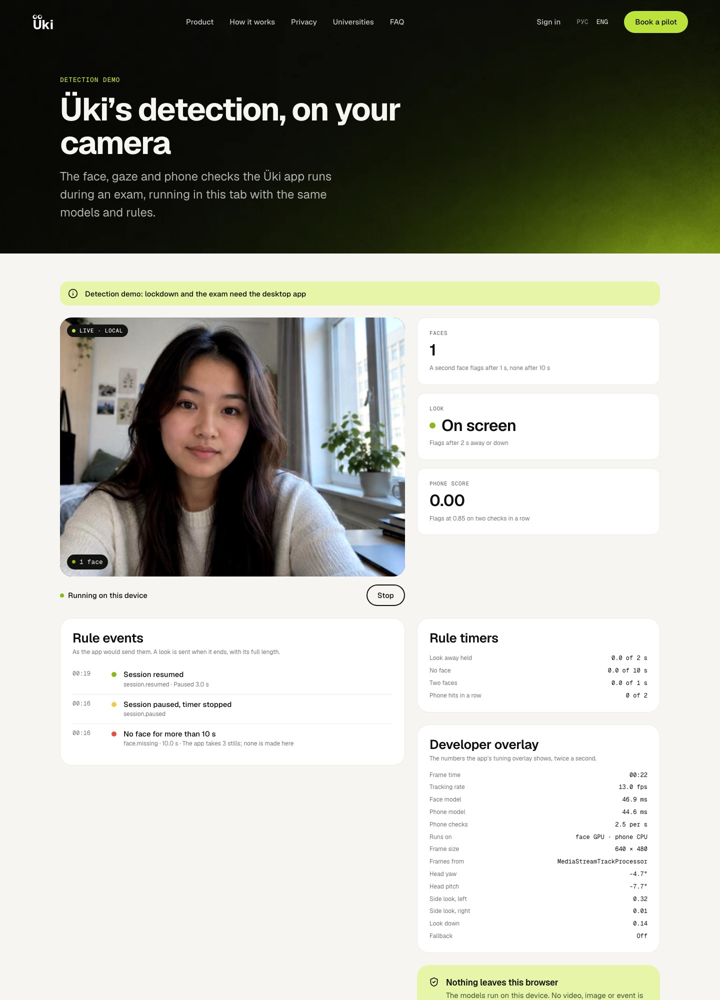 A Motion JPEG of the three pictures (4 s, 3 s, 13 s, then the student again): face.missing at 10.1 s with "The app takes 3 stills; none is made here", session.paused, then I'm here enabled once the face is back and session.resumed with the pause's length | 2026-10-09 |
| Camera denied or missing | pass | 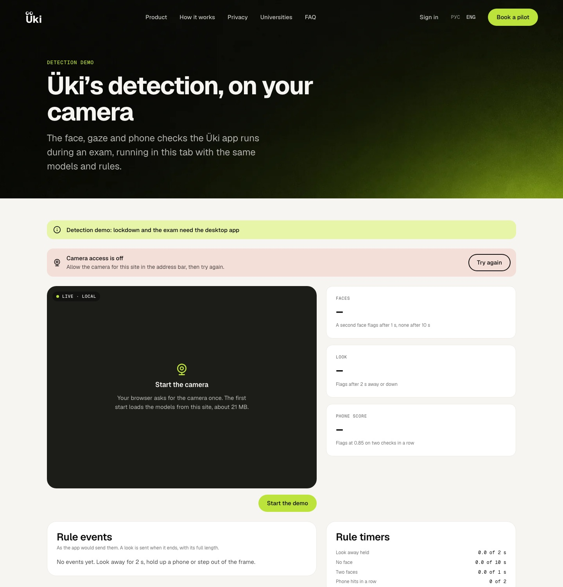 `try.spec.ts` with getUserMedia rejecting NotAllowedError and NotFoundError: each names the problem with Try again; busy, unsupported and the models' failure are in the unit and Russian tests | 2026-10-09 |
| Beside Book a pilot `194:4014` (the band) and 2.1 `51:2074` (the camera tile) | pass | 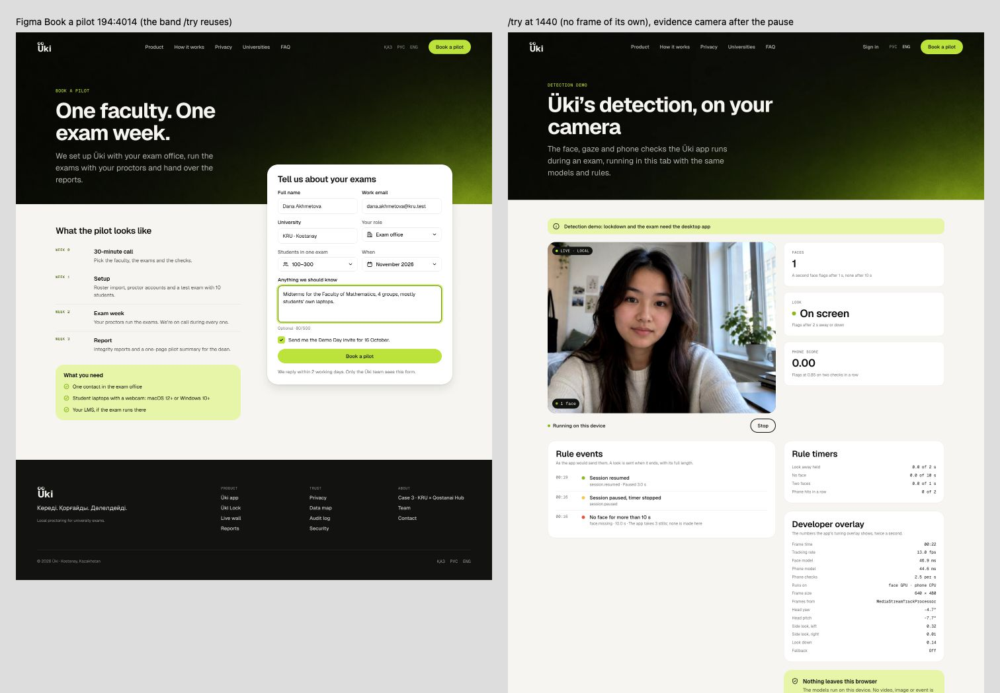 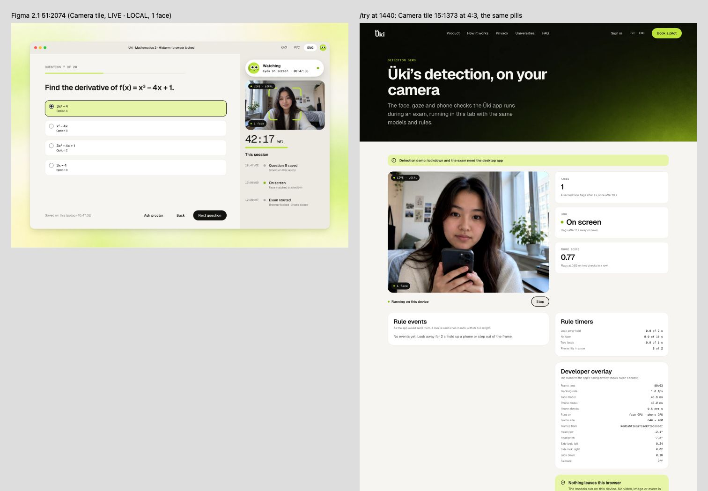 The header, art, overline and type scale of /pilot's band; the Camera tile's LIVE · LOCAL and face pills. The tile's face corners are hidden at 4:3 (decisions) | 2026-10-09 |
| Before the start, at 390, in Russian | pass | 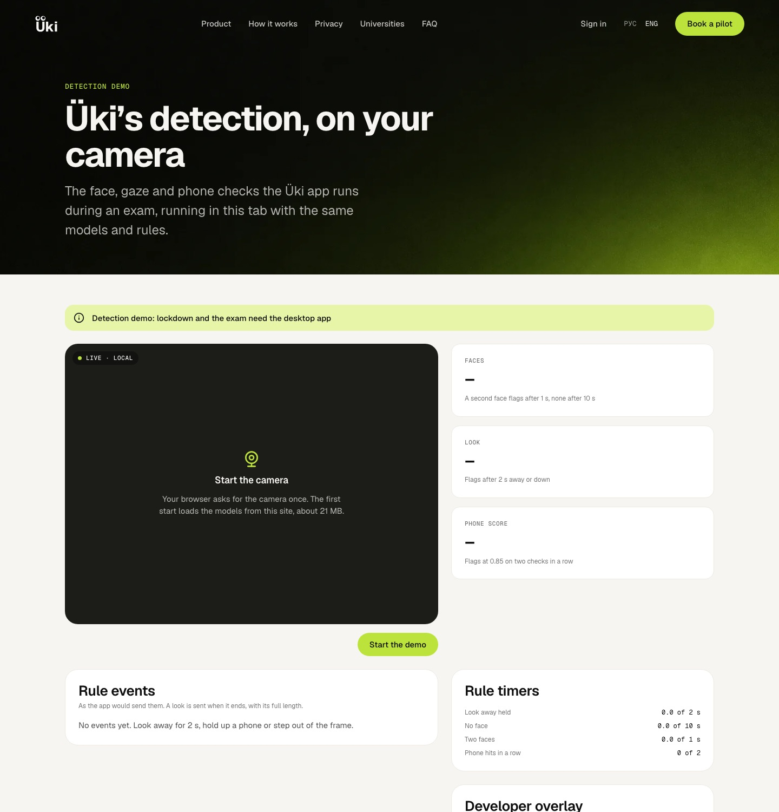 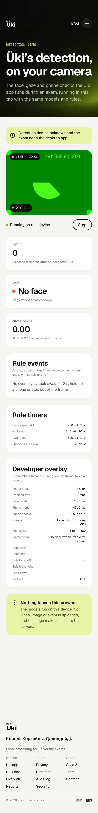 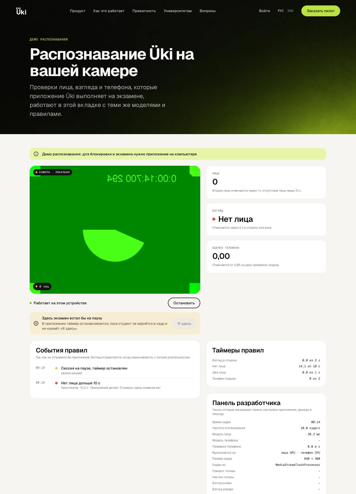 At 390 the columns stack and nothing scrolls sideways; long API names in the overlay wrap | 2026-10-09 |
| Russian render test | pass | `apps/web/test/try-russian.test.tsx` (3 tests): before the start, all five failures, and a run with the overlay filled in, the pause, both cues and one event of every type the rules engine sends; each fails on any next-intl error (`intlErrors`) or raw key | 2026-10-09 |
| Unit tests | pass | `try-model.test.ts` 9 (camera errors, browser support, a title for every rule event in English and Russian, tones, the event list, mm:ss, the timers, the reducer), `try-runtime.test.ts` 6 (the init message with `stills: false` and this site's model URLs, the states in order, camera loss and stop, the models' failure turning the camera off, a camera opening after Stop, I'm here). `@uki/detection` 110: the network guard, the stills switch (`pipeline.test.ts`, `protocol.test.ts`), `isModuleWorkerScope`, `WEB_DEMO_MODEL_PATHS` pinned in the committed manifest, `fileMatches` | 2026-10-09 |
| The web build fetches and verifies the models | pass | `pnpm --filter web build` runs `apps/web/scripts/detection-models.ts` first: 4 files, 20.7 MB, each checked against `apps/desktop/resources/models/manifest.json`; copied from the desktop's models here, downloaded from storage.googleapis.com and copied from node_modules in CI (cached by the manifest's hash). Vercel runs the same `buildCommand` | 2026-10-09 |
| PWA: manifest, icons, installable, offline page | pass | 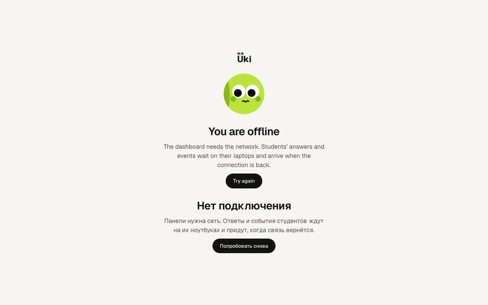 `e2e/try/pwa.spec.ts` against `next start`: the manifest's name, `start_url` and standalone display, every icon a PNG, Chrome's `Page.getInstallabilityErrors` empty; with the network off, a navigation gets `/offline` in English and Russian, styled from the worker's cache; back online, the page itself. `service-worker.test.ts` (7 tests) runs `public/sw.js` in a fake scope: it caches only the offline page and its CSS, fonts and art, answers only failed navigations and failed build assets, and leaves server actions, Supabase, signed URLs, `/models` and `/r/` alone | 2026-10-09 |
| `pnpm check` | pass | Exit 0 after the rebase onto 112a372 (WP 1.10 and the Windows smoke build merged): turbo 22/22 tasks, web 523 tests (this branch adds 25: try-model 9, try-runtime 6, try-russian 3, service-worker 7), detection 110 | 2026-10-09 |
| `pnpm e2e:try` | pass | 6/6 against `next start` (`UKI_TRY_START=1`) after `pnpm --filter web build`, five runs in a row; with `next dev` the PWA test skips | 2026-10-09 |
| CI on the pull request | pass | Run 37840710878 on 251cc1f (before the rebase onto WP 1.10): all six jobs green on Linux, macOS and Windows; the build job fetched and verified the 4 model files and ran `UKI_TRY_START=1 pnpm e2e:try`, 6 passed. Run 37842733738 on 9a116a8 (onto WP 1.10): green, after one rerun of the stack job, whose `command.test.ts` missed a session broadcast ("reaches the student's session channel within 1 s", the known flake 1.13 records); the push run 37842727524 of the same commit passed all six jobs at once. After the rebase onto 112a372: see PR #35 | 2026-10-09 |
| `/try` on Vercel, with a real camera in Chrome, Edge, Safari and Firefox | pending | Hand check after the merge: the models load from the Vercel domain, Safari and Firefox name requestVideoFrameCallback, a real phone held up scores | |
| Install the dashboard from Chrome's address bar on the Vercel domain, and its offline page | pending | Hand check after the merge | |
